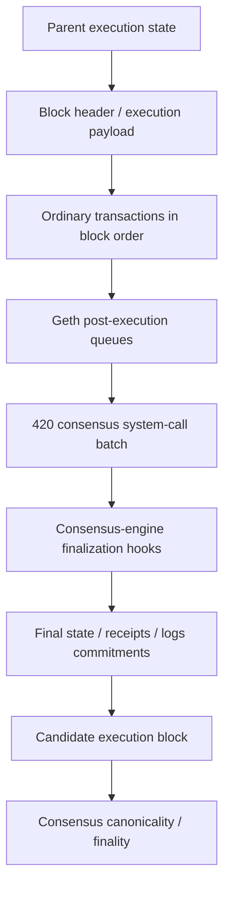
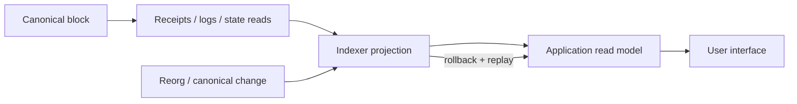

# Blocks and state

This page documents how 420 Integrated commits transactions, receipts, logs, protocol system calls, and EVM state transitions into execution blocks and how clients should reason about canonical versus finalized state.

420 Integrated uses the execution-block model of the pinned go-ethereum baseline, with an additional protocol-owned consensus system-call phase integrated into block processing before the final execution state root is assembled.

## Scope

This page covers:

- execution block structure at the architectural level;
- transaction ordering and deterministic state transitions;
- state-root and receipt/log commitments;
- the consensus system-call phase;
- canonical chain selection as observed by execution;
- reorg handling before finality;
- the distinction between canonical and finalized state;
- recovery and projection rules for Indexer, Explorer, Wallet, and applications.

Validator selection, proposer selection, consensus fork choice, checkpoint/finality mechanics, epochs, and consensus recovery are documented in DOC-4.

## Block-processing model

A simplified execution-block flow is:



Every accepted block must deterministically produce the commitments expected by the execution and consensus rules.

## Parent state and deterministic execution

An execution block begins from the canonical state associated with its parent block.

The block then applies ordered state transitions. For ordinary transactions, each transaction observes the state produced by preceding transactions in the same block. A later transaction therefore may succeed, fail, or produce a different result depending on earlier transitions.

The deterministic execution requirement means that every qualified execution node processing the same parent state, block contents, protocol rules, and consensus system-call batch must compute the same resulting execution state.

A node that computes a different state root or otherwise violates execution validity must reject the candidate rather than inventing a local repair.

## Block contents

At the architecture level, an execution block contains or commits to information including:

- parent block identity;
- block number/height;
- timestamp and other header fields governed by the active protocol rules;
- gas limit and gas usage;
- base-fee and active fee-market fields;
- ordered user transactions;
- transaction/receipt commitments;
- logs bloom and receipt-derived metadata;
- execution state root;
- active EVM/fork-dependent header fields;
- 420-specific execution metadata required by the protocol, including the consensus system-call batch commitment carried in `extraData` for the patched execution path.

Exact field encodings belong to generated/reference documentation and the underlying execution-client specification.

## Transaction ordering

Ordinary transactions execute exactly in block order.

The execution layer does not reorder a block after it has been proposed for validation. If the ordered transaction list cannot validly execute under the current state and protocol rules, the execution payload is invalid.

This gives applications an important invariant: transaction index within a block is part of the canonical execution ordering for that block.

Derived services may sort or group transactions for presentation, but such presentation ordering must not be mistaken for execution ordering.

## State transition model

The canonical execution state contains EVM account data such as:

- native `$420` balances;
- account nonces;
- contract bytecode;
- contract storage;
- protocol/application state represented in contract storage.

For each block:

```text
parent state
  + ordered ordinary transaction effects
  + protocol-owned system-call effects
  + required execution/finalization effects
  = child execution state
```

The resulting child state is committed by the block's execution state root.

A database snapshot, RPC response, Indexer row, Explorer page, or application cache is not itself the canonical state commitment.

## State root

The execution state root cryptographically commits to the EVM-visible state after all required block-processing phases have completed.

420 Integrated's consensus system-call effects are included in this final state. They are not maintained in a parallel side database outside the block commitment.

This is a critical architectural property: a protocol system call that changes contract storage or balances must change the same canonical execution state committed by the block.

If the expected system-call batch cannot execute successfully, the candidate payload is invalidated atomically under the protocol mechanism rather than publishing a block with a partially applied system-call phase.

## Consensus system-call commitment

The 420 execution patch binds the canonical system-call batch to the block through the execution header `extraData` value, which must equal the canonical SHA-256 batch root expected by the protocol path.

The patched execution flow:

1. receives/stages the canonical system-call batch through the authenticated Engine API extension;
2. validates the batch commitment against block `extraData`;
3. executes ordinary transactions;
4. processes the relevant upstream post-execution queues;
5. executes the protocol-owned system-call batch using the native system origin;
6. completes block finalization and state-root assembly.

A normal JSON-RPC transaction cannot substitute for this block-processing phase.

## Receipts

Receipts record per-transaction execution results for canonically included ordinary transactions.

Receipt information includes concepts such as:

- transaction success/failure status;
- gas used;
- contract creation result where applicable;
- emitted logs;
- cumulative execution metadata required by the active receipt format.

Receipts are distinct from state itself. They describe transaction execution outcomes and emitted events, while the state root commits to the resulting EVM state.

Applications should use both appropriately: receipts/logs for execution evidence and events, canonical state for current authoritative protocol/account state.

## Logs and event ordering

Logs are emitted during successful EVM execution scopes and appear in receipt order corresponding to transaction execution.

Within a canonical block, event consumers should retain at least:

- chain/network identity;
- block number;
- block hash;
- transaction hash;
- transaction index;
- log index;
- emitting contract address;
- topics/data required by the event schema.

These coordinates allow Indexer and applications to remove/replay derived events if a pre-finality reorg changes the canonical block history.

## Canonical block versus known block

A node may know about multiple competing blocks temporarily.

A **known block** is merely a block the client has received or stored. A **canonical block** is the block occupying that height on the execution view of the currently selected canonical chain.

Applications must not treat existence by block hash as proof that the block remains canonical.

Where security matters, clients should verify the block against the current canonical chain and, when necessary, the applicable consensus finality state.

## Canonical state versus finalized state

Canonicality and finality are related but distinct.

- **Canonical state** is the state produced by the chain currently selected as canonical.
- **Finalized state** is canonical state protected by the consensus protocol's applicable finality guarantee.

Before finality, canonical blocks may be reorganized if consensus selects a competing valid history.

After the relevant finality guarantee, applications may rely on the stronger stability semantics defined by DOC-4.

Wallets, exchanges, bridges, games, and other value-sensitive applications should choose confirmation/finality policies appropriate to the risk of the action rather than treating the first observed inclusion as irreversible.

## Reorganizations

A reorganization replaces one canonical suffix with another valid canonical suffix before finality.

When a reorg occurs, derived systems must:

1. identify the common ancestor;
2. remove or mark projections created from blocks no longer canonical;
3. replay the replacement canonical blocks in order;
4. rebuild affected balances, transaction statuses, logs, application projections, analytics, and search records;
5. avoid emitting duplicate irreversible side effects unless the application has an explicit idempotency/reconciliation policy.

A reorg does not mean the execution database may arbitrarily mutate history. The canonical history changes only through the chain-selection/finality rules supplied by consensus.

## Indexer and Explorer behavior

420Indexer and 420Explorer are derived services.

They should track block identity, canonicality, and finality explicitly enough to avoid presenting stale fork data as current canonical truth.

Required architectural behavior includes:

- associate projected records with block hashes, not only block numbers;
- process blocks in canonical order;
- detect/reconcile reorgs;
- expose pending/canonical/finalized distinctions where material;
- permit complete rebuild from authoritative chain inputs;
- never change canonical state by modifying an index record.

## Application state projections

Applications often maintain off-chain read models for performance.

A safe projection pattern is:



An application may choose stronger finality thresholds before triggering irreversible off-chain actions such as external settlement, fulfillment, rewards, or cross-system messages.

## Failed transactions inside valid blocks

A valid block may contain transactions whose EVM execution reverted.

Such a transaction:

- remains part of the ordered canonical block;
- has a canonical receipt showing failure;
- consumes gas according to transaction rules;
- consumes the sender nonce when applicable;
- does not preserve reverted state changes.

Therefore, “transaction is in a canonical block” and “transaction succeeded” are separate statements.

## Invalid block/payload conditions

A candidate execution payload must be rejected when execution validity fails.

Examples include conditions such as:

- incorrect parent/state relationship;
- invalid transaction ordering or transaction validity;
- computed state root mismatch;
- invalid receipt/commitment data;
- gas accounting violations;
- incompatible active fork rules;
- invalid or missing required 420 system-call batch commitment;
- failure of an atomic protocol system call;
- other Engine API/execution validity failures.

A client must not publish a locally altered state root to force acceptance.

## Block and state recovery

### Derived-state corruption

If Indexer, Explorer, Search, Analytics, or an application projection is corrupt, rebuild the projection from canonical chain inputs. Do not attempt to “repair” the chain using derived data.

### Execution database corruption

An execution node should recover through qualified node/database restoration, resynchronization, or other supported execution-client procedures. Operator recovery must re-establish agreement with canonical block/state commitments.

### RPC disagreement

If two RPC providers disagree about block hash, transaction status, or state at the same height, clients should determine which provider reflects the canonical/finalized chain rather than averaging responses.

### Pre-finality reorg

Rollback derived effects from orphaned blocks and replay the replacement canonical history.

### Finality inconsistency

A conflict involving finalized state is a consensus/security incident, not an ordinary application reorg. DOC-4 defines the applicable consensus failure model.

## Block/state invariants

- **STATE-001** — a child execution block must be derived deterministically from its parent state and accepted block inputs.
- **STATE-002** — ordinary transaction execution order is the canonical block transaction order.
- **STATE-003** — consensus system-call effects must be included in the same final execution state root as ordinary transaction effects.
- **STATE-004** — derived databases, Explorer pages, and application caches cannot override a canonical block or state commitment.
- **STATE-005** — transaction inclusion and transaction execution success are independent properties.
- **STATE-006** — pre-finality derived state must be capable of rollback/replay across canonical reorgs.
- **STATE-007** — block hash plus transaction/log position must be retained where needed to reconcile event projections safely.
- **STATE-008** — invalid execution/state-root/system-call results invalidate the candidate payload rather than producing a partially authoritative block.
- **STATE-009** — canonical and finalized state must not be presented as equivalent when the distinction affects safety.
- **STATE-010** — recovery begins from authoritative block/state commitments and proceeds outward to derived services.

## Relationship to gas and fees

Blocks impose execution gas limits, transactions consume gas, and the fee market accounts for that resource consumption using native `$420`.

DOC-3.5 documents gas accounting, the genesis gas/base-fee configuration, ordinary transaction fees, priority-fee behavior, and the distinct protocol gas treatment of consensus system calls.

## Related documentation

- [Chain architecture](index.md)
- [Execution layer](execution-layer.md)
- [Accounts](accounts.md)
- [Transactions](transactions.md)
- [Consensus system-call specification](../../CONSENSUS-SYSTEM-CALL-v1.md)
- [System dependency map](../dependency-map.md)
- [Trust-boundary model](../trust-boundary-model.md)

## Non-responsibilities

This page does not define validator fork-choice algorithms, finality thresholds, proposer selection, consensus checkpoint formats, peer-to-peer propagation internals, exact RLP/SSZ-style wire encodings, or operator database commands. Those belong to DOC-4, implementation/reference material, and operator runbooks.
