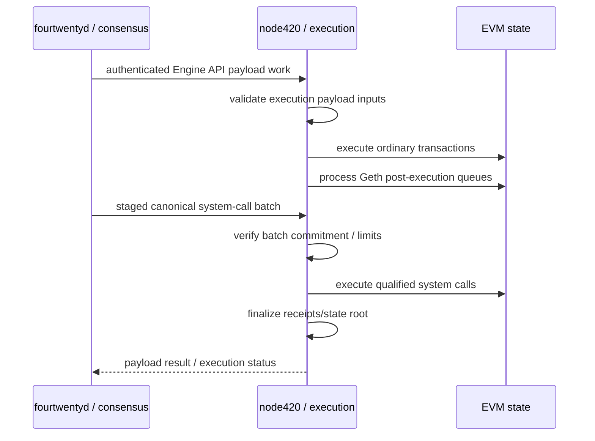

# Execution layer

420 Integrated uses an EVM-compatible execution layer implemented through `node420`, a wrapper and integration surface around a pinned go-ethereum baseline with the 420 protocol patchset.

The execution layer is responsible for deterministic EVM state transition. Consensus determines canonical block ordering and finality; execution determines what each accepted payload does to accounts, contracts, balances, storage, receipts, logs, gas accounting, and the resulting state root.

## Current implementation baseline

The repository currently pins go-ethereum **v1.17.5**. `node420` verifies that baseline before launching the execution client.

The execution genesis config uses chain ID **420** and activates the configured Ethereum execution forks from genesis, including London, Shanghai, and Cancun-era behavior represented in the genesis configuration.

The genesis execution gas limit is **30,000,000 gas** and the configured initial `baseFeePerGas` is **1 gwei**.

These values describe the current genesis artifact; DOC-3.6 documents the network/genesis configuration as a whole.

## Responsibilities

The execution layer owns:

- EVM transaction execution;
- account balance and nonce changes;
- contract creation and code execution;
- contract storage transitions;
- gas consumption and execution-fee accounting;
- transaction success/revert semantics;
- receipt and log production;
- execution block/header validation required by the client;
- execution state-root calculation;
- processing of qualified consensus system calls through the patched block-processing path.

It does **not** independently choose the canonical validator set, proposer, epoch, or finality outcome. Those are consensus responsibilities documented in DOC-4.

## `node420` process model

`node420` locates and verifies the pinned Geth binary, then launches it with the 420 Integrated execution configuration.

Default interfaces exposed by the wrapper are:

| Interface | Default |
| --- | --- |
| JSON-RPC | `127.0.0.1:8545` |
| Engine API | `127.0.0.1:8551` |
| execution P2P | `30303` |
| JSON-RPC modules | `eth,net,web3` |
| sync mode | `full` |

The Engine API uses a JWT secret and is intended for the private consensus-to-execution relationship rather than general application traffic.

## Consensus and execution relationship

420 Integrated separates consensus and execution but connects them through the authenticated Engine API.

Consensus can request payload construction and validation, but it cannot bypass EVM/protocol execution rules merely by supplying a block candidate.

## Consensus system calls

420 Integrated includes genesis-critical consensus-to-execution system calls that stock Geth does not provide.

The current frozen identities are:

- native system origin: go-ethereum `params.SystemAddress` (`0xfffffffffffffffffffffffffffffffffffffffe`);
- gateway predeploy: `ConsensusSystemCall420` at `0x000000000000000000000000000000000000043c`.

The patched execution path:

1. receives the canonical batch through authenticated `engine420_submitSystemCallsV1` staging;
2. requires the execution header `extraData` commitment to match the canonical SHA-256 batch root;
3. enforces a maximum of **64 system calls** and **256 KiB aggregate payload bytes** per batch;
4. executes the system calls after ordinary transactions and Geth post-execution queues;
5. executes them before consensus-engine finalization and state-root assembly;
6. uses protocol-owned gas accounting and the native system origin;
7. includes all resulting writes in the execution state root;
8. invalidates the candidate payload atomically if any system call fails.

These operations are not ordinary user transactions. They do not represent a privileged user account submitting JSON-RPC transactions, and they cannot be safely emulated by the `node420` wrapper outside block processing.

## State authority

Once a block is accepted by consensus and its execution is valid, the execution result is authoritative for EVM-visible state.

Derived systems may observe that result through RPC, events, receipts, or indexing, but:

- Indexer state does not override execution state;
- Explorer presentation does not alter receipts or balances;
- application caches do not redefine contract storage;
- Wallet displays do not redefine nonce or balance state.

Where a derived projection disagrees with canonical execution state, the execution state wins.

## Failure behavior

### Invalid transaction or contract execution

Normal transaction validation or EVM failure follows execution-layer semantics. A reverting transaction does not imply consensus failure; its receipt/status records the execution result according to the chain rules.

### Invalid payload

If payload validation fails, the execution client rejects the candidate. Consensus must not finalize a payload the execution layer reports as invalid.

### Failed consensus system call

The current system-call mechanism is atomic at the candidate-payload level: a failed system call invalidates the candidate payload rather than committing a partial system batch.

### Execution client unavailable

If `node420` is unavailable, consensus cannot safely invent execution results. Block production that requires execution must pause or recover through the documented consensus/execution failover path.

### RPC unavailable

Loss of the public JSON-RPC surface reduces client access but does not itself redefine canonical state. Another qualified node may expose the same canonical state.

## Storage-provider integration

`node420` can optionally supervise the 420Store provider service. That service consumes execution-chain data and exposes storage-provider behavior, but its lifecycle is kept separate from EVM state authority.

The optional storage service can be configured with provider identity, capacity, event-scan confirmation depth, RPC source, and canonical storage-contract addresses. Its failure may cause the wrapper to shut down the paired process under the supervisor policy, but storage-provider state does not become a substitute for canonical execution state.

Detailed storage/resource architecture belongs to DOC-5 and protocol documentation.

## Execution invariants

- **CHAIN-EXEC-001** — EVM-visible state transitions must be deterministic from the accepted block/payload inputs.
- **CHAIN-EXEC-002** — consensus must not finalize an execution payload reported invalid by the execution client.
- **CHAIN-EXEC-003** — derived services must not redefine balances, nonces, code, storage, receipts, or logs.
- **CHAIN-EXEC-004** — consensus system-call writes must enter through the qualified block-processing path, not ordinary user RPC submission.
- **CHAIN-EXEC-005** — a failed qualified system call must not leave a partially committed system-call batch.
- **CHAIN-EXEC-006** — execution state included in a canonical block must be represented by the block's execution state root.
- **CHAIN-EXEC-007** — application, SDK, Indexer, Explorer, or operator convenience layers must not silently acquire execution authority.

## Security assumptions

The execution architecture assumes:

- the Geth baseline and 420 patchset used in production match the qualified release artifacts;
- the Engine API JWT boundary is protected from untrusted callers;
- consensus and execution agree on the system-call commitment and batch constraints;
- chain/network identity is validated by clients before value-sensitive operations;
- operators do not expose private Engine API authority as a public application API.

## Related implementation and documentation

- `execution/README.md` — node420 baseline and release-gate notes
- `execution/cmd/node420/main.go` — wrapper process and interface defaults
- `execution/genesis/execution-genesis.json` — current execution genesis artifact
- `docs/CONSENSUS-SYSTEM-CALL-v1.md` — normative consensus system-call mechanism
- [Chain architecture index](index.md)
- [System dependency map](../dependency-map.md)
- [Trust-boundary model](../trust-boundary-model.md)
