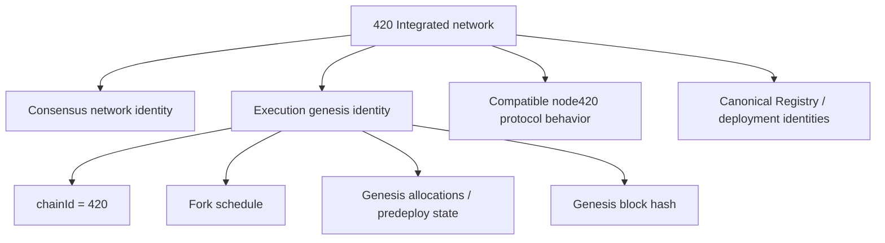

# Network identity and configuration

This page documents how 420 Integrated identifies its canonical execution network, initializes execution state from genesis, exposes default execution interfaces, and rejects incompatible chain configuration.

The network is not identified by a chain ID alone. Correct compatibility depends on the accepted execution genesis, active fork schedule, execution-client baseline/patchset, consensus pairing, protocol predeploys, and other frozen genesis assumptions.

## Canonical execution identity

The current execution genesis defines:

- **chain ID:** `420`;
- **genesis timestamp:** `0`;
- **genesis nonce:** `0x0000000000000420`;
- **genesis gas limit:** `30,000,000`;
- **genesis base fee:** `1,000,000,000 wei` (`1 gwei`);
- **difficulty:** `0`;
- **terminal total difficulty:** `0`;
- **coinbase:** zero address;
- **genesis extra data:** ASCII `420-integrated` encoded as `0x3432302d696e7465677261746564`.

Chain ID `420` is used for transaction-domain separation and EVM `block.chainid` semantics, but matching chain ID is necessary rather than sufficient proof that a peer, RPC endpoint, deployment, or signed request belongs to the intended 420 Integrated network.

## Fork activation at genesis

The execution genesis activates the principal historical Ethereum execution forks from genesis rather than replaying a historical activation schedule.

The current configuration activates at block `0`:

- Homestead;
- EIP-150;
- EIP-155;
- EIP-158;
- Byzantium;
- Constantinople;
- Petersburg;
- Istanbul;
- Berlin;
- London;
- Merge netsplit handling.

It activates by timestamp `0`:

- Shanghai;
- Cancun.

The Cancun blob schedule in the genesis configuration uses:

- target blobs: `3`;
- maximum blobs: `6`;
- base-fee update fraction: `3338477`.

Nodes must not silently substitute another fork schedule merely because the chain ID matches.

## Genesis state

The accepted execution genesis defines the initial state from which all later EVM-visible state derives.

At minimum, genesis establishes:

- chain rules and fork schedule;
- block-level execution parameters;
- initial native `$420` balances;
- protocol/system-contract code and storage where materialized by the full genesis build process;
- any frozen execution identities required before block `1`.

A different genesis allocation or predeploy state produces a different network even when `chainId` remains `420`.

## Current native `$420` allocations

The checked-in execution genesis currently includes the following native-balance allocations:

| Address | Native `$420` allocation |
| --- | ---: |
| `0x0000000000000000000000000000000000000421` | 4,200,000 |
| `0x0000000000000000000000000000000000000422` | 4,200,000 |
| `0x0000000000000000000000000000000000000424` | 8,600,000 |
| `0x0000000000000000000000000000000000000425` | 6,300,000 |
| `0x0000000000000000000000000000000000000426` | 2,100,000 |
| `0x0000000000000000000000000000000000000427` | 1,000,000 |
| `0x000000000000000000000000000000000000042a` | 12,600,000 |
| `0x000000000000000000000000000000000000042e` | 3,000,000 |

These amounts are represented in genesis in the native execution unit with 18-decimal EVM-style denomination.

Genesis funding alone does not establish governance, validator, bridge, protocol-admin, or application authority. Those authorities require their own canonical protocol state and authorization rules.

## Genesis hash and stronger network identity

Operational tooling should treat the canonical genesis block hash, once generated from the accepted genesis bundle, as a stronger identity signal than chain ID alone.

A compatibility check should prefer a combination of:

1. expected chain ID;
2. expected genesis block hash;
3. expected fork schedule;
4. expected execution-client protocol compatibility;
5. expected canonical deployment/Registry state where relevant;
6. expected consensus network identity.

Wallets and dApps may use chain ID as the first fail-fast check, but high-value or privileged integrations should validate canonical deployment identities rather than trusting chain ID plus an arbitrary RPC endpoint.

## Execution client compatibility

The canonical execution implementation is `node420` using the pinned go-ethereum v1.17.5 baseline plus the maintained 420 protocol patchset.

Compatibility is therefore not equivalent to “any client that speaks Ethereum JSON-RPC.” A compatible execution node must implement the chain's required execution behavior, including the consensus-to-execution system-call mechanism.

A stock upstream Geth binary may understand the same chain ID and ordinary transaction formats while still being protocol-incompatible because it lacks the 420 system-call hook and associated Engine API behavior.

`node420` verifies the required Geth baseline before launch and fails if the executable does not report the expected version.

## Genesis initialization

`node420` supports explicit datadir initialization from the accepted execution genesis.

Conceptually:

```text
node420 --datadir <path> --init-genesis execution/genesis/execution-genesis.json
```

Initialization writes the execution database's genesis state. An already initialized datadir must not be casually reused with a different genesis file or fork configuration.

If a node reports a genesis mismatch, the safe response is to verify configuration and network identity rather than forcing incompatible state into the existing database.

## Default execution interfaces

The current `node420` wrapper defaults to:

| Interface | Default bind | Default port | Purpose |
| --- | --- | ---: | --- |
| JSON-RPC HTTP | `127.0.0.1` | `8545` | user/application execution RPC |
| authenticated Engine API | `127.0.0.1` | `8551` | private consensus-to-execution control plane |
| execution P2P | host/network dependent | `30303` | execution peer traffic |
| optional storage provider HTTP | `127.0.0.1` | `8420` | 420Store provider service when enabled |

These are software defaults, not immutable network identity. Operators may change bind addresses and ports without creating a new chain, provided protocol semantics and the actual network configuration remain compatible.

The default public execution HTTP namespaces exposed by the wrapper are `eth`, `net`, and `web3`.

## Engine API boundary

The Engine API is a private authenticated interface between `fourtwentyd` and `node420`.

The current defaults use:

- bind address `127.0.0.1`;
- port `8551`;
- JWT secret path `./jwt.hex` unless overridden.

420 Integrated also uses the authenticated `engine420_submitSystemCallsV1` extension for staging consensus system-call batches.

The Engine endpoint must not be treated as a public application RPC interface. Exposure of Engine credentials or the Engine endpoint expands the attack surface of the node's consensus/execution control plane.

## JSON-RPC network checks

A client connecting to an RPC endpoint should not infer network identity from hostname or branding.

At minimum, compatible clients should verify:

- the expected chain ID through the execution RPC;
- the expected canonical contract/deployment identities for the operation being performed;
- any environment distinction such as development, testnet, or mainnet once separate network profiles exist.

For privileged tooling, operators should additionally verify genesis/network metadata and trusted peer/bootstrap configuration.

## P2P identity and bootstrap configuration

P2P peer identity is distinct from chain identity.

A valid node key identifies one network participant; it does not prove that the peer follows the expected chain. Peering must still converge on compatible genesis and protocol rules.

Bootstrap nodes, static peers, DNS discovery records, or other peer-discovery mechanisms are operational discovery inputs. They do not override genesis or consensus validity.

A malicious or stale bootstrap endpoint may waste connectivity or expose peers, but it must not be able to redefine canonical chain rules for a correctly validating node.

## Chain ID versus environment identity

As 420 Integrated moves through development, testnet, and production/mainnet environments, network-profile documentation must make environment identity explicit.

If multiple environments ever share transaction-format compatibility, tooling must not assume that the human-facing name alone prevents cross-environment mistakes. Network configuration should expose stable machine-readable identity fields and canonical deployment metadata.

Where separate chain IDs are assigned, they provide an additional signing-domain boundary. Where an environment intentionally uses chain ID `420`, genesis hash and canonical deployment identity become especially important disambiguators.

## Configuration classes

Not all settings have the same authority.

### Consensus/execution identity settings

Changing these can create an incompatible network or fork:

- genesis state;
- chain ID;
- fork schedule;
- required execution protocol behavior;
- consensus-critical system-call identities/rules;
- protocol predeploy code/storage where frozen;
- consensus parameters documented as genesis-critical.

### Operational settings

Changing these normally does not create a new chain:

- local datadir path;
- RPC bind address;
- RPC port;
- P2P listen port;
- log level;
- local metrics endpoints;
- storage-provider listen address;
- peer-discovery configuration, provided connected peers validate the same chain.

### Application configuration

Wallet RPC lists, Explorer URLs, Indexer endpoints, and app backend URLs are replaceable service configuration. They must point to the intended network but do not themselves define it.

## Compatibility failure modes

### Wrong chain ID

Transactions/signing requests should fail closed. The user or application must explicitly switch to the intended network.

### Same chain ID, wrong genesis

The node is on a different or incompatible chain. Do not rely on chain ID to override the mismatch.

### Correct genesis, incompatible execution binary

The node may fail during block processing when it encounters required protocol behavior. `node420` baseline/patch qualification exists to prevent this class of failure.

### Wrong canonical deployment address

A transaction may still be valid EVM execution but target the wrong contract. Wallets, SDKs, and applications should verify canonical deployments through Registry/Verify/deployment metadata before privileged or value-bearing interactions.

### Stale RPC or forked peer view

Compare canonical block identity and finality status with trusted network sources and allow the node to resynchronize rather than writing local overrides into chain state.

## Network invariants

- **NET-001** — chain ID `420` is a transaction/signing domain identifier, not sufficient proof of canonical-network identity by itself.
- **NET-002** — the accepted execution genesis and its resulting genesis block identity are consensus-critical network identifiers.
- **NET-003** — nodes with different genesis state or fork schedules must not be treated as members of the same canonical execution network.
- **NET-004** — operational port/bind changes must not alter consensus or execution semantics.
- **NET-005** — the private Engine API and JWT credentials must remain separated from public application RPC access.
- **NET-006** — canonical deployment identity must be verified independently of RPC hostname, UI branding, or chain ID alone.
- **NET-007** — bootstrap/discovery services may locate peers but must not grant authority to redefine chain rules.
- **NET-008** — an incompatible execution client must fail rather than silently approximate 420-specific protocol behavior.
- **NET-009** — genesis funding must not imply unrelated protocol authority.
- **NET-010** — environment/network profiles must expose enough machine-verifiable identity to prevent accidental cross-network signing and privileged integration.

## DOC-3 chain identity summary

The canonical chain can be reasoned about as a set of nested identities:



No single convenience field replaces the complete compatibility model.

## Related documentation

- [Chain architecture](index.md)
- [Execution layer](execution-layer.md)
- [Accounts](accounts.md)
- [Transactions](transactions.md)
- [Blocks and state](blocks-and-state.md)
- [Gas, fees, and native `$420`](gas-fees-native-420.md)
- [Genesis architecture](../genesis-architecture.md)
- [Trust-boundary model](../trust-boundary-model.md)

DOC-4 documents the consensus-side network rules, validator lifecycle, proposer selection, epochs, rewards, slashing, finality, and recovery behavior that pair with this execution configuration.
