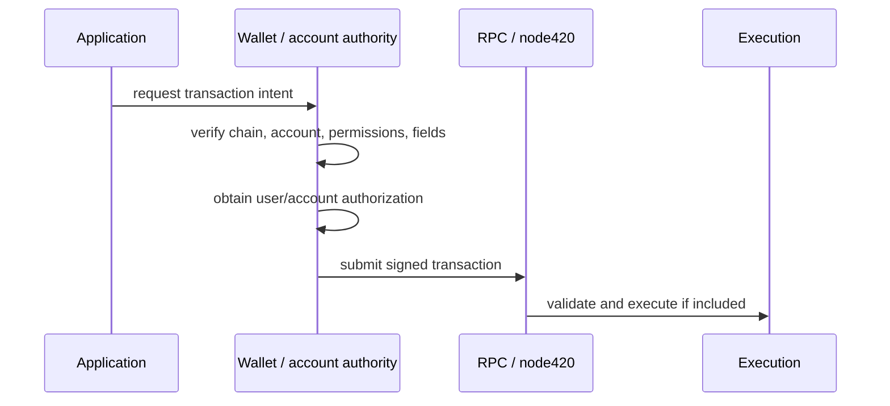

# Transactions

This page documents the canonical transaction model for 420 Integrated: how ordinary user transactions are formed, signed, submitted, validated, executed, recorded, replaced, and failed.

420 Integrated follows the EVM transaction model implemented by the pinned go-ethereum execution baseline, with chain-specific identity, protocol integrations, and a separate consensus-to-execution system-call path.

## Scope

This page covers ordinary EVM-visible transactions submitted by users, Wallet, applications, SDKs, relayers, or compatible tooling.

It does not treat consensus system calls as user transactions. Consensus system calls are protocol-owned execution inputs delivered through the authenticated Engine API path and patched block processor described in [Execution layer](execution-layer.md).

## Transaction lifecycle

A normal transaction moves through the following stages:

```mermaid
flowchart LR
    A[Construct intent] --> B[Resolve chain/account state]
    B --> C[Assign nonce + fee fields]
    C --> D[Sign]
    D --> E[Submit to RPC]
    E --> F[Local validation / tx pool]
    F --> G[Propagation / proposer selection]
    G --> H[Block inclusion]
    H --> I[EVM execution]
    I --> J[Receipt + logs]
    J --> K[Canonical confirmation / finality]
```

The transaction hash identifies the signed transaction bytes. Inclusion in a block does not by itself imply successful contract execution; the receipt status must be checked.

## Transaction intent

A transaction may represent:

- a native `$420` transfer;
- a contract call;
- contract creation;
- token approval or transfer;
- a protocol operation such as payment, swap, staking, governance, bridge, or application action;
- a smart-account or account-abstraction operation that ultimately causes canonical execution through its defined entry path.

Applications may construct transaction requests, but user/account authorization remains a Wallet or smart-account responsibility.

## Core transaction fields

The exact encoded transaction type is determined by the active EVM rules and client implementation, but the security-relevant concepts include:

- **chain ID** — binds the transaction to the intended network domain;
- **nonce** — orders transactions from an EOA and prevents replay within that account sequence;
- **to** — destination account for a call/transfer, or absent for contract creation;
- **value** — native `$420` transferred with the call;
- **data** — calldata or contract-init bytecode;
- **gas limit** — maximum execution gas the sender is willing to provide;
- **fee fields** — base-fee-compatible maximum fee and priority-fee semantics where applicable;
- **signature** — proves authorization by the originating signer for the signed transaction envelope.

Wallets and SDKs must not silently rewrite security-sensitive fields after user approval.

## Chain/domain binding

420 Integrated uses chain ID `420` in the execution genesis configuration.

Transactions intended for another chain must not be accepted as valid 420 Integrated transactions merely because the same key or address exists on both networks.

Chain identity therefore participates in replay protection and user-signing safety.

Client software should fail closed when:

- the connected chain ID is not the expected network;
- a canonical contract address belongs to a different network deployment;
- the user approved an operation under one domain but the final transaction targets another.

## Nonce and replay protection

EOA nonces are part of canonical account state.

For ordinary EOA transactions:

- the sender nonce establishes execution order for that account;
- once a transaction with nonce `N` is canonically executed, the account advances beyond `N`;
- another transaction with the same nonce cannot later execute as an additional independent action;
- pending transactions may be replaced according to transaction-pool fee/replacement rules before canonical inclusion.

Contract-level protocols may require additional replay protection beyond the EOA nonce, including protocol nonces, consumed identifiers, deadlines, epochs, signed-domain separation, or one-time authorization records.

Smart accounts may use their own nonce/key-space rules in addition to any outer transaction semantics.

## Signing boundary

Signing authorizes the exact transaction envelope or smart-account operation being approved.

The security boundary is:

Applications and SDKs may propose transactions, but they do not become signers unless explicit account policy grants them a bounded capability such as an authorized session key.

## Submission and propagation

Ordinary transactions are submitted through an execution JSON-RPC endpoint or a compatible higher-level service that ultimately submits to the execution network.

The default `node420` wrapper exposes standard `eth`, `net`, and `web3` HTTP JSON-RPC namespaces on the configured HTTP interface.

A successful RPC submission response means the node accepted the transaction for further processing. It does not guarantee:

- propagation to all peers;
- inclusion in a block;
- execution success;
- canonical finality.

Clients must treat transaction submission, inclusion, execution status, and finality as distinct states.

## Pre-execution validation

Before inclusion/execution, normal EVM transaction validity rules apply. Depending on transaction type and state, validation includes concepts such as:

- valid transaction encoding;
- valid signature and sender recovery;
- correct chain/domain rules;
- acceptable nonce;
- sufficient intrinsic gas;
- sufficient balance for value plus maximum required fee exposure;
- valid fee relationships under active fork rules;
- size/type constraints;
- transaction-pool policy where the transaction is only pending.

Transaction-pool admission policy is not consensus authority. A transaction rejected by one node's local pool policy may still be valid under consensus rules if included through another valid path, while a consensus-invalid transaction can never become valid merely because an RPC accepted it locally.

## Execution ordering

Within a canonical execution block, ordinary transactions execute in the exact block order chosen by the proposer/builder path and accepted by consensus/execution validation.

Each transaction observes state produced by all successful prior state transitions in that block, subject to EVM revert semantics.

After ordinary transactions and the relevant Geth post-execution queues, 420 Integrated's protocol-owned consensus system-call batch executes through the patched block-processing path before final state-root assembly.

System calls therefore are **not** interleaved with user transactions and are not submitted through the ordinary transaction pool.

## Execution success and revert semantics

A transaction can be canonically included while its contract execution fails.

Typical outcomes include:

### Successful execution

- authorized state changes persist;
- native value movement persists according to EVM rules;
- emitted logs are included in the receipt;
- gas consumed remains charged under the transaction fee rules.

### Revert / failed EVM execution

- state changes made by the reverting call scope are rolled back according to EVM semantics;
- the transaction still consumes gas;
- the sender nonce is still consumed for an included EOA transaction;
- the receipt records failure;
- logs from reverted execution do not become successful canonical event output.

A failed transaction is still a real canonical transaction if included in the canonical block.

## Receipts

A transaction receipt is execution output tied to a canonically included transaction.

Receipts expose information such as:

- transaction hash;
- block identity and transaction position;
- success/failure status;
- cumulative/transaction gas usage as exposed by the execution client;
- contract creation address when applicable;
- emitted logs;
- effective fee information where supported by the transaction/receipt model.

Applications must not infer success from a transaction hash alone. Receipt status and canonical block membership matter.

## Logs and events

Contract logs are part of execution output and are committed through the receipt structure/block commitments.

Indexer, Explorer, Search, Analytics, notifications, and application backends may consume logs to build projections.

Rules:

- logs are evidence of canonical execution only when their containing receipt/block is canonical;
- projections must handle reorgs until the relevant finality guarantee is reached;
- a derived service may omit or mis-index a log without changing what the chain actually emitted;
- application databases should preserve enough block/transaction identity to reconcile derived events against canonical state.

## Pending, included, canonical, finalized

Clients should distinguish at least these lifecycle states:

| State | Meaning |
| --- | --- |
| Constructed | transaction intent exists locally but is not yet signed/submitted |
| Signed | authorization exists for a specific transaction envelope |
| Submitted | at least one endpoint accepted the transaction for processing |
| Pending | transaction is known to a pool/service but not canonically included |
| Included | transaction appears in a block known to the client |
| Canonical | containing block is on the current canonical chain |
| Finalized | consensus has provided the applicable finality guarantee |
| Replaced/dropped | pending transaction is no longer expected to execute in its prior form |
| Reverted | transaction was canonically included but EVM execution failed |

Wallets and applications should avoid using one ambiguous “confirmed” state when security depends on the distinction.

## Replacement and cancellation

Before canonical inclusion, an EOA transaction may be replaced by another transaction using the same account nonce if transaction-pool replacement requirements are satisfied.

A user-facing “cancel” transaction is normally a replacement transaction whose effect is intentionally harmless; cancellation is not a special chain primitive.

Once one transaction for that nonce becomes canonical, competing pending transactions for the same nonce cannot later execute as independent actions.

Applications should not assume a previously observed pending transaction will eventually execute unchanged.

## Dropped transactions

A transaction may disappear from a node's pending pool because of:

- replacement;
- pool eviction;
- insufficient fee competitiveness;
- node restart/configuration;
- nonce becoming unusable because another transaction executed first;
- state changes making the transaction no longer locally admissible;
- propagation failure.

A dropped pending transaction is not the same as an on-chain failed transaction.

## Contract creation

A contract-creation transaction has no ordinary destination address. Execution derives the new contract address according to the EVM creation mechanism used by the transaction/opcode path.

Successful creation commits contract code and any resulting storage/balance state. Failed creation does not leave a successfully deployed contract at the intended derived address.

Canonical application/protocol identity should be verified through Registry/deployment metadata rather than treating the existence of code at an address as sufficient proof that the contract is an approved ecosystem deployment.

## Native value transfer

The transaction `value` field transfers native `$420` at the execution layer.

Native balance transfer is distinct from ERC-style token transfer. Token movements are contract state transitions invoked by transaction calldata; native `$420` is part of account balance state maintained directly by execution.

Gas/fee behavior and native `$420` accounting are documented in DOC-3.5.

## Smart-account transactions

Smart-account flows may introduce an additional authorization/execution layer above ordinary EOA transaction semantics.

Examples include:

- user operations;
- session keys;
- capability-based calls;
- batched actions;
- sponsored execution;
- recovery policies;
- delegated account controllers.

The architectural rule is that convenience does not erase authority boundaries. The smart-account contract/EntryPoint/account policy validates the user operation, and any outer EVM transaction is still subject to canonical chain execution rules.

An application cannot treat “the Wallet UI approved it” as a substitute for successful on-chain smart-account validation.

## Consensus system calls are not user transactions

420 Integrated adds a protocol-level consensus-to-execution system-call hook.

These calls differ from ordinary transactions:

- they are constructed by consensus protocol logic;
- they are staged through authenticated `engine420_submitSystemCallsV1` handling;
- the canonical batch root is bound to execution block `extraData`;
- the patched block processor executes them with the protocol system origin;
- they do not purchase gas like ordinary users;
- their writes become part of the same final execution state root;
- if a system call fails, the candidate payload is invalidated atomically according to the protocol mechanism.

RPC clients must not attempt to emulate this path by submitting a transaction from a look-alike address.

## Failure and recovery behavior

### RPC submission failure

No canonical state change has occurred merely because submission failed. The client may safely retry only after determining whether the transaction was actually accepted/broadcast; blindly signing a new nonce can create duplicate intent.

### Unknown submission result

If a network timeout occurs after submission, clients should query by transaction hash before assuming the transaction was never accepted.

### Reorg before finality

A previously included transaction may cease to be canonical before finality. Clients must reconcile against the current canonical chain and update derived state accordingly.

### Execution revert

Do not retry automatically unless the application understands why the transaction reverted and whether retrying with the same semantic intent is safe.

### Nonce conflict

Refresh canonical/pending nonce state and determine which transaction consumed or replaced the conflicting nonce before constructing a replacement.

## Transaction invariants

- **TX-001** — a valid signature authorizes a specific transaction/domain; it does not grant ambient application authority.
- **TX-002** — chain ID/domain checks must prevent accidental cross-network transaction reuse.
- **TX-003** — EOA nonce consumption prevents multiple canonical transactions from independently executing at the same account nonce.
- **TX-004** — RPC acceptance does not imply inclusion, execution success, canonicality, or finality.
- **TX-005** — canonical inclusion does not imply successful EVM execution; receipt status is authoritative for transaction success/failure.
- **TX-006** — pending transaction-pool state is replaceable and non-canonical.
- **TX-007** — derived transaction/event projections must reconcile reorgs against canonical execution state.
- **TX-008** — consensus system calls remain a distinct protocol path and must not be emulated as ordinary user transactions.
- **TX-009** — transaction retries/replacements must preserve replay, nonce, value, and protocol-level idempotency assumptions.
- **TX-010** — applications must not treat transaction hashes, explorer displays, or indexer status as stronger authority than the canonical receipt/block state they represent.

## Related documentation

- [Chain architecture](index.md)
- [Execution layer](execution-layer.md)
- [Accounts](accounts.md)
- [System design principles](../design-principles.md)
- [Trust-boundary model](../trust-boundary-model.md)
- [Consensus system-call specification](../../CONSENSUS-SYSTEM-CALL-v1.md)

DOC-3.4 documents how transactions, receipts, logs, and state transitions are committed into execution blocks and canonical state.