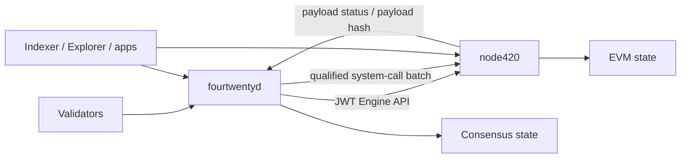
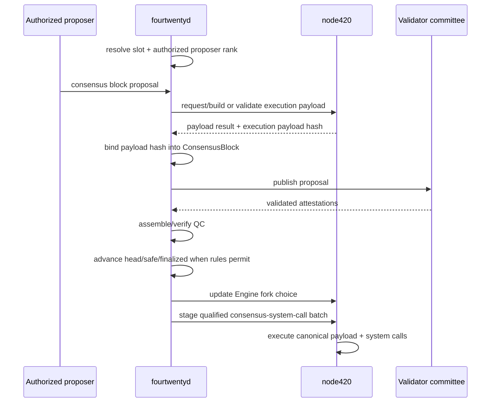

# Consensus overview

420 Integrated uses a separate consensus-client and execution-client architecture. `fourtwentyd` owns consensus state and safety decisions; `node420` owns deterministic EVM execution. The two processes communicate over a private JWT-authenticated Engine API boundary.

This page establishes the consensus-wide architecture. DOC-4.2 through DOC-4.7 document lifecycle, scheduling, finality, economics, slashing, and recovery in detail.

## Responsibilities

`fourtwentyd` is responsible for consensus concerns including:

- tracking the eligible and active validator committee;
- maintaining slot/epoch/rotation time;
- determining the authorized primary and fallback proposers for a slot;
- receiving and validating consensus blocks and attestations;
- assembling and validating quorum certificates (QCs);
- maintaining consensus head, safe, and finalized checkpoints;
- applying validator-set rotation/lifecycle decisions;
- deriving reward and slashing outcomes under the protocol rules;
- persisting consensus state required for restart safety;
- communicating execution fork-choice and payload work through the Engine API;
- deriving the ordered consensus-system-call batch used to materialize qualified consensus outcomes in EVM state.

Consensus does not execute arbitrary EVM transactions or directly mutate execution storage outside the qualified consensus-to-execution mechanism.

## Process and authority split



The core boundary is deliberate:

- consensus chooses/justifies canonical ordering and finality;
- execution validates and computes the EVM result;
- consensus must not finalize an execution payload reported invalid by execution;
- execution must not invent validator/finality decisions independently of consensus;
- derived services observe both domains but do not become authoritative for either.

## Time hierarchy

The current testnet-frozen protocol organizes time as:

```text
slot:      12 seconds
block:     at most one produced block for an occupied slot
epoch:     420 blocks
rotation:  42 epochs = 17,640 blocks
term:      3 rotations for an activated validator
```

A missed slot does not create an empty block and does not increment execution block height. Slot time and block height therefore must not be treated as interchangeable counters.

The canonical block timestamp rule is based on genesis time plus `slot_number * 12 seconds`.

## Slot proposer windows

Each slot may authorize up to three distinct proposers:

1. **primary** — proposal window 0–3 seconds;
2. **fallback 1** — proposal window 4–7 seconds;
3. **fallback 2** — proposal window 8–11 seconds.

The fallback order is deterministic and derives from finalized consensus randomness. A proposal from a proposer rank outside its authorized slot/window is invalid.

If the primary misses and a fallback successfully proposes, that fallback receives the full proposer reward for the slot. An isolated missed primary is not automatically slashable merely for missing the proposal.

Detailed schedule construction belongs to DOC-4.3.

## Committee and cohort model

The active validator set uses quantized stable committee sizes:

- 15;
- 18;
- 21;
- 24;
- 27;
- 30.

Each stable committee contains exactly three equal-sized age cohorts. At a normal rotation boundary, the oldest cohort rotates out and a newly admitted cohort enters.

Committee capacity scales with the eligible validator pool. Upward/downward tier changes require three consecutive qualifying rotation-boundary snapshots under normal anti-flapping behavior. If the current committee cannot be safely filled, the protocol may fall back immediately to the largest safe committee size.

Committee resizing does not shorten or extend an already-active validator's scheduled three-rotation tenure. Transitional sizes may therefore exist while adjacent stable tiers migrate over three rotations.

## Proposer-selection principle

Current proposer scheduling is **equal per active validator** and explicitly **not stake weighted**.

The schedule is generated for one rotation from:

- the finalized active-set snapshot at the rotation boundary;
- a finalized `rotationSeed`;
- domain-separated deterministic permutations for primary, fallback 1, and fallback 2.

The protocol requires distinct proposer identities within a slot and deterministic duplicate resolution. Mid-rotation reshuffling is disabled; an ejected validator's scheduled identity is skipped rather than causing the future schedule to be regenerated.

This preserves deterministic scheduling and keeps economic bond size separate from proposer-selection weight.

## Consensus objects and quorum certificates

The current consensus core defines canonical objects including:

- `Checkpoint`;
- `AttestationData`;
- `Attestation`;
- `QuorumCertificate`;
- `ConsensusBlock`.

Consensus signing roots are domain separated. The production BLS adapter uses BLS12-381 through `blst` in minimal-public-key mode, with 48-byte public keys and 96-byte signatures.

QCs use a validator-seat bitmap and the quorum rule:

```text
quorum = floor(2N / 3) + 1
```

For a 15-validator committee, the threshold is 11.

The `ConsensusBlock` binds the execution payload hash so a QC/finality decision refers to a specific execution result rather than an abstract consensus header detached from execution.

## Chained finality and Engine fork choice

The current consensus core implements one-block chained finality with tracked `head`, `safe`, and `finalized` states.

Consensus finality state is translated into Engine API fork-choice state for `node420`. This does not make Engine API responses a replacement for consensus proof: `fourtwentyd` derives the fork-choice decision and `node420` validates/executes the corresponding execution payloads.

Detailed QC construction, competing-branch behavior, reorganization/finality semantics, and safety rules belong to DOC-4.4.

## Normal block flow



Actual builder/import ordering of consensus system calls is execution-critical and is defined normatively by `docs/CONSENSUS-SYSTEM-CALL-v1.md`.

## Consensus-to-execution system calls

Some finalized consensus outcomes must become EVM-visible protocol state, including validator lifecycle, rotation, reward, and slashing outcomes.

They do not enter execution as user transactions. Instead, `fourtwentyd` derives a canonical ordered batch and stages it through authenticated `engine420_submitSystemCallsV1`. The batch is committed into the execution header and executed by the patched `node420` block-processing path using the native system origin and the `ConsensusSystemCall420` gateway.

Important consequences:

- no validator/admin private key impersonates the protocol system origin;
- ordinary JSON-RPC cannot synthesize this authority;
- the batch is parent/block/chain bound and sequence checked;
- any system-call failure invalidates the candidate payload atomically;
- resulting EVM writes are committed by the execution state root.

## Consensus persistence

Consensus state is persisted independently from execution state. The consensus storage layer is a dedicated KV boundary; EVM state remains in `node420`.

Persistence/restart safety is required for information such as:

- finalized consensus progress;
- committee/schedule state;
- QC/finality state required by the runtime;
- local slashing-protection state;
- restart slot/state recovery information.

A node restart must not erase safety-critical signing history or cause the validator to sign conflicting consensus messages.

## Validator signing boundary

Production architecture requires persistent validator identity, remote-signing support, and local slashing protection.

Consensus keys are not Wallet transaction keys. Validator signing must remain domain separated from user EVM signing and must not be delegated to application, RPC, Indexer, or Explorer services.

DOC-4.2 and DOC-4.6 define validator-key/lifecycle and slashing-safety requirements in detail.

## Availability versus safety

Consensus failure handling distinguishes liveness from safety.

Examples:

- losing quorum should stop finalization/block progress rather than manufacture quorum;
- execution unavailability should stop safe payload production rather than cause consensus to invent execution results;
- peer/network partitions may reduce liveness and can create competing unfinalized views, but finalized safety rules must remain binding;
- corrupted/stale derived services do not redefine consensus state;
- missing proposer duties may allow configured fallbacks without changing the rest of the rotation schedule.

The repository qualification suite includes quorum-loss, partition, restart, fault-matrix, and accelerated-soak scenarios. DOC-4.7 documents the operational recovery model.

## Consensus invariants

- **CONS-001** — consensus and execution are separate authority domains connected through explicit authenticated interfaces.
- **CONS-002** — consensus must not finalize an execution payload that `node420` reports invalid.
- **CONS-003** — proposer authorization is slot/window specific; a validator's active status does not authorize arbitrary block production.
- **CONS-004** — proposer scheduling is equal per active validator and must not become stake weighted without an explicit protocol change.
- **CONS-005** — a QC must satisfy `floor(2N/3)+1` valid committee signatures for the applicable committee snapshot.
- **CONS-006** — consensus finality must bind the exact execution payload identity represented by the consensus block.
- **CONS-007** — qualified consensus outcomes enter EVM state only through the canonical consensus-system-call path; ordinary user transactions cannot emulate that authority.
- **CONS-008** — consensus persistence and slashing protection must survive validator process restart before signing resumes.
- **CONS-009** — loss of quorum must fail toward reduced liveness rather than unsafe finalization.
- **CONS-010** — committee resizing/rotation must preserve the scheduled tenure of already-active validators except explicit safety/ejection rules.

## Non-responsibilities

This overview does not define exact validator admission/exit transactions, proposer permutation algorithms, finality branch-selection internals, reward integer arithmetic, slash schedules, or operator recovery commands. Those are documented in DOC-4.2 through DOC-4.7 and generated/reference documentation.

## Related documentation

- [Consensus architecture index](index.md)
- [Chain architecture](../chain/index.md)
- [Execution layer](../chain/execution-layer.md)
- [Blocks and state](../chain/blocks-and-state.md)
- [System dependency map](../dependency-map.md)
- [Trust-boundary model](../trust-boundary-model.md)
- `docs/STEP-4.3-CONSENSUS-CERTIFICATION.md`
- `docs/CONSENSUS-SYSTEM-CALL-v1.md`

DOC-4.2 documents the validator lifecycle from eligibility and bonding through activation, tenure, exit, cooldown, and return to the candidate pool.
