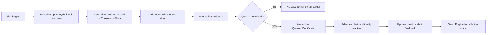

# Epochs, fork choice, QCs, and finality

This page documents how 420 Integrated advances consensus from slots to epochs, collects attestations, forms quorum certificates, tracks head/safe/finalized consensus state, and communicates finalized fork-choice state to the execution client.

The current consensus core uses fixed consensus objects, BLS-compatible quorum certification, the threshold `floor(2N/3)+1`, and one-block chained finality. The canonical implementation notes are `docs/STEP-4.3-CONSENSUS-CERTIFICATION.md` and `docs/STEP-4.4-COMMITTEE-SIMULATION.md`.

## Time hierarchy

The current bounded-validator consensus schedule is organized as:

| Unit | Current size |
| --- | ---: |
| slot | 12 seconds target |
| epoch | 420 slots/blocks |
| rotation | 42 epochs = 17,640 slots |

A missed slot does not create an empty execution block and does not itself advance execution block height. Consensus slot number and execution block number therefore must not be treated as permanently interchangeable counters.

Epochs provide a bounded accounting and coordination interval. Rotation boundaries are the points at which the finalized committee and proposer schedule may change under DOC-4.3.

## Consensus objects

The consensus certification layer defines canonical fixed-size objects including:

- `Checkpoint`;
- `AttestationData`;
- `Attestation`;
- `QuorumCertificate`;
- `ConsensusBlock`.

`ConsensusBlock` binds a consensus proposal to the execution payload hash selected through the Engine API boundary. A validator does not attest to an abstract slot alone; it attests to the canonical consensus target and execution payload commitment identified by the attestation data.

Signing roots are domain separated. Production BLS uses the encoded `blst` adapter in minimal-public-key mode with 48-byte public keys and 96-byte signatures. Test doubles may exercise the QC/finality interface in qualification, but they are not a production cryptographic substitute.

## Proposal to certification flow

The normal path is:



A proposer signature does not by itself certify or finalize a block. Certification requires a valid quorum certificate over the intended target.

## Attestations

For a target consensus block, the attestation collector accepts at most one valid attestation per committee seat for that target.

The collector must reject or exclude:

- duplicate attestations from the same seat for the same target;
- attestations for the wrong target;
- signatures that fail verification;
- attestations from identities outside the relevant committee/seat set;
- conflicting messages prohibited by consensus safety rules.

Attestation validity is a consensus property. An RPC response, indexer record, Explorer page, or execution receipt cannot manufacture consensus participation.

## Quorum threshold

The current quorum threshold is:

```text
quorum(N) = floor(2N / 3) + 1
```

Examples for the stable committee tiers are:

| Active validators | QC threshold |
| ---: | ---: |
| 15 | 11 |
| 18 | 13 |
| 21 | 15 |
| 24 | 17 |
| 27 | 19 |
| 30 | 21 |

Transitional committee sizes during an authorized resize use the same formula against the actual finalized active committee for that rotation.

A QC must not be assembled merely because a local node observed many messages. The signer set, committee context, target, aggregate signature, and quorum threshold must all validate under the canonical consensus rules.

## QuorumCertificate structure

The current QC path records enough information to prove which committee seats certified a target, including:

- target consensus metadata;
- signer bitmap / seat participation;
- aggregate signature through the consensus signature-aggregation interface;
- committee/quorum context required for verification.

The signer bitmap prevents an aggregate signature from becoming an opaque assertion about participation. Verification can determine which seats were represented and whether the count satisfies the threshold.

## Chained finality

The current consensus core implements a **one-block chained finality** rule.

Conceptually:

1. a block becomes the current certified/head candidate when its QC is accepted;
2. certification of a valid child supplies the chained evidence required to advance finality for the parent under the frozen rule;
3. consensus tracks distinct `head`, `safe`, and `finalized` positions;
4. only the consensus finality tracker may advance the canonical finalized checkpoint.

Finalization is therefore not inferred from elapsed time, transaction depth in a UI, or execution-client optimism.

The exact safety rules around conflicting votes, equivocation, lock/unlock behavior, and safety halt are treated as consensus safety responsibilities and are documented further in DOC-4.6 and DOC-4.7.

## Head, safe, and finalized

The consensus client maintains three related but distinct views:

### Head

`head` is the current consensus-preferred tip used for continuing canonical consensus work.

It may advance before older blocks become finalized. Operators and applications must not equate `head` with irreversible state.

### Safe

`safe` represents consensus state with stronger certification than an unqualified head and is mapped into the execution client's safe-block field where the current finality tracker allows it.

### Finalized

`finalized` is the checkpoint that the consensus finality rule has made irreversible absent a consensus-safety failure outside normal operation.

Execution, indexers, bridges, or applications that require irreversible state should use the finalized boundary appropriate to their trust model rather than inventing their own confirmation count.

## Fork choice

Consensus owns fork choice. `node420` executes payloads and maintains EVM state, but it does not independently choose which competing consensus history should become canonical.

The consensus client translates its current state into Engine API fork-choice inputs:

- head execution payload hash;
- safe execution payload hash;
- finalized execution payload hash.

That mapping is sent across the private JWT-authenticated Engine API boundary using the supported `engine_forkchoiceUpdatedV3` path.

Execution may reject an invalid payload or invalid fork-choice request, but an execution client must not silently substitute an unrelated head because local transaction activity, RPC traffic, or operator preference disagrees with finalized consensus.

## Execution-payload binding

A consensus proposal binds to a specific execution payload hash.

This prevents a QC over one consensus block from being reused as authorization for a different execution payload. Validators must validate the proposal/attestation target they sign, including the execution commitment carried by the consensus block.

If the execution payload is invalid, consensus must not certify it as though execution validity were merely an application-level concern.

## Reorganizations

Before finality, competing certified or partially certified branches may require the consensus head to change according to the canonical fork-choice rules.

A pre-finality reorganization may cause execution and derived services to roll back non-finalized state. Therefore:

- Wallet/application displays should distinguish pending/canonical/finalized states;
- 420Indexer must be able to roll back and replay non-finalized projections;
- Explorer/Search/Analytics must treat derived head state as revisable;
- bridges and other high-trust consumers should use their specified finalized-state requirement.

A normal fork-choice change must never rewrite a finalized checkpoint.

If a node observes evidence that would require two conflicting finalized histories, normal progression must stop and the safety/recovery path in DOC-4.6/DOC-4.7 applies.

## Missing quorum

If the required threshold is not reached:

- no valid QC is produced for that target;
- the target must not be treated as certified merely because a majority below quorum agreed;
- the finality tracker must not advance through that target;
- execution fork choice must not claim finalized progress unsupported by consensus evidence.

For a 15-validator committee, 10 attestations are insufficient and 11 are QC-eligible, assuming every attestation and signer is otherwise valid.

Liveness may pause while safety is preserved. The protocol must not lower the QC threshold ad hoc to recover from an outage.

## Duplicate and conflicting participation

The attestation collector's one-attestation-per-seat behavior prevents duplicate messages from inflating quorum.

Local slashing protection additionally refuses conflicting proposals/attestations for a slot. Network-level evidence of equivocation is handled by the safety/slashing layer rather than resolved by counting both conflicting signatures toward progress.

A validator's repeated identical request may be idempotent; a conflicting root for the same protected duty must fail closed.

## Persistence and restart

Consensus state needed to recover fork choice safely must be persisted independently from derived application/indexer state.

After restart, `fourtwentyd` must recover enough canonical state to reconstruct or verify:

- current committee context;
- slot/epoch/rotation position;
- latest accepted QC;
- head/safe/finalized checkpoints;
- execution payload bindings;
- local signing/slashing-protection history required to prevent conflicting signatures.

A restart must not derive finality from wall-clock time or from the execution client's current head alone.

## Consensus-to-execution boundary

The finality pipeline and EVM state transition remain separate responsibilities:

| Concern | Canonical authority |
| --- | --- |
| committee/seat set | consensus |
| proposal authorization | consensus |
| attestation validity | consensus |
| QC threshold and certification | consensus |
| head/safe/finalized consensus state | consensus |
| execution payload validity | execution |
| EVM state root/receipts/logs | execution |
| Engine fork-choice request | consensus to execution |
| derived finalized projection | Indexer/Explorer after canonical sources |

Neither side may manufacture the other's authority.

## Finality invariants

- **FIN-001** — a proposal alone must never be treated as quorum-certified.
- **FIN-002** — QC eligibility must use `floor(2N/3)+1` against the actual finalized committee for the relevant rotation.
- **FIN-003** — duplicate attestations from one seat must not increase quorum weight.
- **FIN-004** — a QC must be bound to one canonical target and its execution-payload commitment.
- **FIN-005** — only valid committee members/seats may contribute to the QC for that committee context.
- **FIN-006** — `head`, `safe`, and `finalized` must remain distinct consensus concepts; interfaces must not silently collapse them.
- **FIN-007** — normal fork choice may reorganize non-finalized history but must not rewrite finalized consensus state.
- **FIN-008** — execution fork-choice state must be derived from consensus head/safe/finalized decisions, not local RPC/operator preference.
- **FIN-009** — quorum loss must stop certification/finality progress rather than weaken the threshold.
- **FIN-010** — restart recovery must restore canonical QC/finality/signing state before new safety-sensitive duties resume.
- **FIN-011** — conflicting finalized histories must trigger safety handling rather than automatic continuation.
- **FIN-012** — derived services must remain subordinate to canonical consensus and execution state and must tolerate pre-finality reorgs.

## Failure and recovery behavior

### Invalid execution payload

Do not certify it. The consensus proposal and execution validity boundary must fail closed.

### Invalid or insufficient QC

Do not advance certification/finality. A UI or peer assertion cannot substitute for QC verification.

### Engine API unavailable

Consensus cannot safely claim an execution fork-choice update was applied. Operators must restore the private authenticated Engine boundary and reconcile the execution head with canonical consensus before resuming normal production.

### Consensus state disagreement after restart

Use persisted canonical consensus data and verified QCs, then reconcile against execution payload hashes. Do not choose whichever local database appears newest.

### Conflicting finality evidence

Enter the safety path. Preserve evidence, stop unsafe signing/progression, and follow DOC-4.6/DOC-4.7 recovery rules.

## Relationship to the remaining DOC-4 pages

- [Consensus overview](consensus-overview.md) defines the whole consensus authority model.
- [Validator lifecycle](validator-lifecycle.md) defines which validators may participate.
- [Proposer selection, cohorts, and rotation](proposer-selection-cohorts-rotation.md) defines who may propose each slot and how committee context changes.
- DOC-4.5 defines issuance/reward effects of successful proposer and attestation participation.
- DOC-4.6 defines equivocation, slashable evidence, and signing safety.
- DOC-4.7 defines quorum-loss, partition, Engine-outage, restart, and operator recovery procedures.

## Implementation references

- `docs/STEP-4.3-CONSENSUS-CERTIFICATION.md`
- `docs/STEP-4.4-COMMITTEE-SIMULATION.md`
- `config/protocol.json`
- `consensus/`
- `consensus/engine/`
- `consensus/storage/`
