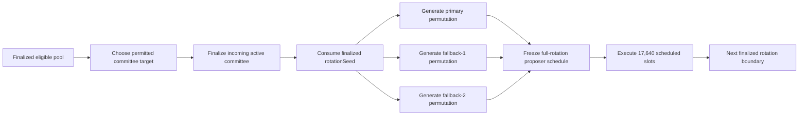

# Proposer selection, cohorts, and rotation

This page documents how 420 Integrated converts the finalized active validator set into deterministic proposer/fallback schedules and how the active committee changes across rotations. It covers equal-weight scheduling, domain-separated proposer permutations, committee tiers, age cohorts, committee migration, ejection handling, fairness, and anti-flapping.

The current frozen proposer-selection rules are defined by `config/protocol.json` and `docs/STEP-3-DECISION-03-PROPOSER-SELECTION.md`. Validator eligibility and tenure are documented separately in [Validator lifecycle](validator-lifecycle.md).

## Scheduling model at a glance

At every finalized rotation boundary, consensus performs the following high-level sequence:



A normal fault inside the rotation does not regenerate the schedule. The next rotation boundary is the ordinary point where committee membership and proposer scheduling are recomputed.

## Equal proposer weight

During the bounded-validator phase:

```text
one active validator = one proposer scheduling unit
```

Proposer selection is deliberately **not stake weighted**.

The following do not increase proposer probability:

- bonding more than the required effective validator bond;
- replacing protocol-owned validator credit with more participant-owned collateral;
- holding more liquid `$420`;
- governance holdings;
- application reputation or user count;
- Wallet/account balance outside the validator bond.

A fully self-funded validator and a validator using the qualified 21k/21k matched-credit structure receive the same proposer scheduling weight when both are active.

## Rotation scope

A proposer schedule is generated once per rotation.

The current rotation contains:

- **42 epochs**;
- **420 slots per epoch**;
- **17,640 slots per rotation**;
- a target slot interval of **12 seconds**.

At the incoming rotation boundary, consensus freezes the schedule for the complete rotation. There is no normal mid-rotation reshuffle.

This protects determinism and prevents ordinary faults, fallback success, or operator behavior from becoming a mechanism for repeatedly drawing a new proposer schedule.

## Inputs to schedule generation

The proposer scheduler consumes only finalized consensus inputs for the incoming rotation:

1. the finalized active committee;
2. its canonical validator ordering;
3. the finalized `rotationSeed`;
4. the rotation index/context;
5. persisted fairness state for validators that remain continuously active.

A local node must not invent or substitute any of these inputs from an unfinalized view, a stale indexer, wall-clock state, or operator configuration.

## Domain-separated proposer permutations

Three independent deterministic proposer schedules are derived from the same finalized rotation seed using separate domains:

- `420/primary`
- `420/fallback1`
- `420/fallback2`

Conceptually:

```text
primarySeed   = H(rotationSeed || "420/primary")
fallback1Seed = H(rotationSeed || "420/fallback1")
fallback2Seed = H(rotationSeed || "420/fallback2")
```

Each domain drives a deterministic cryptographic shuffle of the same canonical active-validator set.

Domain separation prevents a single permutation from being reused directly for every proposer rank and makes the primary/fallback schedules independently derived while remaining reproducible from the same finalized consensus seed.

## Distinct proposers within a slot

Each slot authorizes at most three proposer identities:

1. primary;
2. fallback #1;
3. fallback #2.

All three identities must be distinct.

If a fallback permutation produces an identity already assigned to a higher-ranked proposer for that slot, the scheduler advances deterministically through the relevant fallback permutation until it finds a distinct eligible identity.

No operator discretion is involved in resolving these collisions.

## Slot windows

The proposer ranks map to the frozen 12-second slot timing model:

| Rank | Authorized proposal window |
| --- | --- |
| primary | seconds 0–3 |
| fallback #1 | seconds 4–7 |
| fallback #2 | seconds 8–11 |

The propagation intervals between windows are part of the slot-timing design. A proposal outside the proposer rank/window authorized for that slot is invalid under the current protocol rules.

A successful fallback receives the full proposer reward for that block. Fallback success does not remove or shift any future primary assignments already scheduled for that validator.

## Missed slots

If no authorized proposer successfully produces an accepted block during the slot:

- the slot is missed;
- no block is created for that slot;
- block height does not advance merely because wall-clock slot time elapsed;
- the next scheduled slot proceeds using the frozen rotation schedule.

A missed primary alone is not a principal-slashing event under the genesis rules. Reward non-issuance and operational-readiness consequences are documented in later DOC-4 pages.

## Fairness objective

The scheduler distributes **scheduled opportunities** as evenly as mathematically possible across the active committee.

Fairness is measured using assigned proposer opportunities rather than successful blocks. Validators do not receive compensating future slots because they were offline or failed an assigned duty.

For a 17,640-slot rotation:

| Active validators | Exact primary assignments per validator where divisible |
| ---: | ---: |
| 15 | 1,176 |
| 18 | 980 |
| 21 | 840 |
| 24 | 735 |
| 27 | 653 remainder 9 |
| 30 | 588 |

At 27 validators, nine unavoidable extra primary assignments exist. Deterministic fairness debt carries those remainder obligations across rotations for validators that remain active so the same identities are not repeatedly favored.

Equivalent fairness accounting applies to fallback assignments.

## Fairness state and validator continuity

Fairness state belongs to the active scheduling context, not to economic stake.

For a validator that remains active across consecutive rotations, deterministic fairness debt can carry forward.

A validator that rotates out stops accumulating active-schedule fairness state. Under the current testnet scheduling specification, reactivation resets the scheduling debt by default unless the qualified implementation explicitly preserves a compatible historical debt mechanism.

Fairness accounting must never override:

- validator eligibility;
- scheduled lifecycle exit;
- a safety ejection;
- distinct-proposer requirements;
- the canonical active committee for the rotation.

## Committee size tiers

The bounded-validator protocol uses stable active-committee tiers:

| Eligible-pool threshold | Stable active committee |
| ---: | ---: |
| 60 | 15 |
| 72 | 18 |
| 84 | 21 |
| 96 | 24 |
| 108 | 27 |
| 120 | 30 |

The active target is selected from the permitted tiers rather than changing one validator at a time in response to every small eligible-pool fluctuation.

The largest permitted tier whose threshold has satisfied the anti-flapping persistence rule becomes the target, subject to the safety reduction exception.

## Three-cohort model

Every stable active committee consists of exactly **three equal-sized age cohorts**.

One entire oldest cohort rotates out at each normal rotation boundary.

Stable cohort and replacement sizes are therefore:

| Active committee | Cohort size / normal rotation swap |
| ---: | ---: |
| 15 | 5 |
| 18 | 6 |
| 21 | 7 |
| 24 | 8 |
| 27 | 9 |
| 30 | 10 |

This structure produces the frozen three-rotation active tenure:

```text
scheduled_exit_rotation = activation_rotation + 3
```

Cohort labels describe age/order inside the current committee. The validator's actual tenure rule remains authoritative even during committee-size migration.

## Rotation boundary sequence

A normal rotation transition conceptually performs these steps:

1. finalize the outgoing rotation state;
2. snapshot the eligible validator pool;
3. update anti-flapping persistence counters;
4. determine the permitted incoming committee target;
5. age existing active cohorts;
6. remove validators whose scheduled three-rotation tenure completes;
7. apply finalized exclusions/ejections that affect incoming eligibility;
8. select the incoming cohort from the eligible pool using the canonical selection/randomness mechanism;
9. finalize the actual incoming active committee;
10. consume the finalized `rotationSeed`;
11. generate the primary and fallback schedules for that actual committee;
12. freeze those schedules until the next rotation boundary.

The exact internal implementation may combine steps, but the resulting consensus state must preserve the same authority and invariants.

## Anti-flapping

Committee scaling uses three-snapshot persistence to avoid repeatedly expanding and contracting from short-lived eligible-pool changes.

The measurement point is the eligible-validator-pool snapshot at each finalized rotation boundary.

For ordinary scaling:

- a higher target becomes effective only after the corresponding threshold has been satisfied for **three consecutive rotation-boundary snapshots**;
- a lower target likewise requires **three consecutive qualifying snapshots**;
- ordinary active-target changes do not happen mid-rotation.

This makes the active-set size stable enough for proposer scheduling, reward accounting, cohort tenure, and operational planning.

## Safety reduction exception

Anti-flapping must not force the protocol to pretend a committee can be filled when insufficient eligible validators remain.

If the currently scheduled active committee cannot be safely filled with eligible validators, consensus may reduce the active target immediately to the largest safe committee permitted by the eligibility rules.

This is a safety exception, not an ordinary governance/operator control and not a way to bypass lifecycle rules.

DOC-4.6 and DOC-4.7 document the safety and recovery implications in more detail.

## Adjacent-tier migration

Normal committee resizing proceeds only between adjacent stable tiers and takes **three rotations**.

The key invariant is that resizing must not shorten or lengthen an already-active validator's three-rotation tenure.

When expanding to the next tier, the size of each newly admitted cohort increases by one validator. Existing cohorts age out naturally.

Examples:

```text
15 -> 16 -> 17 -> 18
18 -> 19 -> 20 -> 21
21 -> 22 -> 23 -> 24
24 -> 25 -> 26 -> 27
27 -> 28 -> 29 -> 30
```

Contraction mirrors this pattern:

```text
30 -> 29 -> 28 -> 27
27 -> 26 -> 25 -> 24
24 -> 23 -> 22 -> 21
21 -> 20 -> 19 -> 18
18 -> 17 -> 16 -> 15
```

The transitional committee size is authoritative for that rotation even though it is not one of the stable target tiers.

A new proposer schedule is generated at each migration rotation boundary using the **actual finalized committee for that rotation**.

## Mid-migration reversal

Normal anti-flapping behavior does not permit a resize migration to reverse direction halfway through its three-rotation transition.

This prevents validator tenure and cohort aging from becoming unstable because of oscillating pool measurements.

A safety fallback may override ordinary migration behavior if required to preserve a fillable/safe committee. Such a safety action must remain consensus-determined and auditable.

## Ejection during a rotation

If a validator becomes ineligible or is forcibly ejected after the rotation schedule has been frozen:

- the current schedule is not regenerated;
- scheduled appearances for that identity are skipped;
- the ordinary fallback hierarchy remains in effect;
- future primary assignments for unrelated validators remain unchanged;
- the next rotation is scheduled from the new finalized committee.

This prevents ejection/slashing from being used as a mechanism to obtain a fresh random proposer schedule during the same rotation.

## Fallback success and schedule immutability

When fallback #1 or #2 successfully proposes:

- the successful fallback receives that slot's proposer treatment;
- the validator's later primary/fallback assignments remain unchanged;
- the future primary schedule is not recomputed;
- fairness is still measured from scheduled opportunities rather than successful blocks.

This separates liveness recovery from schedule manipulation.

## Committee and proposer authority boundaries

| Concern | Canonical authority |
| --- | --- |
| validator eligibility | consensus lifecycle state |
| committee target | consensus protocol rules at finalized rotation boundary |
| actual active committee | finalized consensus |
| cohort aging/tenure | consensus lifecycle/rotation state |
| proposer randomness seed | finalized consensus randomness |
| proposer/fallback schedule | deterministic consensus scheduler |
| slot proposer rank | frozen rotation schedule + slot timing rules |
| Wallet/Explorer/indexer view | derived projection only |
| validator bond balance | execution `ValidatorRegistry` custody |
| governance | no direct committee/proposer appointment authority |

Execution contracts may settle finalized committee/reward/slashing outcomes through qualified consensus-system calls, but they do not independently pick the active validator set or proposer order.

## Selection and rotation invariants

- **SCHED-001** — proposer scheduling weight is equal per active validator and must not be increased by excess stake or token holdings.
- **SCHED-002** — each rotation schedule must derive from the finalized incoming committee and finalized `rotationSeed`.
- **SCHED-003** — primary, fallback #1, and fallback #2 identities for a slot must be distinct.
- **SCHED-004** — ordinary proposer schedules must not reshuffle mid-rotation.
- **SCHED-005** — fallback success must not rewrite future scheduled proposer assignments.
- **SCHED-006** — ejection during a rotation must skip the affected identity rather than regenerate the remaining rotation schedule.
- **SCHED-007** — fairness is measured from scheduled opportunities, not successful proposals.
- **SCHED-008** — a stable committee must contain exactly three equal-sized age cohorts.
- **SCHED-009** — normal rotation removes one oldest cohort and must preserve each already-active validator's three-rotation tenure.
- **SCHED-010** — ordinary active-target scaling must use the permitted committee tiers and three finalized rotation-boundary persistence snapshots.
- **SCHED-011** — adjacent-tier migration must not shorten or lengthen existing validator tenure and must generate each rotation's schedule from the actual transitional committee.
- **SCHED-012** — governance, applications, Wallets, RPC providers, and derived services must not directly appoint proposers or rewrite canonical committee schedules.

## Failure and recovery behavior

### Rotation seed unavailable or not finalized

The incoming rotation schedule must fail closed. Consensus must not substitute local randomness, block hash, operator entropy, or an unfinalized seed.

### Nodes disagree on proposer schedule

Operators must treat this as a consensus-critical configuration/state disagreement. Before signing, nodes must reconcile the active committee, rotation index, canonical validator ordering, seed, scheduler implementation, and persisted fairness state.

### Eligible pool fluctuates near a threshold

The committee target remains unchanged until the three-snapshot persistence requirement is met. A single threshold crossing does not change the target.

### Active committee cannot be filled safely

The safety reduction exception may select the largest safe permitted committee. Recovery must preserve lifecycle evidence and must not let operators hand-pick replacements.

### Validator disappears mid-rotation

The frozen schedule remains. The affected proposer opportunities fall through the normal primary/fallback/missed-slot rules; no ordinary schedule regeneration occurs.

### Restart during migration

Persisted consensus state must recover the current migration direction, target tier, actual transitional committee, cohort ages, validator scheduled exits, fairness state, rotation seed, and frozen proposer schedule before signing resumes.

## Relationship to other consensus documentation

- [Consensus overview](consensus-overview.md) defines the consensus/execution authority split.
- [Validator lifecycle](validator-lifecycle.md) defines eligibility, activation, tenure, exit, cooldown, and withdrawal timing.
- DOC-4.4 defines the attestations, QCs, fork choice, and finality that make rotation-boundary inputs canonical.
- DOC-4.5 defines reward accounting for scheduled and successful duties.
- DOC-4.6 defines safety offenses and ejection/slashing behavior.
- DOC-4.7 defines recovery from quorum loss, partitions, persistent-state faults, and operator incidents.

## Implementation references

- `config/protocol.json`
- `docs/STEP-3-DECISION-03-PROPOSER-SELECTION.md`
- `docs/STEP-4.4-COMMITTEE-SIMULATION.md`
- `docs/PROTOCOL-v0.1.md`
- `consensus/` proposer, committee, validator, randomness, and scheduling implementation
- `simulations/committee15/`
