# Validator lifecycle

This page documents the canonical bonded-validator lifecycle for the bounded-validator genesis/testnet phase of 420 Integrated. It explains how an operator moves from registration to eligibility, activation, active service, scheduled exit, cooldown, withdrawal hold, and final exit, and where consensus authority ends and EVM collateral custody begins.

The frozen lifecycle and slashing specification is `docs/VALIDATOR-LIFECYCLE-SLASHING-v1.md`. Where this architectural page summarizes a lifecycle rule, that frozen specification and qualified implementation remain authoritative for exact protocol behavior.

## Lifecycle at a glance

```mermaid
stateDiagram-v2
    [*] --> Registered: registration + effective bond
    Registered --> ActivationDelay: registration finalized
    ActivationDelay --> Eligible: full delay + readiness + no exclusion
    Eligible --> Active: selected at finalized rotation boundary
    Active --> Active: three scheduled rotations
    Active --> Cooldown: scheduled term completes
    Active --> Suspended: readiness/safety action
    Active --> Ejected: terminal consensus safety action
    Eligible --> ExitPending: voluntary exit notice effective
    Active --> ExitPending: notice recorded; active term still completes
    Cooldown --> WithdrawalHold: cooldown / exit conditions satisfied
    ExitPending --> WithdrawalHold: notice + duty obligations satisfied
    Suspended --> Eligible: restored bond/readiness + re-entry rules
    Ejected --> WithdrawalHold: only if protocol permits post-ejection withdrawal
    WithdrawalHold --> Withdrawable: six-rotation slashability hold complete
    Withdrawable --> Exited: final withdrawal settled
    Exited --> [*]
```



The diagram is descriptive rather than an exhaustive enumeration of internal implementation status constants. Consensus and execution contracts may use more granular intermediate states, but they must preserve the lifecycle invariants on this page.

## Fixed timing

The current frozen timing model is:

| Lifecycle interval | Duration |
| --- | ---: |
| consensus epoch | 420 blocks |
| rotation | 42 epochs = 17,640 blocks |
| activation delay | 1 full rotation |
| active service term | 3 rotations = 52,920 blocks |
| normal cooldown | 3 rotations |
| voluntary-exit notice | 1 full rotation |
| post-duty withdrawal/slashability hold | 6 rotations = 105,840 blocks |

At the 12-second target slot interval, one scheduled three-rotation active term is approximately 7.35 days and the six-rotation post-duty slashability hold is approximately 14.7 days. Consensus progression is defined by canonical protocol state and finalized boundaries, not by wall-clock estimates alone.

## Registration is not eligibility

A wallet address, node process, deposited balance, or Registry entry by itself does not make a validator eligible.

A validator becomes eligible only after all required conditions are simultaneously satisfied, including:

- a complete effective bond of **42,000 `$420`**;
- a valid and unique validator/BLS key under the consensus key rules;
- finalized registration and bond state;
- completion of the full activation delay;
- readiness and operational qualification;
- no effective voluntary exit;
- no active exclusion, suspension, or ejection condition;
- any other current consensus eligibility checks.

The eligible-validator pool is therefore a consensus-qualified set, not a count of registered wallets.

## Bond models

`ValidatorRegistry` is the canonical native-`$420` bond vault for the bounded-validator phase. Bond accounting must correspond to native `$420` actually held by the registry; synthetic or merely declared collateral does not satisfy the effective-bond requirement.

### Self-funded validator

A self-funded validator supplies the full **42,000 `$420`** effective bond as participant-owned collateral.

### Qualified community-credit validator

A qualified early validator may use the frozen matched-credit structure:

- **21,000 `$420`** participant-owned collateral; and
- **21,000 `$420`** protocol-owned validator credit supplied through `CommunityValidatorReserve`.

Protocol-owned credit remains protocol property. It provides effective collateral but does not become liquid validator property, voting weight, or transferable stake.

Assigned credit must be designated to the validator identity/beneficiary and actually funded into the canonical bond vault before registration can complete.

## Collateral conservation

The bond vault must preserve actual-custody conservation:

```text
ValidatorRegistry.balance >= totalOwnedCustody + totalProtocolCreditCustody
```

Pending funded protocol credit remains part of protocol-credit custody until consumed by registration or reclaimed under the reserve rules.

A validator must not enter eligibility, probationary re-entry, or active service with an effective bond below **42,000 `$420`**.

## Protocol-credit replacement

A matched-credit validator may replace protocol-owned credit with participant-owned collateral without increasing the effective bond above 42,000 `$420`.

For a replacement amount:

1. participant-owned collateral increases;
2. protocol-credit collateral decreases by the same amount;
3. the corresponding native `$420` returns to `CommunityValidatorReserve`;
4. the reserve releases the associated assignment/funding accounting.

This changes collateral ownership composition but does **not** increase proposer weight, voting weight, committee priority, or active-term length.

After a non-terminal slash, participant-owned collateral may be added to restore the effective bond, but restoration of bond alone does not guarantee immediate re-entry. Consensus readiness, lifecycle timing, exclusion state, and selection rules still apply.

## Activation delay

A newly registered validator waits one complete rotation after registration/bond finalization before it can become eligible for selection.

The activation delay prevents a newly funded identity from appearing immediately in the active committee and provides a finalized boundary for:

- bond confirmation;
- validator-key uniqueness checks;
- readiness qualification;
- registry/consensus-state reconciliation;
- operator configuration checks;
- exclusion or safety review where required.

Completion of the delay makes the validator **eligible**, not automatically active.

## Bounded-validator handoff

The bonded-validator handoff cannot occur before block **4,200** and requires at least **60 eligible validators**.

Those requirements are separate:

- reaching block 4,200 without a sufficient eligible pool is not enough;
- reaching 60 registrations is not enough if some registrations are not consensus-eligible;
- governance cannot manufacture the eligible count by assigning labels or protocol credit without the complete lifecycle requirements.

The handoff changes how active committees are sourced; it does not transfer consensus selection authority to governance.

## Selection into active service

Eligible validators enter the active committee only through the canonical consensus selection/rotation process at a finalized rotation boundary.

The current model uses stable committee tiers of 15, 18, 21, 24, 27, and 30 validators. Each stable committee contains exactly three age cohorts. Newly activated validators join through the cohort admitted for that rotation.

DOC-4.3 documents the deterministic selection, cohort, resizing, and anti-flapping mechanics in detail.

## Active tenure

Once activated, a validator receives a scheduled service term of exactly **three rotations**.

The canonical tenure rule is:

```text
scheduled_exit_rotation = activation_rotation + 3
```

Committee resizing does not shorten or lengthen an already-active validator's scheduled tenure. During an adjacent-tier migration, newly admitted cohort size changes while existing cohorts continue aging out naturally.

An active validator is expected to perform all assigned consensus duties during its scheduled term, including proposer/fallback duties, attestations, QC participation, and required safety/recovery signaling.

## Voluntary exit

A validator may submit a voluntary-exit notice, but the current protocol requires **one full rotation of notice**.

An active validator cannot use voluntary exit to abandon the middle of its scheduled three-rotation term. If notice is submitted while active:

- the notice may be recorded immediately;
- scheduled consensus duties continue until the active term completes;
- withdrawal timing cannot begin until both the notice requirement and active-term obligation have been satisfied.

This prevents an operator from selectively leaving after learning future duty assignments or during adverse network conditions.

## Normal cooldown

After a normal active service term, the validator enters a **three-rotation cooldown**.

Cooldown separates consecutive active service periods and supports the cohort-rotation design by preventing immediate churn back into the next active committee.

Cooldown is distinct from the post-duty slashability/withdrawal hold. Completing normal cooldown does not erase liability for provable safety faults committed during prior service.

## Suspension and ejection

Consensus may remove a validator from current duty eligibility when readiness or safety conditions require it.

### Suspension

Suspension is a safety/readiness state that may be recoverable. Examples can include prolonged operational failure or a non-terminal safety action.

A suspended validator does not regain active eligibility merely because its node comes back online. Re-entry may require:

- resolution of the triggering condition;
- restoration of the full effective bond after a non-terminal slash;
- readiness qualification;
- completion of applicable lifecycle delay/cooldown requirements;
- selection through a later canonical committee transition.

### Ejection

Ejection removes the validator from active scheduling according to the consensus safety rules. The proposer schedule treats an ejected scheduled identity as unavailable and skips it according to the frozen schedule behavior; ejection does not cause a mid-rotation reshuffle of the future primary schedule.

Terminal safety faults can also affect whether/when remaining collateral becomes withdrawable. A pending voluntary exit cannot be used to escape slashability for an offense committed while the validator was responsible for consensus safety.

DOC-4.6 defines the safety offenses, evidence requirements, principal-slash ceilings, and ejection consequences.

## Availability faults versus safety faults

The genesis lifecycle deliberately distinguishes ordinary availability failure from cryptographically provable safety violations.

Ordinary inactivity is not itself a principal-slashing offense:

- a missed proposer duty loses the applicable proposer reward;
- missed participation loses that validator's participation reward;
- sustained downtime may lead to suspension/ejection under readiness rules;
- principal is not confiscated merely because a validator is offline.

Safety faults such as double proposals, double votes, conflicting votes, invalid signed consensus messages, or conflicting finalized history are handled through the slashing/safety system.

## Post-duty slashability hold

After duty obligations are complete, a validator remains subject to a **six-rotation** post-duty withdrawal/slashability hold.

The hold exists so evidence relating to the validator's prior active service can be finalized and adjudicated before participant-owned collateral leaves the canonical bond vault.

During this hold:

- the validator is not free to withdraw participant-owned bond merely because it stopped active service;
- remaining protocol credit is still protocol-owned and locked to the lifecycle;
- valid principal-slash evidence may still be applied;
- a previously requested exit does not override safety adjudication.

## Final withdrawal

Only after consensus marks the validator `WITHDRAWABLE` following the complete slashability hold may final collateral settlement occur.

The final settlement rules are:

1. remaining participant-owned collateral is paid only to the registered withdrawal address;
2. remaining protocol-owned validator credit returns to `CommunityValidatorReserve`;
3. the validator becomes `EXITED`;
4. protocol credit is never paid to the validator or withdrawal address.

After final exit, the owner's active registration slot may be available for a later registration subject to current rules, but validator/BLS key reuse remains prohibited where the frozen specification forbids it.

## Key and signing boundaries

Consensus validator authority is distinct from the Wallet/dApp account model.

The implementation architecture requires a remote signer and local slashing protection for production validator operation. Validator signing keys must not be treated as ordinary application session keys.

A dApp, Wallet permission, delegated smart-account capability, or governance role must not silently acquire validator signing authority.

At genesis there is also no public delegated-validator pool and no stake-weighted delegation mechanism. The validator bond secures validator duties; it does not create transferable governance power.

## Consensus versus execution authority

The lifecycle deliberately splits responsibilities:

| Concern | Canonical authority |
| --- | --- |
| duty performance | `fourtwentyd` / consensus |
| eligible pool | consensus |
| active committee membership | consensus |
| activation/rotation outcome | consensus |
| safety-fault proof/adjudication | consensus |
| slash correlation tier | finalized consensus |
| native `$420` bond custody | `ValidatorRegistry` |
| owned-bond/protocol-credit accounting | `ValidatorRegistry` |
| protocol-credit reserve custody/assignment | `CommunityValidatorReserve` |
| final collateral transfer | execution after qualified consensus lifecycle outcome |

Execution contracts validate and settle qualified finalized outcomes; they do not independently choose committee members, fabricate consensus evidence, or reinterpret validator performance.

## Governance boundary

Governance may administer permitted qualification/assignment processes for community validator credit and may participate in the one-time genesis binding of consensus-system authority where specified.

Governance must not:

- directly appoint itself or another identity to the active committee;
- bypass eligibility or activation delay;
- rewrite a finalized committee outcome;
- fabricate a slash or reward;
- invoke consensus-owned validator-state transitions after the immutable consensus-system binding is established.

## Lifecycle invariants

- **VAL-001** — registration alone must never count as consensus eligibility.
- **VAL-002** — active eligibility requires a fully funded 42,000-`$420` effective bond plus all consensus readiness/key/lifecycle checks.
- **VAL-003** — validator collateral accounting must correspond to actual native `$420` held in the canonical bond vault.
- **VAL-004** — protocol-owned validator credit must never become liquid validator property, delegation weight, or governance power.
- **VAL-005** — a newly registered validator must complete the full activation delay before becoming eligible.
- **VAL-006** — active tenure is three rotations; ordinary committee resizing must not shorten or lengthen an already-active validator's scheduled tenure.
- **VAL-007** — voluntary exit must not permit an active validator to abandon the middle of its scheduled term.
- **VAL-008** — completion of active service must not eliminate slashability for evidence arising from that service.
- **VAL-009** — participant-owned collateral must not be released before the complete post-duty withdrawal/slashability hold and canonical `WITHDRAWABLE` transition.
- **VAL-010** — execution/governance surfaces must not independently manufacture eligibility, committee membership, safety evidence, or consensus lifecycle outcomes.
- **VAL-011** — suspension/ejection must not silently regenerate the remainder of the current rotation's proposer schedule.
- **VAL-012** — validator signing authority must remain separate from dApp/session-key convenience and protected by production signing/slashing controls.

## Failure and recovery behavior

### Bond incomplete or inconsistent

Registration/eligibility must fail closed. The validator must not become active until canonical custody and lifecycle state agree on the complete effective bond.

### Duplicate or invalid validator key

Eligibility must fail closed. Validator identity/key uniqueness is a consensus safety property.

### Node not ready after activation delay

Elapsed time alone does not force admission. The identity remains outside active selection until readiness requirements are satisfied.

### Validator fails during active service

Consensus applies fallback proposer, participation, readiness, suspension, and safety rules. The validator cannot self-authorize a replacement identity into its seat.

### Registry or consensus projection disagreement

Operators must stop value/safety-sensitive lifecycle actions and reconcile against finalized consensus plus canonical execution custody. A derived UI, indexer, or stale local state must not decide eligibility or withdrawal.

### Restart during lifecycle transition

Persisted consensus state must recover activation rotation, scheduled exit, committee membership, safety state, and finalized transition information before duties resume. Recovery must not infer a new lifecycle merely from local wall-clock time.

## Relationship to the remaining DOC-4 pages

- [Consensus overview](consensus-overview.md) defines the whole consensus authority model.
- DOC-4.3 defines how eligible validators enter and leave cohorts and how proposer schedules are generated.
- DOC-4.4 defines attestation/QC/finality state that makes lifecycle boundaries canonical.
- DOC-4.5 defines reward issuance while active.
- DOC-4.6 defines slashable evidence, penalty ceilings, and safety-driven suspension/ejection.
- DOC-4.7 defines operator recovery, quorum loss, persistent state, remote signing, and safety-halt procedures.

## Implementation references

- `docs/VALIDATOR-LIFECYCLE-SLASHING-v1.md`
- `config/protocol.json`
- `consensus/`
- `contracts/` validator/reward/reserve implementations and tests
- `docs/STEP-4.3-CONSENSUS-CERTIFICATION.md`
