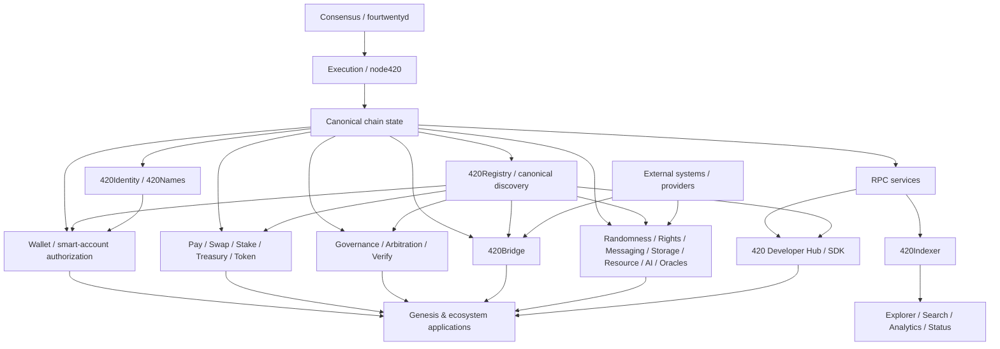
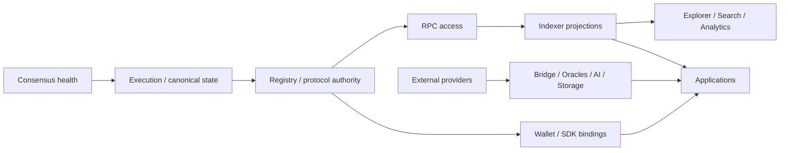

# System dependency map

This page defines the top-level dependency structure for 420 Integrated. It distinguishes **authoritative dependencies**, **derived dependencies**, **replaceable service dependencies**, and **external trust dependencies** so that failures and authority do not blur across layers.

The map is intentionally directional: if component **A depends on B**, then A may require B's state, interface, or guarantees to operate. The reverse relationship is not implied.

## Dependency classes

### Authoritative dependency

The dependent component requires canonical state or a canonical rule owned by the dependency.

Examples:

- Wallet depends on canonical chain state, account state, Identity, Registry, and smart-account authorization rules;
- Swap depends on canonical balances, settlement rules, and registered assets/contracts;
- Governance depends on canonical voting, proposal, treasury, and execution state;
- Bridge settlement depends on canonical bridge state plus verified external attestations.

If an authoritative dependency is unavailable or inconsistent, affected writes should fail closed.

### Derived dependency

A component consumes a projection of canonical state for usability, indexing, analytics, discovery, or performance.

Examples include 420Explorer, 420Search, 420Analytics, dashboards, status pages, and application caches consuming 420Indexer output.

Derived dependencies may become stale or unavailable without changing canonical state.

### Replaceable service dependency

The dependent component needs a service capability but should not depend permanently on one implementation or operator.

Examples include:

- RPC providers;
- indexers;
- storage gateways;
- AI compute providers;
- oracle providers;
- media delivery;
- relayers;
- notifications;
- external automation workers.

The protocol defines the required guarantee; providers remain replaceable unless an accepted architecture decision explicitly narrows that choice.

### External trust dependency

The system accepts information, proofs, or effects originating outside the 420 chain and must verify them before allowing canonical state transitions.

Examples include external-chain bridge proofs, oracle observations, reserve attestations, external outcomes, and off-chain computation results.

These dependencies cross a trust boundary and must be validated explicitly.

## Top-level dependency graph

The diagram shows dependency direction, not authority ownership. For example, applications depend on Wallet and protocols, but applications do not acquire authority over them.

## Canonical base dependencies

### Consensus → execution

Consensus orders and finalizes blocks. Execution applies deterministic state transitions to the canonical EVM-compatible state.

A consensus failure can halt new finality. It must not silently rewrite already-finalized application state outside the protocol's recovery rules.

### Execution → canonical state

Contracts, balances, registries, validator-relevant execution state, protocol state, and application-owned on-chain state derive from execution of finalized blocks.

Anything that claims canonical chain state ultimately depends on this layer.

## Registry and identity dependencies

### 420Registry

420Registry acts as a canonical discovery surface for protocol/application identities, registered components, compatible interfaces, deployments, and other explicitly registered objects.

Consumers may cache registry data, but must not promote an unregistered object to canonical status merely because a front end, SDK, or indexer displays it.

### 420Identity and 420Names

Identity and naming provide canonical references used by Wallet, permissions, discovery, messaging, applications, and human-facing presentation.

Applications may attach local metadata, but local metadata does not override canonical identity state.

## Wallet and authorization dependencies

420 Wallet and smart-account flows depend on:

1. chain identity and canonical execution state;
2. registered canonical wallet/authorization contracts;
3. account and capability state;
4. explicit signer/session authority;
5. compatible transaction and EntryPoint semantics where applicable.

Applications and SDKs depend **on** Wallet authority. Wallet authority must not depend on an application's willingness to behave correctly.

If application metadata, SDK state, or a runtime adapter disagrees with canonical authorization state, Wallet must fail closed.

## Economic protocol dependencies

Economic components such as 420Pay, 420Swap, staking, treasury, grants, launchpad, bridge settlement, games, and application economies depend on canonical asset identity and accounting state.

Critical economic dependencies include:

- native `$420` semantics;
- canonical asset or deployment identity;
- balances/allowances/custody state;
- settlement adapters and execution targets;
- fee and treasury rules;
- oracle data where a protocol explicitly requires it;
- replay protection and lifecycle state.

A convenience service must not become an accounting authority.

## Governance and dispute dependencies

Governance depends on canonical proposal, voting, authorization, timing, and execution state.

Arbitration and verification may supply bounded decisions or evidence to protocols that explicitly consume them. Neither should become an ambient superuser across unrelated protocols.

Governance may control defined upgrade or parameter paths, but component dependency graphs must document those powers explicitly.

## Bridge dependencies

420Bridge has two distinct dependency directions:

1. **inbound external trust** — proof/attestation sources describing another chain or external system;
2. **outbound canonical settlement** — 420 chain state recording accepted messages, wrapped assets, releases, or other bridge effects.

The bridge must validate external evidence before canonical settlement. External providers, relayers, or proof carriers cannot be treated as canonical merely because they delivered a message.

Bridge failure should isolate cross-chain operations rather than corrupt unrelated local protocols.

## Randomness dependencies

Protocols requiring randomness depend on the guarantee exposed by 420Randomness, not on an arbitrary provider implementation.

Provider-specific delivery may be replaceable, but applications must understand whether they require threshold randomness, VRF-backed results, commit-reveal, or another qualified mechanism.

If the required randomness guarantee is unavailable, dependent state transitions should stop or enter a documented fallback state rather than substitute weaker randomness silently.

## Oracle dependencies

The Oracle Interface Layer is provider-neutral.

Protocols may depend on external observations such as prices, proof-of-reserve, outcomes, automation triggers, API results, or off-chain computation. Those protocols must define:

- freshness requirements;
- quorum/provider requirements if any;
- accepted schemas;
- validation rules;
- stale-data behavior;
- fail-closed behavior.

Oracle providers are external dependencies, not protocol owners.

## Storage and resource dependencies

On-chain state should hold commitments, registries, entitlements, economics, proofs, or pointers where appropriate; bulk content may live in distributed/off-chain storage systems.

Applications depending on storage should distinguish:

- ownership/rights state;
- proof-of-storage or availability guarantees;
- content-addressed identity;
- gateway availability;
- replication/repair services;
- application caching.

Gateway failure must not redefine ownership or rights.

## AI compute dependencies

420AI separates on-chain job authority/economics from off-chain inference or compute execution.

On-chain dependencies may include job registration, routing, staking, escrow, payment, proof/SLA state, and provider qualification. Off-chain workers perform compute and return results under the defined protocol.

An AI provider outage should affect compute availability, not chain consensus or unrelated protocol authority.

## Messaging dependencies

420Town / messaging architecture separates on-chain membership, roles, permissions, subscriptions, treasuries, and entitlements from off-chain encrypted message transport/storage.

Transport providers can fail or be replaced without rewriting canonical membership or entitlement state.

## Indexer dependency rules

420Indexer is a shared projection layer.

It depends on chain/RPC data and produces normalized views consumed by Explorer, Search, Analytics, Developer Hub tooling, applications, and status surfaces.

Rules:

- Indexer state is not canonical chain state.
- Consumers must know when a read is projected rather than authoritative.
- Indexer data must be rebuildable from authoritative sources.
- Reorg/finality handling must be explicit.
- Indexer outage should degrade reads/search/discovery, not mutate canonical state.

## Explorer, Search, Analytics, and Status

These services depend primarily on Indexer projections plus canonical verification/reference data where necessary.

They are observability and discovery surfaces. They must never become transaction authority, custody authority, or a substitute for canonical registry state.

## Developer Hub dependencies

The Developer Hub and `@420/sdk` depend on:

- published network configuration;
- canonical contract/deployment catalogue;
- RPC interfaces;
- Wallet integration boundaries;
- indexer/query APIs where useful;
- public protocol schemas/events/errors.

Developer tooling must orchestrate canonical interfaces. It must not create hidden alternate authorization, deployment, or signing semantics.

## Application dependency rules

Applications may compose multiple protocols, but each dependency should be classified.

For every material dependency an application should know:

1. Is it authoritative, derived, replaceable, or external?
2. What happens if it is unavailable?
3. Can reads continue safely?
4. Must writes stop?
5. Can another provider be substituted?
6. Does substitution change trust assumptions?
7. How is recovery verified?

Applications should avoid circular authority—for example, an application registry entry may identify a game, but the game should not be able to redefine Registry authority.

## Failure-containment matrix

| Dependency failure | Expected impact | Must not do |
| --- | --- | --- |
| consensus/finality unavailable | halt or delay canonical progression | invent finality locally |
| RPC unavailable | fail over or pause client access | assume cached data is canonical indefinitely |
| Indexer unavailable | degrade projections/search/analytics | change balances, ownership, permissions, or settlement |
| Explorer/Search unavailable | reduce observability/discovery | block canonical protocol operation unless explicitly required |
| Wallet UI unavailable | prevent affected user signing UX | transfer signing authority to applications |
| storage gateway unavailable | reduce content retrieval | redefine content ownership/rights |
| AI worker unavailable | delay/fail AI jobs | affect consensus authority |
| oracle unavailable/stale | pause dependent transitions per protocol | guess values/outcomes |
| randomness unavailable | pause dependent transitions or documented fallback | silently use weaker randomness |
| bridge proof path unavailable | pause cross-chain settlement | mint/release from unverified messages |
| notification/status unavailable | reduce visibility | alter canonical protocol state |

## Cycles to avoid

The architecture should avoid dependency cycles that create ambiguous recovery or authority.

Problematic examples include:

- Registry requiring an application front end to determine whether Registry entries are canonical;
- Wallet requiring an application server to validate Wallet authority;
- Indexer output being used as the sole source from which the same Indexer reconstructs canonical state;
- Governance requiring an off-chain dashboard's private database to determine proposal execution eligibility;
- Bridge verification depending solely on the same relayer that financially benefits from acceptance.

Where cyclic operational dependencies cannot be eliminated, authority must still have a clear acyclic root.

## Dependency direction invariants

- **DEP-001** — canonical state must not depend on a derived projection of itself for validity.
- **DEP-002** — replaceable providers must not silently become protocol authority.
- **DEP-003** — application convenience layers must not become Wallet/signing authority.
- **DEP-004** — external trust inputs must be verified before canonical state transitions consume them.
- **DEP-005** — observability failures must not mutate protocol truth.
- **DEP-006** — dependency substitution must preserve or explicitly change documented trust guarantees.
- **DEP-007** — authoritative dependency failures should fail closed for affected writes.
- **DEP-008** — derived state must be rebuildable or independently verifiable from documented authoritative inputs.
- **DEP-009** — one protocol's administrative authority must not become ambient authority over unrelated protocols.
- **DEP-010** — recovery must establish a trusted dependency chain before writes resume.

## Recovery ordering

When multiple layers fail, recovery should proceed from authoritative roots outward:

Applications should not resume value-sensitive or authority-sensitive writes until their authoritative dependencies and required external guarantees are healthy.

## Relationship to DOC-2.5

This dependency map identifies **who depends on whom**. DOC-2.5 adds the complementary trust-boundary model: **what authority, custody, data, proofs, and failure assumptions cross those dependency edges**.

## Non-responsibilities

This page does not define exact deployment addresses, protocol-specific contract call graphs, API schemas, RPC methods, or operator failover procedures. Those belong to deeper protocol, infrastructure, developer, operator, and generated-reference documentation.
