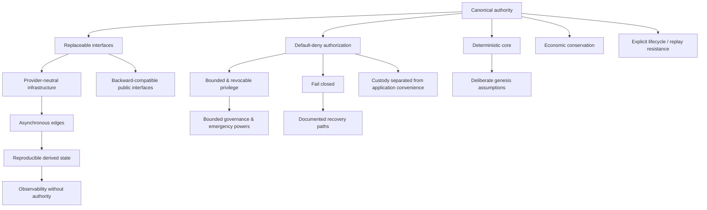

# System design principles

This page defines the architectural principles that guide 420 Integrated across the chain, consensus layer, canonical protocols, shared infrastructure, developer surfaces, and applications.

These principles are constraints on implementation choices. They do not replace component-specific invariants, protocol specifications, or Architecture Decision Records.

## 1. Canonical state lives at the authority layer

Balances, ownership, registrations, settlements, governance outcomes, validator state, protocol permissions, and other authoritative facts must be anchored in the chain or the canonical protocol that owns that domain.

Derived services such as 420Indexer, 420Explorer, 420Search, 420Analytics, application caches, dashboards, and recommendation systems may project that state for usability and performance, but they must not become a second source of truth.

Consequences:

- projections must be rebuildable from authoritative inputs;
- disagreement between a projection and canonical state is resolved in favor of canonical state;
- a front end cannot create legitimacy by displaying an unregistered or unauthorized object;
- caches and indexes may fail without changing balances, ownership, or protocol authority.

## 2. Interfaces are replaceable; authority is narrow

Public RPC endpoints, indexers, gateways, storage providers, AI providers, oracle providers, relayers, search engines, explorers, notification systems, and user interfaces are replaceable service surfaces.

They may transport, summarize, attest to, or render information, but they must not silently acquire authority over unrelated domains.

Examples:

- 420Bridge carries verified cross-chain attestations but does not grant arbitrary governance authority;
- 420AI providers execute jobs but receive no consensus privilege;
- 420Notifications reports events but cannot sign transactions for a user;
- 420AppStore may curate discovery, but registry state determines canonical application identity.

## 3. Default deny for privileged behavior

Security-sensitive actions are allowed only through explicit authority.

Wallet execution, capabilities, recovery, validator administration, protocol roles, treasury movement, governance execution, bridge operations, emergency controls, and application permissions should fail closed when authority is absent, stale, ambiguous, expired, revoked, or inconsistent.

Ambient privilege is treated as a design defect.

## 4. Authority must be explicit, bounded, and revocable

Every privileged component should be able to answer:

1. who may perform the action;
2. which exact actions are authorized;
3. against which resources or domains;
4. for how long;
5. under which preconditions;
6. how authority is revoked or rotated;
7. what evidence exists after execution.

Where practical, permissions should be capability-scoped rather than role-wide, time-bounded rather than permanent, and independently revocable.

## 5. Fail closed around value, identity, and external trust

If 420 Integrated cannot validate a value-sensitive, identity-sensitive, or cross-system claim, the system should reject or defer the action rather than guess.

This applies to cases such as:

- unknown chain identity;
- mismatched contract catalogues;
- expired or replayed authorizations;
- stale or missing oracle data;
- unverified bridge attestations;
- unavailable randomness guarantees;
- non-canonical wallet authority contracts;
- missing settlement adapters;
- incompatible protocol versions.

User experience may explain the failure, but it must not weaken the validation rule.

## 6. Shared infrastructure should compose through canonical interfaces

420 Integrated is designed as one ecosystem rather than a collection of isolated dApps.

Applications should discover and reuse canonical services through stable interfaces and registries wherever possible. Common examples include Wallet, Registry, Identity, Names, Pay, Swap, Rights, Messaging, Randomness, Notifications, storage, AI compute, and the 420 Interoperability Standard.

The objective is reuse without forcing applications to share a single front end.

## 7. Provider-neutral infrastructure

Where the chain depends on off-chain services, the protocol should define the guarantee that is required rather than permanently hard-code one commercial or first-party provider.

This principle applies to:

- oracle feeds and external outcomes;
- randomness providers;
- storage and gateways;
- AI compute;
- relayers and automation;
- external attestations;
- media delivery and other application infrastructure.

A provider may be preferred operationally without becoming protocol authority by default.

## 8. Deterministic core, asynchronous edges

Consensus and canonical protocol transitions should be deterministic from agreed inputs.

Off-chain work such as indexing, search, analytics, media delivery, AI inference, messaging transport, storage replication, and external data retrieval may be asynchronous and eventually consistent.

The architecture must keep those asynchronous edges from introducing ambiguous canonical outcomes.

## 9. Derived state must be reproducible or independently verifiable

If a service publishes derived information that materially affects user decisions, another implementation should be able to reproduce or verify the result from documented inputs where practical.

Examples include:

- explorer transaction status;
- verification results;
- validator and finality metrics;
- indexer resource views;
- analytics aggregates;
- bridge proof status;
- solvency or reserve proofs;
- generated contract catalogues.

Reproducibility reduces dependence on one operator and makes failures diagnosable.

## 10. Economic conservation before convenience

Payment, exchange, wagering, treasury, bridge, rewards, and fee systems must preserve accounting invariants before optimizing for UX or throughput.

Rounding, partial execution, refunds, split payments, sponsored gas, multi-step routing, retries, and asynchronous settlement must not create or destroy value outside the explicit economic rules of the protocol.

## 11. Replay resistance and explicit lifecycle state

Operations that move value or authority should have clear lifecycle state and replay protection.

The architecture should distinguish states such as proposed, authorized, pending, executable, executed, expired, cancelled, refunded, superseded, revoked, or finalized where those distinctions matter.

Identifiers, nonces, deadlines, epochs, domain separation, and one-time consumption rules should be used where necessary to prevent ambiguous re-execution.

## 12. Governance is not universal root authority

Governance may change parameters, upgrade defined components, administer treasury policy, or execute approved protocol actions, but governance should not automatically gain arbitrary custody or bypass every component's safety boundary.

Protocols should define which governance powers exist and which powers remain deliberately unavailable.

## 13. Emergency controls must be narrow

Emergency mechanisms are intended to contain damage, not provide a permanent administrative backdoor.

Preferred properties include:

- narrow scope;
- explicit triggering conditions;
- bounded duration where possible;
- auditability;
- separation from ordinary user custody;
- inability to silently rewrite unrelated canonical state;
- defined recovery or reactivation path.

## 14. Genesis assumptions are frozen deliberately

Not every implementation detail is a genesis invariant.

Components should be frozen only when network safety, interoperability, economics, identity, or authoritative discovery require a shared assumption at launch.

Other layers should remain replaceable or upgradeable under explicit compatibility rules.

## 15. Backward compatibility is a protocol concern

Changes to contracts, RPC, SDKs, events, errors, chain configuration, public schemas, or canonical service identities must consider existing consumers.

Material compatibility breaks require explicit versioning, migration guidance, and documentation. Silent semantic drift is not acceptable for public interfaces.

## 16. Security boundaries should match responsibility boundaries

A component should possess only the authority required to perform its declared responsibilities.

Examples:

- an indexer needs read access to chain data, not signing authority;
- a notification service needs subscription/event context, not wallet custody;
- an AI worker needs job inputs and payment settlement, not governance power;
- an explorer needs public state and verification data, not contract administration;
- a game server may coordinate off-chain gameplay without controlling canonical asset ownership unless the game architecture explicitly grants that role.

## 17. User custody remains distinct from application convenience

Applications may request transactions, capabilities, sessions, or smart-account operations, but user keys and authorization policy remain under Wallet/smart-account authority.

Developer tooling and application SDKs should orchestrate approved wallet flows rather than silently acquiring signing power.

## 18. Observability must not become authority

Status pages, telemetry, dashboards, logs, alerts, and analytics are essential for operation and incident response, but they report the system; they do not define its canonical state.

An observability outage should reduce visibility, not mutate protocol truth.

## 19. Recovery paths are part of the architecture

Important components must document what happens when dependencies are unavailable, inconsistent, delayed, or compromised.

Recovery behavior should identify:

- which operations stop;
- which reads remain safe;
- whether retries are idempotent;
- which state must be rebuilt;
- whether operator or governance action is required;
- how the system proves it has returned to a safe state.

## 20. Documentation is part of the public interface

For material external behavior, architecture and documentation must evolve with the implementation.

A code path can be technically complete while the release remains incomplete if users, developers, validators, or operators cannot determine how to use it safely and correctly.

## Design-principle map

## Relationship to later DOC-2 pages

These principles are applied concretely in the remaining DOC-2 architecture documents:

- **DOC-2.3 — Genesis architecture** identifies which components and assumptions exist at launch and why.
- **DOC-2.4 — Dependency map** defines authoritative, derived, replaceable, and external dependencies plus failure-containment and recovery ordering.
- **DOC-2.5 — Trust-boundary model** identifies where authority, custody, external trust, and failure isolation cross component boundaries.

## Non-responsibilities

This page does not define:

- chain execution semantics;
- consensus algorithms;
- individual protocol state machines;
- validator economics;
- exact governance thresholds;
- contract addresses;
- SDK method signatures;
- deployment procedures.

Those belong to DOC-3 onward, generated reference documentation, protocol specifications, and accepted ADRs.
