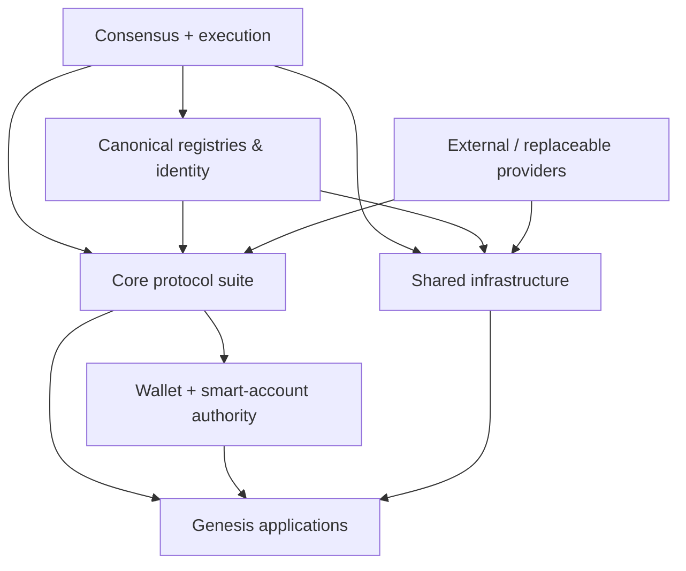
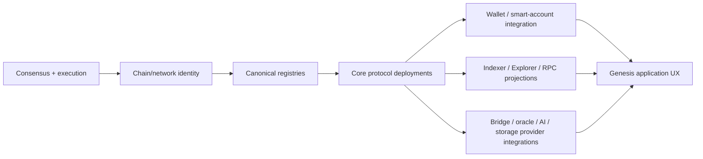

# Genesis architecture

This page defines the launch-time architecture of 420 Integrated: the components, shared assumptions, and canonical services that must exist for the network to operate coherently at genesis.

Genesis is intentionally narrower than the full ecosystem. A component belongs in genesis when the network requires a shared, authoritative assumption at launch for safety, identity, interoperability, economics, discovery, or core user access. Convenience features, optional applications, replaceable providers, and later ecosystem products do not become genesis requirements merely because they are useful.

## Genesis objectives

The genesis architecture must provide enough shared structure for the network to:

- produce and finalize blocks;
- execute EVM-compatible transactions;
- expose canonical chain identity and native `$420` economics;
- identify authoritative contracts and services;
- support user custody and transaction authorization;
- expose common identity, naming, registry, payment, swap, bridge, staking, governance, AI, attention, and status primitives;
- support canonical indexing and exploration surfaces without making them sources of truth;
- preserve explicit authority boundaries between on-chain state and off-chain service providers;
- allow later applications to integrate against stable interfaces instead of bespoke launch assumptions.

## Genesis layers

The dependency direction is intentional: higher layers depend on lower authoritative layers, while off-chain providers remain replaceable edges.

## 1. Consensus and execution

Genesis begins with the chain itself.

Required launch responsibilities include:

- block proposal and validation;
- finality and validator lifecycle rules;
- execution of EVM-compatible transactions;
- canonical account and contract state;
- gas and fee accounting;
- native `$420` balance accounting;
- chain identity and network configuration;
- deterministic state transition rules.

`fourtwentyd` and `node420` are implementation components around these responsibilities, but the architectural authority belongs to the consensus and execution rules rather than to one user interface or operational wrapper.

Detailed execution and consensus behavior is documented later in DOC-3 and DOC-4.

## 2. Canonical identity and discovery

A multi-application ecosystem requires shared answers to questions such as:

- which chain am I connected to;
- which contract is the canonical instance of a named protocol;
- which application or protocol identity is registered;
- which address, name, capability, deployment, or service endpoint is authoritative;
- which version of a public interface is expected.

Genesis therefore includes canonical discovery and identity surfaces such as:

- **420Registry** for authoritative ecosystem registration and discovery;
- **420Names** for canonical naming relationships;
- **420Identity** for identity-related protocol state;
- **420Verify** and related verification surfaces where protocol authenticity or deployment evidence must be checked;
- chain/network metadata used by Wallet, SDKs, Explorer, Indexer, and applications.

Derived catalogues may cache or package this information, but they must remain verifiable against canonical state.

## 3. Genesis protocol suite

The locked genesis application/protocol decision includes:

- **420 Wallet**;
- **420 Explorer**;
- **420 Registry**;
- **420 Names**;
- **420 Identity**;
- **420 Swap**;
- **420 Bridge**;
- **420 Stake**;
- **420 Governance**;
- **420 AI**;
- **420 Attention**;
- **420 Status**.

The faucet is testnet-only and is not a mainnet genesis application requirement.

Genesis inclusion means the network launches with a canonical integration contract, interface, or service expectation for the component. It does not mean every internal implementation detail is permanently frozen.

## 4. Wallet and smart-account authority

420 Wallet is the primary user authorization boundary at genesis.

The genesis architecture separates application intent from signing authority:

- applications may request transactions, capabilities, sessions, or smart-account operations;
- Wallet and smart-account components validate and authorize those operations;
- SDKs and Developer Hub tooling orchestrate approved flows but do not silently acquire private-key authority;
- capabilities, session keys, recovery, and smart-account policy remain explicit and bounded;
- chain mismatch, non-canonical authority contracts, stale permissions, or revoked capabilities fail closed.

This preserves user custody while still allowing applications to provide integrated workflows.

## 5. Economic primitives

Genesis must expose common economic infrastructure instead of forcing each application to invent its own settlement model.

Key launch primitives include:

- native `$420` transfer and fee behavior;
- 420Pay-style settlement and payment paths;
- 420Swap for canonical swap execution;
- 420Stake for validator/user staking semantics;
- 420Treasury and related shared-fund controls where required by launch policy;
- protocol-level fee, reward, refund, replay, and accounting invariants;
- bridge accounting for supported external assets.

Economic systems must preserve conservation rules before convenience. Partial execution, retries, sponsorship, refunds, bridge mint/burn or lock/release semantics, and multi-step settlement must not create ambiguous value ownership.

## 6. Governance and emergency control

420 Governance exists at genesis as a bounded protocol authority, not as a universal root account.

Genesis governance architecture should define:

- the domains governance may administer;
- proposal and execution boundaries;
- upgrade or parameter-change surfaces;
- treasury or protocol-management powers;
- emergency mechanisms and their scope;
- actions governance explicitly cannot perform.

Emergency controls must remain narrow, auditable, and separated from ordinary user custody.

## 7. Shared data and observation infrastructure

The network is usable only if applications and users can query it efficiently, but read infrastructure must not become canonical authority.

Genesis shared infrastructure includes or anticipates:

- **420Indexer** for normalized, queryable projections of chain/protocol state;
- **420Explorer** for human-facing inspection and verification;
- RPC access to execution and chain state;
- status and health surfaces;
- event and log consumption;
- application-facing APIs derived from canonical state.

If Indexer or Explorer state disagrees with chain state, the chain and canonical protocol state win. These services must be rebuildable from authoritative inputs.

## 8. Storage, resource, and gateway infrastructure

420 Integrated includes shared storage/resource architecture so later applications do not depend on one centralized provider.

Relevant launch architecture includes the canonical interfaces around:

- 420 Storage Proof Protocol;
- 420 Resource Protocol / resource-market concepts;
- provider/gateway discovery;
- integrity and proof metadata;
- replaceable storage and gateway operators.

Not every storage operator or gateway is a genesis authority. The protocol/interface contract is the shared assumption; individual providers remain replaceable.

## 9. AI compute

420 AI is a genesis component, but inference remains off-chain.

The launch architecture separates:

- on-chain registries, job routing, escrow/payment, staking/slashing, and service-level evidence;
- off-chain GPU/compute execution;
- provider-neutral worker participation;
- application consumption of completed AI jobs.

AI workers do not gain consensus, governance, wallet, or registry authority merely because they execute jobs.

## 10. Oracle interface layer

External facts cannot be made trustworthy merely by placing them in a transaction.

The genesis architecture therefore uses a provider-neutral Oracle Interface Layer for classes such as:

- price feeds;
- proof of reserves;
- randomness;
- external API outcomes;
- automation triggers;
- off-chain computation results.

Protocols should define validation, freshness, quorum, proof, or attestation requirements without permanently coupling the chain to one provider.

420Bridge carries attestations across the bridge boundary; it does not become general-purpose authority over unrelated external facts.

## 11. Messaging and off-chain transport

Where applications need messaging or large payload delivery, the genesis architecture distinguishes on-chain authorization/state from off-chain transport.

For example, 420Town-style architecture keeps membership, roles, permissions, subscriptions, treasuries, and entitlements on-chain while message transport and storage may remain off-chain.

The same separation applies more broadly: transport availability may affect usability, but it must not silently rewrite canonical permissions or ownership.

## 12. Application composition

Genesis applications are expected to compose shared protocol surfaces rather than duplicate them.

Examples:

- applications use Wallet for authorization rather than embedding their own custody layer;
- applications use Registry/Identity/Names for canonical discovery and identity;
- payments use shared settlement paths;
- randomness consumers use provider-neutral randomness interfaces;
- AI consumers use 420 AI job/settlement surfaces;
- storage consumers use shared resource/storage interfaces;
- apps publish events that Indexer/Explorer can project;
- applications expose documentation and stable deep links through 420Docs.

This reduces incompatible one-off authority models at launch.

## Genesis authority matrix

| Domain | Genesis authority | Replaceable / derived surfaces |
| --- | --- | --- |
| Chain state | consensus + execution rules | RPC providers, explorers, caches |
| `$420` balances and fees | execution state | wallet display, analytics |
| Contract/application identity | canonical registry state | SDK catalogues, app-store views |
| User authorization | Wallet / smart-account policy | dApp UI, SDK orchestration |
| Names and identity | canonical Names / Identity protocols | search and presentation layers |
| Payments/swaps | canonical settlement contracts | routing UIs, quote providers |
| Staking | canonical staking state | dashboards and analytics |
| Governance | defined governance contracts/rules | proposal UIs, notification services |
| Bridge state | canonical bridge verification/settlement | relayers, monitoring dashboards |
| AI job settlement | canonical AI registries/escrow | compute workers and inference APIs |
| Indexed queries | chain/protocol state is authoritative | 420Indexer projections |
| Explorer views | chain/protocol state is authoritative | 420Explorer presentation |
| External facts | protocol validation rules | oracle/provider implementations |
| Storage/resource proofs | canonical proof/registry rules | storage providers and gateways |

## What is deliberately not frozen at genesis

The following are expected to remain replaceable, extensible, or post-genesis unless a later accepted ADR states otherwise:

- individual RPC operators;
- individual indexer/explorer deployments;
- oracle vendors;
- storage providers and gateways;
- AI compute providers;
- media/CDN providers;
- search ranking implementations;
- analytics implementations;
- front-end applications and presentation layers;
- non-genesis games and ecosystem applications;
- optional Developer Hub conveniences that do not define protocol authority.

The architectural contract matters more than one provider implementation.

## Genesis invariants

At launch, the system should preserve the following cross-cutting invariants:

1. canonical chain state is the final source of truth for on-chain domains;
2. all privileged actions require explicit authority;
3. user signing/custody authority is not silently delegated to applications or SDKs;
4. canonical protocol identities are discoverable and verifiable;
5. external facts are accepted only through defined verification/attestation rules;
6. derived state can be rebuilt or independently checked from authoritative inputs;
7. value-moving operations preserve accounting and replay-protection rules;
8. governance and emergency mechanisms remain bounded to documented domains;
9. provider outages reduce availability but do not silently change canonical state;
10. public interfaces expose version/compatibility expectations sufficient for genesis consumers.

## Genesis startup dependency order

A simplified launch dependency order is:

This is a dependency order, not necessarily a literal deployment script. Exact deployment sequencing belongs in deployment/runbook documentation.

## Failure and recovery assumptions

Genesis architecture must tolerate failures at replaceable edges without confusing them with canonical state failure.

Examples:

- Indexer outage: writes may continue; indexed reads become stale/unavailable; rebuild from chain data.
- Explorer outage: inspection UI is unavailable; chain state remains authoritative.
- RPC provider outage: clients fail over to another compatible provider where available.
- Oracle provider outage: affected protocol actions fail closed or wait for valid data.
- AI worker outage: jobs remain pending/reassignable according to protocol rules; chain consensus is unaffected.
- Storage/gateway outage: retrieval availability degrades; proof/registry state remains separately verifiable.
- Bridge verifier/relayer outage: cross-chain settlement pauses rather than accepting unverifiable claims.
- Wallet UI outage: user-facing signing flow is unavailable, but protocol custody rules do not transfer elsewhere.

Consensus or canonical contract failure is a different class of incident and is treated in deeper architecture and operator documentation.

## Relationship to the rest of DOC-2

- [System overview](system-overview.md) defines the top-level system map.
- [System design principles](design-principles.md) defines the rules used to decide what belongs in genesis and where authority should live.
- [System dependency map](dependency-map.md) makes cross-component dependency direction explicit and defines failure containment/recovery ordering.
- **DOC-2.5 — Trust-boundary model** will identify the boundaries crossed by user authority, external attestations, provider data, and administrative control.

## Non-responsibilities

This page does not define exact genesis contract addresses, validator membership, deployment commands, chain configuration values, governance thresholds, bridge asset parameters, or operator procedures. Those belong in generated reference, deployment manifests, DOC-3/DOC-4/DOC-5, protocol specifications, and accepted ADRs.
