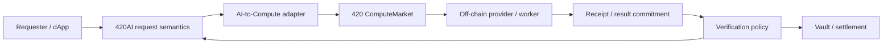

# 420AI compute infrastructure

420AI is the native AI workload layer of 420 Integrated. It defines canonical model identity, model-version semantics, provider/deployment references, AI request constraints, result commitments, verification policy, and user-facing AI job state. The actual inference, generation, fine-tuning, embedding, reranking, training, and accelerator work is performed off-chain by `420ai`/compute providers.

The infrastructure rule is strict: **420AI defines what AI work is requested; 420 ComputeMarket defines who executes it, on what resources, under what accepted price/SLA/verification terms, and how the resulting entitlement settles.** AI providers and workers supply computation but never gain consensus, execution, governance, bridge, identity, or arbitrary wallet authority.

## Genesis role and authority boundary

The Genesis configuration reserves the `420ai` node role and the AI provider/model/job/escrow/reputation interfaces while explicitly declaring that AI inference is neither consensus inference nor execution-layer inference and that chain liveness does not depend on AI providers.

The frozen Genesis discovery identities are:

- `0x...042f` — `AIProviderRegistry`;
- `0x...0430` — `AIModelRegistry`;
- `0x...0431` — `AIJobManager`;
- `0x...0432` — `AIJobEscrow`;
- `0x...0433` — `AIReputationRegistry`.

These addresses preserve discovery compatibility. Mature implementations may harden or route through shared infrastructure, but they must not be silently repurposed into unrelated authority.

## AI versus ComputeMarket

420AI and 420 ComputeMarket are intentionally separate layers.

420AI owns or binds:

- model and model-version identity;
- AI workload class;
- input commitment and schema/reference;
- privacy policy;
- deployment/provider constraints;
- user-authorized maximum spend;
- deadline;
- verification profile;
- result commitment and AI-level lifecycle.

ComputeMarket owns or binds:

- compute provider, node, and resource identity;
- resource capabilities and offers;
- accepted match;
- pricing/SLA/verification terms;
- compute job state;
- execution receipts;
- verification outcome;
- settlement entitlement and refund state.

420AI must not create a second hidden compute marketplace. Likewise, ComputeMarket remains general-purpose and must support non-AI workloads without requiring 420AI participation.

## Current implementation state

The repository currently contains hardened Genesis-compatible AI contracts plus the frozen mature V1 architecture.

Current AI implementation includes:

- `AIProviderRegistry` — provider identity, operator/settlement accounts, stake reference, ComputeMarket provider reference, lifecycle, and operational status;
- `AIModelRegistry` — model identity, immutable model-version artifact/runtime/schema/verification fields, Model420 disclosure metadata, and explicit fail-closed training-rights grants;
- `AIJobManager` — bounded AI request/job state machine and Compute adapter boundary;
- `AIJobEscrow` — compatibility accounting facade bound to Vault/settlement adapters with direct custody disabled;
- `AIReputationRegistry` — evidence-derived compatibility counters fed only through the bound 420Trust adapter;
- AI contribution verification/reward adapters for authenticated AI ecosystem contributions.

The mature architecture further separates provider/node/resource/offer/request/match/job/receipt/verification/settlement objects through 420 ComputeMarket.

## Provider identity and eligibility

`AIProviderRegistry` uses explicit provider lifecycle states:

`REGISTERED -> ACTIVE <-> SUSPENDED -> RETIRED`

Operational provider state requires an ACTIVE provider with a nonzero stake reference. Provider state tracks:

- operator account;
- settlement account;
- metadata commitment;
- stake reference;
- ComputeMarket provider reference;
- revision and lifecycle state.

A provider's AI identity does not create a second economic identity that can silently diverge from its compute provider identity. The ComputeMarket reference is the bridge into the shared execution market.

Provider suspension may stop new work, but it does not fabricate failures, redirect earned balances, or erase historical jobs/results.

## Models and model versions

Model identity and model-version identity are separate.

A stable model ID represents the model family/creator relationship. Each model version commits to the material semantics that can affect execution or verification, including:

- artifact/weights hash;
- artifact or storage manifest hash;
- runtime profile;
- compute requirement profile;
- input/output schema hash;
- verification profile;
- license policy;
- Model420 architecture/capability/disclosure commitments where used.

A changed artifact, runtime, schema, verification policy, or other material behavior requires a new model-version identity rather than mutating historical meaning.

The current Model420 path also treats AI training permission as distinct from ordinary model ownership/licensing. Training fails closed unless the version is configured for explicit grants and a valid grant exists for the grantee/scope.

## AI workload classes

The current canonical workload IDs cover:

- text inference;
- multimodal inference;
- image generation;
- audio generation;
- video generation;
- embeddings;
- reranking;
- fine-tuning;
- batch workloads.

Unsupported workload classes fail closed rather than being interpreted as a loosely compatible job.

## Request and job lifecycle

The current `AIJobManager` enforces the mature bounded lifecycle directly:

`CREATED -> FUNDED -> MATCHED -> ACCEPTED -> RUNNING -> RESULT_COMMITTED -> VERIFIED -> SETTLED`

Exceptional terminal or recovery states include:

- `CANCELLED`;
- `EXPIRED`;
- `FAILED`;
- `DISPUTED`;
- `REFUNDED`.

Every transition is constrained by its predecessor state and caller authority. There is no generic arbitrary status setter.

A request binds, at minimum:

- requester;
- model-version ID;
- workload class;
- request/input commitment;
- privacy policy;
- verification profile;
- maximum spend;
- deadline.

After funding and matching, it additionally binds:

- funding reference and amount;
- ComputeMarket request/job IDs;
- provider ID;
- result commitment and manifest hash;
- dispute reference when applicable.

Terminal requests cannot be reopened or regain spending authority.

## Funding, escrow, and settlement

Native `$420` is the default Genesis settlement asset for AI compute.

The hardened `AIJobEscrow` deliberately disables legacy direct custody. Funding is confirmed through a bound Vault adapter, and settlement/refund transitions are controlled through a separate settlement adapter.

The escrow compatibility state records:

- payer;
- canonical provider ID;
- already-bound beneficiary;
- Vault/funding references;
- settlement reference;
- amount;
- bounded escrow state.

Release cannot supply an arbitrary recipient: the release destination must equal the already-bound beneficiary. Refunds return to the recorded payer.

ComputeMarket/Vault settlement must preserve the same principles:

- paid execution is amount-bounded;
- provider entitlement derives from the accepted canonical match;
- settlement cannot exceed the requester-authorized maximum;
- unused value remains recoverable under policy;
- duplicate settlement is impossible;
- emergency authority cannot confiscate or redirect valid balances.

## Matching and routing

Routing may be direct or open-market, but the accepted canonical match must satisfy both sides' constraints.

AI adaptation may **narrow** a request but must never broaden:

- maximum spend;
- permitted provider/deployment set;
- resource requirements;
- privacy requirements;
- deadline;
- verification policy.

A replaceable off-chain matcher may discover compatible providers, but it does not receive authority to rewrite canonical request or offer constraints. Economically material terms become canonical before execution can create settlement rights.

## Provider resources and SLA

420 ComputeMarket separates provider, node, resource, and offer identity.

Resources may declare classes such as CPU, GPU inference/training/rendering, accelerator, ZK proving, or high-memory capacity. Commercial hardware names remain profile/manifest metadata rather than consensus-critical enums.

An accepted AI/compute match binds the applicable resource, pricing profile, availability window, SLA policy, verification profile, and quoted/maximum amount. Provider endpoint or manifest replacement after acceptance must not alter the identity or economic terms already bound to the job.

## Off-chain execution

Raw AI work executes outside consensus/execution state. Off-chain provider infrastructure may include:

- model/artifact retrieval;
- GPU/CPU/accelerator scheduling;
- runtime/container isolation;
- prompt/input retrieval and decryption;
- inference or training execution;
- output storage/delivery;
- receipt generation;
- attestation/proof generation;
- worker health and capacity reporting.

These systems are operational infrastructure, not chain authority. A worker's local claim that a job completed is insufficient by itself to create canonical settlement rights.

## Inputs, outputs, and privacy

Large or private AI payloads remain off-chain, including:

- prompts and context;
- images/audio/video;
- datasets and private documents;
- embeddings;
- generated outputs;
- model weights when not intentionally public;
- secrets and API credentials.

Canonical state stores only the commitments and references needed for identity, authorization, matching, verification, settlement, dispute handling, and reconstructability.

Privacy policy may constrain provider class, region, retention, TEE requirements, deployment choice, and whether public result commitments are permitted. No AI registry, administrator, governance role, or matching service receives universal plaintext access by protocol design.

## Result commitments

An AI result recorded on-chain is a commitment to an off-chain output and related manifest, not the raw output itself.

A result commitment establishes what bytes/manifest the provider committed for that job. It does **not** imply that:

- the answer is factually true;
- the result is subjectively high quality;
- the model behaved as the requester hoped;
- the computation was correct absent the bound verification policy.

This distinction prevents result hashes from being misrepresented as universal correctness proofs.

## Receipts and execution evidence

Compute receipts should be provider-signed, replay-safe, domain-separated, and chain-linked/monotonic when cumulative metering is used. A receipt may commit to:

- job/provider/resource IDs;
- execution interval;
- metered units;
- cumulative/final charge;
- output commitment;
- execution manifest;
- verification-evidence reference.

A signature proves that a provider signed a claim. It is not universal proof that arbitrary AI computation was performed correctly.

## Verification profiles

Verification policy must be explicit and bound before it can authorize settlement.

Supported/anticipated classes include:

- requester acknowledgement;
- deterministic re-execution;
- quorum/attestation;
- trusted-execution-environment attestation;
- zero-knowledge proof;
- oracle/external verification;
- application-specific verifier.

Verification failure fails closed for the affected settlement path. The protocol must never substitute "provider said so" when the bound policy requires stronger evidence.

## Reputation and 420Trust

The hardened compatibility reputation registry no longer permits arbitrary administrator counter replacement. Evidence is applied once through a bound 420Trust adapter and only for recognized outcomes.

420Trust is the canonical destination for authenticated performance evidence such as:

- jobs accepted/completed;
- objective failures;
- disputes and upheld disputes;
- SLA adherence;
- verification outcomes;
- slash events;
- settlement failures.

This evidence does not create one mandatory protocol-wide social/credit score and does not itself grant routing, custody, or settlement authority.

## Contribution rewards

AI ecosystem contributions such as accepted dataset contributions, finalized evaluations, accepted model corrections, and provider validation can be forwarded into the shared contribution/reward infrastructure only after verification against a bound source.

Contribution rewards are separate from compute-job settlement. Publishing or receiving an AI contribution reward does not alter provider/job authority.

## Staking and slashing

Provider stake is economic assurance, not proof of model quality, correctness, confidentiality, or subjective usefulness.

Objectively provable misconduct may include:

- forged execution receipts;
- duplicate settlement attempts;
- conflicting signed commitments;
- provider/resource identity fraud;
- provable attestation fraud;
- accepted-job nonperformance where the bound policy defines objective evidence.

Subjective quality, artistic preference, factual disagreement without a bound verifier, or user dissatisfaction are not automatically slashable conditions.

## Failure behavior

### No AI providers available

AI service becomes unavailable/degraded. Consensus and block finality continue normally.

### Provider disappears before acceptance

Rematch or expire according to request policy. Do not create provider entitlement.

### Provider fails during execution

Move through the defined failure/dispute path. Refund or replacement depends on canonical policy; never fabricate completion.

### Worker returns malformed or missing result

Do not advance to a valid result/verified state. Preserve the job and evidence for retry/dispute/refund handling.

### Verification fails

Fail closed for settlement eligibility and use the bound dispute/refund path.

### Endpoint changes

New work may use an updated valid deployment/manifest, but accepted jobs retain their already-bound provider/resource/economic identity.

### Matcher/router outage

Matching degrades; canonical provider/job state remains intact. A replacement matcher can resume using the same constraints.

### Vault/settlement outage

Do not mark jobs settled merely because compute finished. Preserve the verified entitlement until accounting recovers.

### Trust/reputation service outage

Routing may lose optional evidence inputs, but existing jobs and settlement rules remain governed by their canonical constraints.

## Recovery order

A representative AI/compute recovery sequence is:

1. verify canonical chain and AI/Compute contract state;
2. restore provider/node/resource identity and status views;
3. reconcile model/model-version/deployment references and manifests;
4. reconcile funded requests and Vault reservations;
5. reconstruct accepted matches and active job state;
6. restore worker endpoints/runtime resources;
7. reconcile receipts/result commitments already submitted;
8. restore bound verification services;
9. resolve verified settlement/refund entitlements;
10. restore matching/routing and optional Trust/reputation projections;
11. accept new AI work only after the above state agrees.

Off-chain worker queues may be rebuilt from canonical requests/jobs plus committed manifests. They must not be treated as the source of truth when they disagree with canonical job state.

## 420AI infrastructure invariants

- **AI-INFRA-001** — AI execution is off-chain and never required for consensus, execution validity, or ordinary chain liveness.
- **AI-INFRA-002** — AI providers/workers gain no ambient validator, governance, custody, bridge, identity, or arbitrary wallet authority.
- **AI-INFRA-003** — 420AI request/model semantics and ComputeMarket execution/economic semantics remain distinct and reconstructable.
- **AI-INFRA-004** — model, model-version, provider, deployment, request, compute-job, receipt, result, and settlement identities cannot be silently conflated or reassigned.
- **AI-INFRA-005** — AI-to-Compute adaptation may narrow but never broaden requester spend, provider/resource, privacy, deadline, or verification constraints.
- **AI-INFRA-006** — accepted jobs cannot settle above the requester-authorized maximum, and beneficiary identity derives from canonical accepted state.
- **AI-INFRA-007** — raw private prompts, datasets, documents, media, embeddings, outputs, weights, secrets, and credentials are not required canonical plaintext state.
- **AI-INFRA-008** — provider signatures/receipts are evidence of claims, not universal proof of correct computation or truthful model output.
- **AI-INFRA-009** — verification policy is explicit, versioned, and bound before it can authorize settlement; verification failure fails closed.
- **AI-INFRA-010** — terminal jobs cannot reopen or regain spend authority, and no generic administrator may arbitrarily assign lifecycle state.
- **AI-INFRA-011** — provider/matcher/worker/Trust outages degrade AI service only and cannot halt consensus or rewrite canonical history.
- **AI-INFRA-012** — provider suspension, emergency action, or infrastructure recovery cannot confiscate or redirect already-earned valid entitlements except through the bound dispute/verification path.

## Implementation status and evolution

The Genesis-compatible AI provider/model/job/escrow/reputation contracts are implemented and hardened around bounded authority, while the mature V1 architecture freezes the direction toward explicit model/deployment/request/result objects and shared 420 ComputeMarket execution infrastructure.

Future worker daemons, schedulers, model-serving stacks, GPU fleets, matching services, verification adapters, and 420AI application frontends can evolve behind these boundaries. Material implementation changes must update this page rather than creating a competing description of the AI compute trust model.

## Related documentation

- [Infrastructure overview](infrastructure-overview.md)
- [Storage & resource infrastructure](storage-resource-infrastructure.md)
- [RPC, gateways, and network ingress](rpc-gateways-network-ingress.md)
- `docs/420-AI-V1-ARCHITECTURE.md`
- `docs/420-COMPUTE-MARKET-V1-ARCHITECTURE.md`
- `config/ai-genesis.json`
