# 420Automation infrastructure

420Automation is the replaceable off-chain scheduling and execution-coordination service for 420 Integrated. It watches approved trigger classes, evaluates registered jobs against bounded chain/service evidence, coordinates replaceable workers, and submits only the transaction intent already committed by the job definition.

It is **not** consensus, finality, wallet, custody, bridge, Oracle, governance, or target-protocol authority.

## What Automation can do

Automation can:

- normalize time, block, event, 420Oracle, and explicit manual triggers;
- determine whether an already-registered job is eligible for an execution attempt;
- produce deterministic occurrence/attempt identities;
- coordinate one eligible occurrence through bounded worker leases;
- enforce job funding, fee, gas, calldata, retry, and batch limits;
- submit a worker-signed payload through a same-chain, canonical-safe RPC dependency;
- expose authenticated job-management/read APIs to approved Developer Hub clients;
- report readiness, bounded metrics, redacted snapshots, and execution receipts;
- stop safely when replay, finality, freshness, identity, resource, or authorization assumptions fail.

## What Automation cannot do

Automation cannot:

- create protocol permissions because a trigger fired;
- invent or alter a registered target, selector, calldata commitment, native value, or gas limit;
- sign as a user or custody wallet keys;
- treat worker ownership or a lease as protocol authority;
- decide canonical chain state or finality;
- treat raw Oracle/provider data as execution authority;
- substitute for bridge verification or settlement proofs;
- enlarge configured funding/spending ceilings;
- replay an ambiguous transaction without fresh canonical-safe evidence;
- use telemetry, receipts, or readiness state as proof of inclusion/finality;
- expose the Engine API or any equivalent consensus/execution control plane.

## Trigger and execution flow

```mermaid
flowchart LR
    T[bounded trigger observation] --> N[normalize / bind trigger]
    N --> E[eligibility evaluation]
    E --> O[deterministic occurrence]
    O --> L[worker lease]
    L --> B[funding + execution budget checks]
    B --> P[immutable transaction plan]
    P --> S[worker signature]
    S --> R[same-chain canonical-safe RPC]
    R --> C[target protocol/contract]
```

Every arrow is a service transition, not a transfer of protocol authority. The target protocol remains responsible for enforcing its own permissions and state-transition rules.

## Security hardening

AUT-11 adds the hostile-state boundary around the complete pipeline:

- signed observation envelopes bind source identity, chain 420, payload hash, timestamp, and monotonic sequence;
- stale, future-dated, wrong-chain, malformed, or signature-invalid observations fail closed;
- duplicate request identities and non-monotonic source sequences are replay-rejected;
- live replay protection is capacity-bounded and is never silently evicted to accept more work;
- calldata, gas, retry count, batch job count, and batch byte volume are bounded;
- finalized-height rollback and finalized-hash conflicts are rejected;
- diagnostics recursively redact secret-like fields;
- metrics reject secret and high-cardinality labels;
- cross-layer tests prove trigger spoofing cannot create execution authority and tampered calldata cannot reach submission.

## Failure and recovery model

Automation favors lost liveness over unsafe execution.

A job should remain blocked when:

- chain/RPC observations are stale or on the wrong chain;
- canonical-safety evidence is unavailable;
- an occurrence has already been consumed;
- an earlier submission is ambiguous;
- finality observations conflict with a previously accepted checkpoint;
- worker identity/liveness or lease ownership is uncertain;
- job funding/budget evidence is insufficient;
- Oracle evidence fails its freshness/confidence/quorum policy;
- an API caller lacks the required scope or application binding;
- a security/resource limit is exceeded.

Recovery follows the AUT-6 rule: ambiguity or reorg effects are resolved only with fresh canonical-safe evidence. Operator telemetry can explain the stop condition but cannot authorize a retry.

## Current qualification status

AUT-0 through AUT-11 are implemented. The AUT-11 hostile-state and cross-layer suites passed the dedicated 420Automation workflow and full 420 Integrated qualification on the AUT-11 branch. AUT-12 remains the public-testnet qualification and launch-closeout phase.

## Related documentation

- [420Automation implementation roadmap](../../420AUTOMATION-ROADMAP.md)
- [420Automation architecture and trust boundary](../../420AUTOMATION-ARCHITECTURE.md)
- [AUT-9 API/authentication](../../420AUTOMATION-AUT9-API-AUTH.md)
- [AUT-10 observability and recovery](../../420AUTOMATION-AUT10-OBSERVABILITY.md)
- [420Automation user guide](../../users/420automation.md)
- [RPC, gateways, and network ingress](rpc-gateways-network-ingress.md)
- [Oracle and external-provider infrastructure](oracle-external-provider-infrastructure.md)
