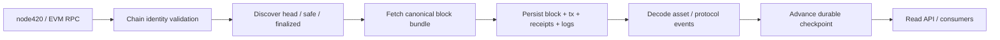

# 420Indexer infrastructure

420Indexer is the shared, non-authoritative off-chain projection service for 420 Integrated. It ingests canonical execution data and registered protocol metadata once, preserves provenance and finality context, and exposes rebuildable query projections for Explorer, Search, Analytics, Wallet, Notifications, Status, Developer Hub, and other consumers.

Its core rule is strict: **indexed data never becomes protocol authority**. Canonical balances, ownership, identity, rights, governance outcomes, settlements, bridge state, validator state, eligibility, and other protocol decisions remain on-chain.

## Authority boundary

420Indexer may:

- read canonical chain data;
- persist blocks, transactions, receipts, logs, checkpoints, asset/protocol projections, and decoder metadata;
- track indexed head, safe, and finalized positions;
- repair non-finalized history after a reorg;
- rebuild all indexed state from canonical sources;
- expose read-only APIs and deterministic pagination.

420Indexer must not:

- mutate canonical chain state;
- invent balances, ownership, protocol state, or finality;
- silently rewrite finalized history;
- accept data from the wrong chain;
- expose private/encrypted payload contents that the owning protocol does not mark public/indexable;
- become an independent protocol decision-maker for downstream applications.

## Source interface

The implementation consumes chain data behind the transport-neutral `ChainSource420` boundary. The qualified production source uses standard EVM JSON-RPC and validates `eth_chainId` before indexing.

Current ingestion includes:

- head discovery through `eth_blockNumber`;
- block retrieval with full transactions;
- per-transaction receipt retrieval;
- canonical logs and provenance;
- canonical `safe` and `finalized` block-tag reads;
- historical protocol metadata/decoder resolution.

420Indexer does not require a dedicated 420RPC implementation. A future RPC adapter may satisfy the same source contract without changing indexing semantics.

## Chain identity

The canonical configuration requires chain ID `420` and rejects wrong-chain sources.

A source being reachable is not sufficient. Readiness requires source identity and indexed provenance to match the intended network.

## Ingestion model

A normal ingestion cycle is:

Checkpoint advancement must occur only after the complete bundle required for that height is durably persisted. A restart resumes from the last durable checkpoint rather than assuming partially written data is complete.

## Canonical, safe, and finalized cursors

420Indexer tracks head, safe, and finalized independently.

The durable progression model is:

`HEAD -> SAFE -> FINALIZED`

Promotion requires exact indexed hash agreement at the relevant boundary. Invalid ordering or disagreement at safe/finalized boundaries fails closed.

Downstream consumers must be able to distinguish:

- indexed head;
- indexed safe height;
- indexed finalized height;
- index lag/freshness;
- schema/decoder version;
- degraded or rebuild state.

## Reorg reconciliation

Non-finalized history is repairable. Finalized history is a safety boundary.

When canonical ancestry changes before finality, the indexer:

1. detects the ancestry mismatch;
2. finds the nearest common ancestor;
3. refuses to cross below the finalized boundary;
4. rolls back block-scoped rows and dependent projections above the ancestor;
5. rewinds checkpoints/finality metadata as required;
6. deterministically replays the replacement canonical suffix;
7. resumes normal ingestion.

A conflict with finalized indexed history enters degraded/fail-closed state. The service must not silently mutate finalized records merely to match a newly observed source.

## Durable projections

The current implementation includes durable/rebuildable projections for:

- blocks;
- transactions;
- receipts;
- addresses/contracts;
- canonical logs;
- checkpoints;
- native `$420`, ERC-20, ERC-721, and ERC-1155 transfers/balances;
- genesis protocol event journals and latest-object views;
- historical protocol service/version metadata.

Projection writes are subordinate to canonical provenance. Derived balances and protocol views can be discarded and rebuilt when necessary.

## Protocol decoding

Protocol decoding is version-aware and historical.

420Indexer projects ProtocolRegistry history and resolves the implementation/service version active at the indexed block. Decoder dispatch is pinned to that historical version. If a required historical decoder is missing, indexing fails closed rather than falling forward to a newer ABI and guessing semantics.

Schema and decoder versions remain explicit and observable.

## Public read API

The stable v1 consumer boundary is read-only and versioned. It includes:

- `/health`;
- `/ready?chainId=`;
- `/v1/status?chainId=`;
- block, transaction, receipt, log, address, asset-transfer, protocol-event, protocol-object, and search routes.

Operational responses expose indexed/finality metadata and explicitly mark the projection as non-authoritative.

Paged routes use opaque keyset cursors rather than OFFSET pagination. The default page size is 50 with a hard maximum of 200. Consumers must not bind to internal SQL schemas or row layouts.

## Downstream consumers

420Indexer is intended to prevent each application from implementing its own chain-ingestion, checkpoint, decoder, and reorg logic.

Primary consumers include:

- 420Explorer;
- 420Search;
- 420Analytics;
- 420Wallet;
- 420Notifications;
- 420Status;
- Developer Hub APIs;
- future AppStore/Verify projections where appropriate.

420Explorer is already qualified as an Indexer API consumer and disables its own independent RPC ingestion, checkpoints, reorg engine, and decoder registry.

## Privacy boundary

The indexer handles public/indexable chain records only.

It must not ingest or expose plaintext private Messenger content, private Identity fields, encrypted Resource payload contents, raw private Attention telemetry, Wallet secrets, application secrets, or other non-public material unless the owning protocol explicitly defines that field as public/indexable.

## Persistence and rebuild

The current qualified correctness baseline supports durable file-backed storage, restart/resume, and atomic reset of rebuildable indexed state. The storage boundary remains replaceable; a database-backed implementation is recommended for higher production volume but does not change the authority model.

Full rebuild mode discards rebuildable projection state and recreates it from canonical RPC and approved deployment/ABI manifests.

A rebuild is preferable to repairing uncertain derived state when canonical sources remain trustworthy.

## Health and readiness

`/health` is process liveness only.

`/ready` requires more than a running process. Readiness should account for:

- database/store accessibility;
- expected chain identity;
- indexed-head availability;
- successful source access;
- no finalized-history conflict;
- valid checkpoint/finality ordering;
- acceptable index lag for the advertised service class.

`/v1/status` exposes projection state including indexed head/finality metadata and `authoritative: false`.

## Failure behavior

### RPC unavailable

Ingestion stops or retries according to operator policy. Existing projections may be stale and must not be presented as current without freshness metadata.

### Wrong chain

Fail closed. Do not ingest.

### Non-finalized reorg

Rollback to the nearest safe common ancestor and deterministically replay the replacement suffix.

### Finalized conflict

Enter degraded/fail-closed state without mutating finalized local indexed history.

### Decoder mismatch or missing historical decoder

Fail closed for the affected decode path rather than guessing.

### Store corruption or uncertain projection state

Restore from a known-good checkpoint if provable, otherwise reset and rebuild from canonical sources.

### Indexer outage

Explorer/Search/Analytics and other dependent reads may degrade, but consensus and execution must continue independently.

## Recovery order

A safe 420Indexer recovery is:

1. verify the canonical chain/finality source is healthy;
2. verify chain ID and environment identity;
3. preserve diagnostics/checkpoint metadata if investigating an incident;
4. validate durable store consistency;
5. resume from the last trusted checkpoint when possible;
6. if uncertain, atomically reset rebuildable state;
7. replay from canonical sources;
8. promote safe/finalized only after exact indexed-hash checks;
9. verify `/ready` and `/v1/status`;
10. re-enable dependent public consumers.

Never mutate canonical chain state to make an index projection match.

## 420Indexer invariants

- **IDX-INFRA-001** — indexed data is never canonical protocol authority.
- **IDX-INFRA-002** — every canonical-source record retains chain/block provenance.
- **IDX-INFRA-003** — the expected chain identity is validated before ingestion/readiness.
- **IDX-INFRA-004** — checkpoint advancement occurs only after the required block bundle is durably persisted.
- **IDX-INFRA-005** — non-finalized reorgs are repaired deterministically from a common ancestor.
- **IDX-INFRA-006** — normal recovery never rewrites finalized history silently.
- **IDX-INFRA-007** — safe/finalized promotion requires exact indexed-hash agreement.
- **IDX-INFRA-008** — missing historical decoder/version information fails closed rather than guessing semantics.
- **IDX-INFRA-009** — all derived projections remain rebuildable from canonical sources plus approved manifests/decoder metadata.
- **IDX-INFRA-010** — public APIs expose freshness/finality context and remain read-only.
- **IDX-INFRA-011** — private/encrypted payload content is excluded unless explicitly public/indexable by the owning protocol.
- **IDX-INFRA-012** — failure of 420Indexer or any downstream projection cannot lower consensus/execution safety or redefine canonical state.

## Implementation status

The current codebase has completed the foundation, EVM ingestion core, reorg/finality engine, durable core projections, asset projections, functionally complete genesis-protocol projections, query/database layer, and the v1 public consumer API through IDX-7.4.

Remaining Indexer roadmap work is operational/scale oriented: event-stream delivery, operational hardening, testnet qualification, and deployment-stage concrete manifest/service probes. Those later improvements do not change the non-authoritative projection boundary documented here.

## Related documentation

- [Infrastructure overview](infrastructure-overview.md)
- [`node420`](node420.md)
- [Blocks and state](../chain/blocks-and-state.md)
- [Epochs, fork choice, QCs and finality](../consensus/epochs-fork-choice-qcs-finality.md)
- `docs/420INDEXER.md`
- `docs/420INDEXER-API-V1.md`
- `config/420indexer-v1.json`
