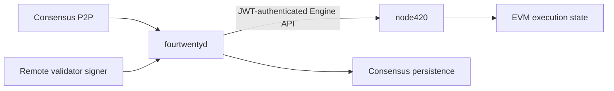
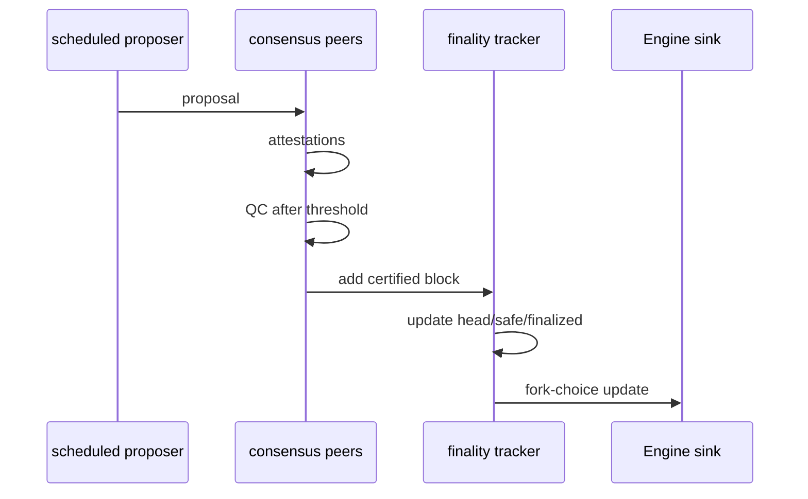

# `fourtwentyd` infrastructure

`fourtwentyd` is the 420 Integrated consensus daemon. It owns the consensus-side decisions that determine which execution payload becomes canonical and finalized, while `node420` remains authoritative for EVM execution and execution-state transitions.

This page documents `fourtwentyd` as an operator-facing infrastructure component: its process model, dependencies, configuration surfaces, persistence, P2P and Engine boundaries, signing requirements, startup/shutdown behavior, health/readiness, and recovery constraints.

## Responsibilities

`fourtwentyd` is responsible for consensus-domain behavior including:

- slot and epoch progression;
- primary/fallback proposer scheduling;
- validator committee/cohort state;
- consensus P2P message processing;
- attestations and quorum-certificate processing;
- fork-choice head/safe/finalized decisions;
- consensus-side reward and slashing outcomes;
- deterministic consensus-system-call inputs;
- `SAFETY_HALT` and consensus recovery state;
- validator duty/signing orchestration through the approved signer boundary.

It does **not** execute ordinary EVM transactions, maintain the EVM mempool, calculate EVM gas/base-fee state, own contract storage, or provide the public Ethereum JSON-RPC interface.

## Process boundary

The frozen implementation architecture uses separate processes:



This separation is a safety boundary, not just a packaging choice. `fourtwentyd` may select and certify execution payloads, but it must not silently become an execution client.

## Current binary and build surface

The current binary is built from:

```text
consensus/cmd/fourtwentyd
```

The repository build target produces:

```text
bin/fourtwentyd
```

The current daemon reports version `0.1.0-dev` and the container image builds the same Go command into `/usr/local/bin/fourtwentyd`.

The present command entrypoint still labels the non-devnet default path as a Step 4.7 scaffold. Operators should therefore distinguish **frozen protocol architecture** from **current CLI/runtime completeness**. Documentation must not imply that a scaffold-only production launch mode already exists when the implementation still exposes devnet-oriented flags.

## Current CLI surfaces

The current command exposes these important surfaces:

| Flag | Purpose |
| --- | --- |
| `--version` | print `fourtwentyd` version |
| `--protocol` | print frozen chain/timing constants |
| `--engine` | Engine API endpoint |
| `--jwt-secret` | Engine JWT secret path; defaults to `./jwt.hex` |
| `--engine-probe` | negotiate Engine capabilities and exit |
| `--devnet-validator` | run the deterministic local devnet validator |
| `--node-id` | local devnet node/validator identifier |
| `--seat` | devnet validator seat (`0..14`) |
| `--bus` | devnet TCP broker endpoint; current default `127.0.0.1:9420` |
| `--max-slots` | devnet slots before exit |
| `--slot-ms` | accelerated devnet slot duration |
| `--state` | devnet persistent consensus-state file |
| `--engine-state` | file-backed Engine fork-choice sink for devnet testing |

Fault-injection flags such as `--primary-down` and `--fb1-down` exist for deterministic devnet testing and are not production validator policy controls.

## Protocol identity

`fourtwentyd --protocol` exposes the frozen timing identity compiled into the consensus implementation:

- chain ID;
- 12-second slot target;
- slots per epoch;
- epochs per rotation;
- slots per rotation.

A production service must verify that the binary, consensus configuration, execution network identity, genesis artifacts, and canonical deployment set all describe the same network before validator duties are enabled.

A running daemon connected to the wrong execution network is not ready merely because its process is alive.

## Engine API dependency

`fourtwentyd` communicates with `node420` over the private Engine API.

The current Engine client:

- requires a **32-byte JWT secret**;
- reads that secret from the configured file path;
- creates HS256 JWTs with `iat`, client id `fourtwentyd`, and client version claims;
- uses a 10-second HTTP client timeout;
- treats HTTP 401/403 as Engine authorization failure;
- bounds Engine response reads;
- uses JSON-RPC request IDs and explicit RPC-error handling.

The Engine control plane must remain private and must not be exposed as an ordinary public application endpoint.

## Engine capability probe

The current `--engine-probe` mode requests these capabilities:

- `engine_forkchoiceUpdatedV3`;
- `engine_getPayloadV3`;
- `engine_newPayloadV3`;
- `engine420_submitSystemCallsV1`.

The custom 420 system-call capability is part of the consensus/execution contract. An Engine endpoint that is reachable but lacks required 420 semantics is not compatible.

Operational readiness should therefore distinguish:

1. TCP/HTTP reachability;
2. JWT authorization;
3. Engine API method compatibility;
4. 420-specific system-call capability;
5. matching chain/genesis/execution state.

## Fork-choice relationship

When consensus observes a newly certified block, the consensus finality tracker derives head/safe/finalized checkpoints and passes the mapped execution fork-choice state through the configured Engine sink.

The authority split remains:

- `fourtwentyd` decides the consensus fork-choice checkpoints;
- `node420` validates/applies execution-layer Engine operations;
- failure of the Engine update must not cause `fourtwentyd` to pretend execution accepted a state transition that it did not accept.

Consensus and execution divergence is a fail-closed recovery condition.

## Consensus-system calls

Protocol-owned state transitions such as qualified reward/slash/system outcomes use the canonical consensus-system-call path rather than ordinary user transactions.

`fourtwentyd` is responsible for producing the qualified deterministic consensus-side inputs. `node420` is responsible for applying the corresponding execution state transition under the custom Engine/system-call integration.

The consensus daemon must not bypass this boundary by impersonating a normal EOA, paying ordinary user gas, or directly mutating execution storage outside the execution client.

## Consensus P2P

The frozen architecture specifies **libp2p** for production consensus P2P.

Consensus P2P transports consensus-domain objects such as proposals, attestations, QCs, committee/scheduling data, and recovery/safety messages. Public JSON-RPC is not a substitute for consensus P2P.

The current deterministic devnet implementation uses a TCP broker transport to exercise the same broad message roles under test. That devnet transport should not be confused with the intended production libp2p network stack.

## Devnet message flow

The current devnet node demonstrates the expected consensus control flow:



For the current 15-seat deterministic devnet, QC publication occurs after 11 attestations, matching the `floor(2N/3)+1` quorum rule documented in DOC-4.

## Persistence

Consensus persistence is a separate recovery domain from execution state and validator signing/slashing-protection state.

The current file store persists:

- consensus `head` checkpoint;
- `safe` checkpoint;
- `finalized` checkpoint;
- `next_slot`;
- optional last QC message identifier.

Current save behavior writes a temporary file, uses restrictive `0600` file permissions, attempts a file sync, and atomically renames the temporary file into place.

The current devnet node reloads the stored head/safe/finalized checkpoints and next slot on restart.

## Persistence does not equal slashing protection

Consensus state storage and local validator slashing-protection storage are related but distinct.

Losing consensus persistence may make fork-choice/finality position uncertain. Losing slashing-protection history may make signing unsafe even if consensus state can be reconstructed from peers.

A validator must not resume signing simply because `fourtwentyd` can start successfully. Production readiness requires the remote signer and protected duty history to be reconciled as well.

## Validator signing boundary

Production architecture requires:

- remote validator signing;
- persistent local slashing protection;
- separation between validator keys and Wallet/application keys;
- duty/domain validation before a signature is authorized.

Validator BLS signing material must not be loaded into dApps, Wallet session-key systems, general automation, public RPC servers, or ordinary application processes.

The signer is a privileged dependency, but it does not decide consensus. It signs only requests that `fourtwentyd` is authorized to make and that pass protected-duty checks.

## Configuration classes

Production `fourtwentyd` configuration should be divided into explicit classes.

### Network/protocol configuration

Examples:

- chain/network identity;
- genesis/manifest identity;
- slot/epoch/rotation constants;
- committee/validator policy;
- P2P network identifier and bootstrap peers;
- canonical system/deployment identities where needed.

### Execution boundary

Examples:

- Engine endpoint;
- Engine JWT path;
- supported Engine versions/capabilities;
- expected `node420` compatibility/version.

### Validator identity/signing

Examples:

- validator identity;
- signer endpoint/credential reference;
- slashing-protection database location;
- lifecycle/eligibility state.

### Persistence

Examples:

- consensus database/state path;
- backup/snapshot location;
- filesystem durability requirements.

### Operations

Examples:

- metrics/logging endpoints;
- alert thresholds;
- shutdown timeout;
- peer/readiness policy.

Secrets must not be mixed into public network manifests merely because non-secret configuration is versioned.

## Startup order

A safe validator startup should follow dependency order.

1. Verify binary/release checksum and expected network configuration.
2. Verify local consensus persistence and protected signing state are available and internally consistent.
3. Start/verify `node420` against the expected genesis/network.
4. Verify the private Engine endpoint and JWT secret.
5. Run Engine capability/compatibility checks, including the required 420 extension.
6. Establish consensus P2P/bootstrap connectivity.
7. Reconcile head/safe/finalized state with trusted consensus history and execution.
8. Verify remote signer availability and slashing protection.
9. Only then enable validator signing/duties.
10. Expose readiness to operator automation after all preceding safety conditions pass.

Process start must not automatically imply signing enablement.

## Shutdown order

A deliberate maintenance shutdown should protect signing and durable state.

1. Stop accepting new validator signing duties where the operational mode permits.
2. Allow/record the latest protected signing state.
3. Persist consensus checkpoints/next-slot state.
4. Stop consensus P2P processing.
5. Close Engine communication cleanly.
6. Terminate `fourtwentyd`.
7. Stop `node420` separately only if execution maintenance is also intended.

The current devnet process handles interrupt/SIGTERM through a context and persists state before normal exit.

## Health and readiness

`fourtwentyd` health should be evaluated in layers.

### Process health

- process running;
- event loop responsive;
- persistence I/O available.

### Network health

- sufficient consensus peers;
- expected network identity;
- messages flowing without persistent decode/validation failures.

### Engine health

- Engine endpoint reachable;
- JWT accepted;
- required Engine capabilities available;
- execution head not unacceptably divergent from consensus expectations.

### Consensus health

- slots advancing as expected;
- QCs being formed when quorum is available;
- head/safe/finalized checkpoints progressing;
- no conflicting valid QCs/finality evidence;
- no required `SAFETY_HALT` condition ignored.

### Signing health

- remote signer reachable;
- protected duty database available;
- no unresolved signer/slashing-protection inconsistency.

A validator is **ready to sign** only when all relevant safety domains are healthy, not merely when the daemon responds to a process probe.

## Monitoring expectations

Operator monitoring should correlate `fourtwentyd` with execution rather than observing it in isolation.

Important signals include:

- slot/epoch/rotation;
- consensus head/safe/finalized;
- QC formation and attestation participation;
- proposer rank/fallback usage;
- active/eligible validator counts;
- peer count and peer churn;
- Engine API error rate;
- execution-head lag;
- persistence write failures;
- signer errors/slashing-protection refusals;
- `SAFETY_HALT` state;
- daemon/release version hashes.

The existing testnet monitoring baseline treats no certified block for 42 consecutive slots, conflicting valid QCs, active seats below 15, Engine errors, peer collapse, and disk persistence failures as alert conditions.

## Failure behavior

### Engine unavailable

`fourtwentyd` must not fabricate successful execution or finality advancement. Keep/re-enter the appropriate degraded/halted recovery state until execution connectivity and compatibility are restored.

### JWT invalid or missing

Fail the Engine dependency. Do not fall back to unauthenticated Engine control.

### Required Engine capability missing

Treat the execution peer as incompatible. Reachability alone is insufficient.

### Consensus persistence unreadable or inconsistent

Do not resume signing from uncertain state. Preserve evidence, restore from a trusted backup/recovery path, and reconcile against finalized consensus/execution history.

### Slashing-protection database missing

Remain non-signing until protected duty history is recovered and verified.

### Remote signer unavailable

The validator may remain online as an observer if architecture permits, but must not substitute an unapproved local/private key path to restore liveness.

### Insufficient quorum

Stop certification/finality progress rather than lowering the quorum threshold.

### Network partition

Do not treat partition-local inactivity as authorization to arbitrarily replace validators or rewrite finalized history.

### Conflicting valid QCs/finality

Enter safety-halt/recovery handling. Do not choose a preferred history opportunistically and continue signing.

## Recovery order

For a failed validator node, recovery should proceed in this order:

1. preserve logs, QCs, slash evidence, persistence files, and signer-protection data;
2. identify the trusted finalized checkpoint;
3. restore/verify `node420` execution state compatible with that checkpoint;
4. restore/verify `fourtwentyd` consensus persistence;
5. restore/verify local slashing protection and remote signer identity;
6. verify Engine JWT/capability compatibility;
7. restore consensus P2P and reconcile current head/safe/finalized state;
8. remain non-signing until safety checks pass;
9. resume validator duties only after readiness is re-established.

Recovery must never lower quorum, finality, evidence, or signing-safety rules simply to restore uptime.

## Security boundaries

| Asset/control | Required boundary |
| --- | --- |
| Engine JWT | private to consensus/execution operator control plane |
| validator BLS key | remote signer / protected validator signing domain |
| slashing-protection DB | durable protected operator state |
| consensus state DB | consensus process persistence domain |
| Wallet/user keys | outside `fourtwentyd` |
| public RPC credentials | outside validator signing authority |
| observability credentials | read/telemetry authority only |

Compromise of an observability account or public RPC token must not grant Engine or validator-signing authority.

## Deployment shape

A normal validator deployment should treat `fourtwentyd` and `node420` as separately supervised services with:

- separate data directories;
- private authenticated Engine transport;
- independent process restart policies;
- explicit dependency/readiness checks;
- separate logs/metrics;
- isolated validator signer credentials;
- backup procedures for consensus and signing-protection state.

Co-locating processes on one machine does not erase their authority boundary.

## `fourtwentyd` invariants

- **FTD-001** — `fourtwentyd` is authoritative for consensus decisions but must not directly mutate EVM state outside the Engine/system-call boundary.
- **FTD-002** — the Engine API must remain private and JWT-authenticated; public JSON-RPC must not be used as a substitute consensus control plane.
- **FTD-003** — Engine reachability without the required 420 capabilities must not be treated as readiness.
- **FTD-004** — validator signing must remain disabled whenever consensus persistence or slashing-protection history is uncertain.
- **FTD-005** — remote signing authority must remain separate from Wallet/application/session-key authority.
- **FTD-006** — insufficient quorum must stop certification rather than trigger a quorum reduction.
- **FTD-007** — consensus P2P transport must not delegate consensus authority to RPC gateways, indexers, or derived services.
- **FTD-008** — consensus checkpoints and next-slot state must be durably persisted before destructive maintenance or safe restart claims.
- **FTD-009** — `fourtwentyd` must not declare execution transitions accepted when `node420` rejected or failed to apply them.
- **FTD-010** — startup readiness must validate network identity, execution compatibility, consensus state, and signing safety before duties begin.
- **FTD-011** — restart/recovery must preserve finalized-history and slash-evidence safety; live finalized history must not be rewritten as an operational shortcut.
- **FTD-012** — failure of derived infrastructure, AI, storage, oracle, Explorer, or Indexer must not alter `fourtwentyd` consensus rules or liveness prerequisites.

## Implementation references

- `consensus/cmd/fourtwentyd/main.go`
- `consensus/engine/`
- `consensus/storage/`
- `consensus/p2p/`
- `consensus/devnet/`
- `consensus/slashing/`
- `config/protocol.json`
- `docs/STEP-3-DECISION-18-IMPLEMENTATION-ARCHITECTURE.md`
- `docs/STEP-4.3-CONSENSUS-CERTIFICATION.md`
- `docs/STEP-4.4-COMMITTEE-SIMULATION.md`
- `docs/CONSENSUS-SYSTEM-CALL-v1.md`
- [Consensus architecture](../consensus/index.md)
- [Failure, recovery, and operator safety](../consensus/failure-recovery-operator-safety.md)

## Relationship to DOC-5.3

DOC-5.3 documents the execution-side counterpart: `node420`, the pinned Geth distribution, execution datadir/genesis lifecycle, public JSON-RPC, private Engine listener, P2P, optional execution services, health, and recovery.
