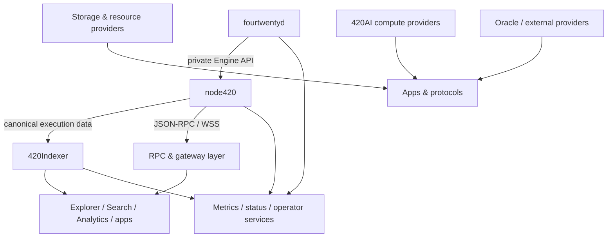

# Infrastructure architecture

This section documents the operational and service infrastructure that exposes, transports, derives, stores, or executes work around the canonical 420 Integrated chain without silently becoming a substitute for chain or consensus authority.

Infrastructure includes the consensus and execution processes themselves, but also the supporting services that make the network usable: indexing, RPC access, gateways, distributed storage/resource providers, AI compute workers, oracle/provider integrations, and operator-facing observability/status systems.

## DOC-5 phase map

- **DOC-5.1 — [Infrastructure overview](infrastructure-overview.md)** — infrastructure layers, authority model, service dependency direction, public/private boundaries, replaceability, degradation behavior, and infrastructure-wide invariants.
- **DOC-5.2 — [`fourtwentyd`](fourtwentyd.md)** — consensus-daemon process model, configuration, persistence, P2P, Engine dependency, signing boundary, startup/shutdown, health, and recovery.
- **DOC-5.3 — [`node420`](node420.md)** — execution-client wrapper/distribution, pinned Geth relationship, datadir/genesis initialization, JSON-RPC, Engine API, P2P, optional services, health, and recovery.
- **DOC-5.4 — [420Indexer](420indexer.md)** — ingestion, canonical/finalized cursors, reorg reconciliation, projection ownership, schemas/checkpoints, consumers, rebuild/replay, and non-authority guarantees.
- **DOC-5.5 — [RPC, gateways, and network ingress](rpc-gateways-network-ingress.md)** — public RPC/WSS, private Engine transport, rate limiting, gateway/proxy boundaries, endpoint discovery, failover, and trust assumptions.
- **DOC-5.6 — [Storage and resource infrastructure](storage-resource-infrastructure.md)** — storage/resource provider roles, proof/registry boundaries, content addressing, replication/availability, settlement, failure handling, and provider neutrality.
- **DOC-5.7 — [420AI compute infrastructure](420ai-compute-infrastructure.md)** — worker/provider roles, job routing, off-chain inference, on-chain commitments/economics, result delivery, SLA/proof boundaries, and failure isolation.
- **DOC-5.8 — [Oracle and external-provider infrastructure](oracle-external-provider-infrastructure.md)** — provider-neutral oracle adapters, external data/computation, attestations, freshness/verification, automation triggers, provider failure, and replacement.
- **DOC-5.9 — [Observability, status, and operator services](observability-status-operator-services.md)** — metrics/logs/traces, health/readiness, alerts, 420Status/Notifications boundaries, incident signals, backups, and operator-service recovery.

DOC-5 is complete on the phase branch. The full stack must still be reconciled against current `main` and pass final qualification before merge.

## Authority boundary

Infrastructure is divided into three broad classes:

1. **canonical infrastructure** — processes that directly participate in canonical consensus or execution, principally `fourtwentyd` and `node420`;
2. **derived infrastructure** — services such as 420Indexer, Explorer, Search, Analytics, status dashboards, caches, and read APIs that reproduce or project canonical state;
3. **replaceable/provider infrastructure** — RPC gateways, storage/resource providers, AI workers, oracle providers, relays, and other external-facing services whose individual operators must remain replaceable.

A service being required for convenient operation does not make it protocol authority.

## Core dependency direction

The arrows show service/data dependency, not delegated authority. Derived and provider services may observe or transport canonical facts, but they do not redefine them.

## Public versus private infrastructure

Some infrastructure surfaces are intentionally public:

- Ethereum-compatible JSON-RPC/WSS endpoints;
- Explorer/indexer-derived APIs;
- public status and health summaries;
- approved gateway/service endpoints;
- provider discovery metadata where intended.

Other surfaces are intentionally private or tightly authenticated:

- the Engine API between `fourtwentyd` and `node420`;
- validator remote-signing channels;
- operator credentials and administrative control planes;
- database/storage maintenance interfaces;
- internal provider settlement/control channels where public exposure is unnecessary.

A private control surface must not be exposed merely because a public application needs related read data.

## Replaceability principle

420 Integrated treats most edge infrastructure as replaceable.

Applications should prefer canonical registries/manifests and stable interfaces over hard-coded dependence on one operator. Failure of one RPC provider, indexer replica, storage node, AI worker, or oracle provider should degrade the dependent feature rather than silently promote that provider into network authority.

Provider-neutrality is especially important for storage, AI compute, oracle/external data, and public RPC access.

## Canonical versus derived state

Canonical facts come from chain/consensus state and finalized execution results.

Derived infrastructure may materialize:

- address/transaction/block lookup tables;
- searchable event projections;
- balances or protocol views cached for performance;
- aggregate analytics;
- human-friendly names/metadata;
- health and service availability information.

Derived state must remain rebuildable, reorg-aware where applicable, and visibly weaker than canonical state when the distinction matters.

## Failure containment

Infrastructure failures should fail in the narrowest possible domain.

Examples:

- 420Indexer failure must not stop consensus or execution;
- Explorer failure must not make canonical blocks disappear;
- an RPC gateway outage should not alter chain state;
- storage/provider loss should affect content/service availability rather than rewrite on-chain commitments;
- an AI worker failure should fail or reroute the compute job rather than affect consensus liveness;
- an oracle provider failure should fail closed or use the protocol's approved fallback/aggregation rule rather than invent a value;
- observability failure must not itself become evidence that consensus failed.

## Service discovery and configuration

Infrastructure endpoints should be resolved from canonical network configuration, registries, manifests, or environment-specific deployment configuration rather than copied ad hoc into every application.

Network identity checks remain mandatory. A healthy service attached to the wrong chain, genesis, deployment set, or environment is not a valid dependency.

## Recovery principle

Recovery follows authority order:

1. preserve/establish canonical consensus and finalized history;
2. restore execution to the matching canonical state;
3. restore canonical protocol-facing system services;
4. replay/rebuild derived projections such as 420Indexer;
5. restore public gateways and application-facing caches;
6. restore replaceable external providers and optional services;
7. verify observability agrees with canonical state before declaring recovery complete.

Derived data may be discarded and rebuilt when that is safer than attempting to repair an uncertain projection.

## Infrastructure-wide invariants

- **INFRA-001** — no derived or provider service may redefine canonical consensus or execution state.
- **INFRA-002** — private consensus/execution/signing control surfaces must remain segregated from public application interfaces.
- **INFRA-003** — derived infrastructure must be rebuildable or reconcilable from canonical sources.
- **INFRA-004** — provider infrastructure should be replaceable through stable interfaces/configuration wherever protocol design permits.
- **INFRA-005** — endpoint health alone is insufficient; network identity and deployment compatibility must also be verified.
- **INFRA-006** — infrastructure failure must fail closed around value, signatures, identity, and external trust inputs.
- **INFRA-007** — loss of Indexer/Explorer/Search/Analytics must not halt consensus or execution.
- **INFRA-008** — storage, AI, oracle, RPC, and gateway providers receive no ambient consensus/governance authority merely by providing service.
- **INFRA-009** — operator credentials and maintenance channels must remain separate from user/session signing authority.
- **INFRA-010** — recovery must restore canonical authorities before derived and optional service layers.
- **INFRA-011** — service observability may report health but must not become an authorization or consensus oracle.
- **INFRA-012** — infrastructure documentation and manifests must distinguish canonical, derived, replaceable, and external dependencies explicitly.

## Related documentation

- [System overview](../system-overview.md)
- [System dependency map](../dependency-map.md)
- [Trust-boundary model](../trust-boundary-model.md)
- [Chain architecture](../chain/index.md)
- [Consensus architecture](../consensus/index.md)
