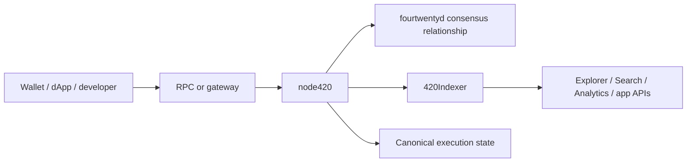
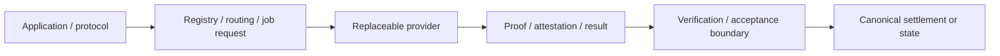

# Infrastructure overview

420 Integrated infrastructure is the collection of processes and services that run, expose, project, transport, store, or perform work around the canonical network. This layer spans the consensus/execution pair (`fourtwentyd` and `node420`) through derived services such as 420Indexer and outward to replaceable RPC, storage, AI, oracle, gateway, and operator-service providers.

The central architectural rule is simple: **service importance does not imply protocol authority**. Infrastructure must preserve the authority boundaries established by the chain, consensus, and canonical protocols.

## Infrastructure layers

### Layer 1 — Consensus process

`fourtwentyd` owns consensus responsibilities such as slots, proposer selection, attestations/QCs, fork choice/finality, committee state, consensus rewards/slashing decisions, and safety/recovery state.

It communicates with the execution layer through the private authenticated Engine API rather than through ordinary public JSON-RPC.

### Layer 2 — Execution process

`node420` owns EVM execution and execution-state responsibilities. It wraps the maintained 420 execution distribution around the pinned upstream Geth baseline and exposes Ethereum-compatible execution interfaces where intended.

Consensus chooses which valid execution payload becomes canonical; execution computes the payload's EVM state transition.

### Layer 3 — Canonical read/projection infrastructure

420Indexer consumes canonical execution/consensus-facing data and creates query-optimized projections for Explorer, Search, Analytics, Developer Hub, Wallet, and applications.

Those projections are operationally important but remain derived. If Indexer data disagrees with canonical chain state, the chain wins and the projection must reconcile or rebuild.

### Layer 4 — Network access and ingress

Public RPC/WSS services, gateways, proxies, bootstrapping endpoints, and endpoint-discovery metadata provide access to canonical or derived services.

These services may authenticate, rate-limit, cache, route, balance, or fail over traffic. They do not gain authority to change the meaning of a transaction, receipt, finalized block, identity, protocol deployment, or consensus outcome.

### Layer 5 — Resource/provider infrastructure

Storage/resource nodes, AI workers, oracle providers, external-computation providers, bridge/gateway adapters, and similar services supply work or data that cannot or should not execute directly inside EVM consensus.

Their outputs cross explicit verification, settlement, or commitment boundaries before influencing canonical state.

### Layer 6 — Operations and observability

Metrics, logs, traces, health checks, dashboards, status pages, notifications, backup systems, incident tooling, and operator automation help humans operate the system safely.

Observability reports what the system appears to be doing. It is not itself chain authority.

## Canonical, derived, replaceable, and external dependencies

Infrastructure dependencies fall into the same classes established by the system dependency map.

| Dependency class | Typical infrastructure examples | Authority expectation |
| --- | --- | --- |
| canonical | `fourtwentyd`, `node420`, canonical protocol/system predeploy access | authoritative only within their assigned consensus/execution domain |
| derived | 420Indexer, Explorer, Search, Analytics, caches | rebuildable projection; never stronger than canonical state |
| replaceable | public RPC, gateways/proxies, storage nodes, AI workers, oracle providers | interface-compatible and operator-replaceable where feasible |
| external trust | source chains, external APIs, external data publishers, infrastructure vendors | explicit validation/attestation boundary required |

The architecture should prevent a replaceable provider from becoming a hidden single root of trust.

## Normal infrastructure flow

A typical user-visible read/write path is:

For writes, the public ingress path submits ordinary transactions to execution. Consensus certification/finality determines canonical inclusion.

For reads, consumers may query execution directly or use derived/indexed services. Applications that make security-sensitive decisions must understand which source they are relying on and whether the answer is canonical, pending, derived, or external.

## Provider-backed flow

Provider-backed services follow a different pattern:

Examples include AI inference, storage proofs/resource service, oracle values, external API outcomes, and cross-chain attestations.

The provider performs service; the verification/acceptance boundary determines whether the result may influence canonical state.

## Public JSON-RPC versus private Engine API

The network deliberately separates public execution access from consensus control.

### Public JSON-RPC/WSS

Used by Wallets, dApps, developers, Explorer/Indexer ingestion where applicable, and general ecosystem tooling.

Public endpoints should support:

- chain/network identity checks;
- bounded method exposure;
- authentication when required;
- rate limiting and abuse controls;
- request/response size limits;
- observability;
- multiple provider/endpoints where operationally appropriate.

### Private Engine API

Used by `fourtwentyd` to coordinate execution payload construction/validation and fork-choice state with `node420`.

The Engine endpoint is a privileged control boundary and is expected to remain private and JWT-authenticated. It must not be exposed as an ordinary public RPC convenience endpoint.

## Data ownership

Infrastructure stores several different kinds of data, each with different recovery semantics.

### Canonical execution data

Owned by `node420`/execution state. Loss requires execution recovery/resynchronization from trusted chain data.

### Consensus data

Owned by `fourtwentyd` consensus persistence. Validator signing/slashing-protection history requires especially conservative recovery because uncertain history can create safety risk.

### Derived/index data

Owned by 420Indexer and downstream projections. This data should be reproducible by replaying canonical sources from a known checkpoint/genesis.

### Bulk/provider data

Owned or replicated by storage/resource providers or other service providers. On-chain commitments/pointers/proofs determine what is authoritative where applicable; provider-local copies are availability mechanisms.

### Operational telemetry

Logs, metrics, traces, alerts, and incident records aid operations but do not replace canonical chain evidence.

## Startup dependency ordering

A normal infrastructure startup should respect dependency direction rather than merely starting every service at once.

A representative order is:

1. validate network/genesis/deployment configuration;
2. start execution (`node420`) and establish its local canonical state/readiness;
3. start consensus (`fourtwentyd`) with its consensus database, signing boundary, and Engine connectivity;
4. establish canonical head/safe/finalized progression;
5. start/reconcile 420Indexer from its trusted cursor/checkpoint;
6. expose public RPC/gateway services after network-identity and health checks pass;
7. start dependent provider/discovery services;
8. enable Explorer/Search/Analytics/application-facing projections;
9. verify observability reflects canonical state before advertising the system healthy.

Exact operator runbooks belong in operator documentation, but infrastructure architecture must make dependency ordering explicit.

## Shutdown and maintenance principle

Maintenance should avoid creating ambiguous canonical state or unsafe signing conditions.

Examples:

- validator signing should be disabled before destructive consensus persistence maintenance;
- public ingress may be drained before execution maintenance;
- derived services may be stopped independently without halting consensus;
- Indexer maintenance may resume through replay/reconciliation;
- replaceable providers may be removed from discovery/routing without rewriting canonical protocol state.

## Health versus readiness

A process being alive is not the same as being safe to serve production traffic.

Infrastructure should distinguish at least:

- **liveness** — process responds/is running;
- **readiness** — service is compatible with the expected network and able to perform its intended role;
- **canonical freshness** — service is sufficiently synchronized with canonical head/safe/finalized state;
- **provider capability** — optional provider can actually satisfy the advertised job/resource class;
- **safety state** — no condition exists that requires fail-closed operation or `SAFETY_HALT`.

A stale Indexer, wrong-chain RPC, disconnected Engine client, or provider with expired external data may be alive but not ready.

## Failure domains

### Consensus failure

Consensus liveness/finality may stop, but infrastructure must not lower quorum/security rules or fabricate progress to appear healthy.

### Execution failure

Consensus cannot safely finalize execution payloads it cannot validate/build through the execution boundary. Public write paths should fail rather than pretend transactions succeeded.

### Indexer failure

Reads depending on derived projections may fail or become stale. Canonical execution remains authoritative and consensus should continue independently.

### RPC/gateway failure

Clients should fail over to another approved endpoint where available. Gateway failure must not alter transaction or chain semantics.

### Storage/resource provider failure

Content/job availability may degrade. Protocol commitments and provider-selection/failure rules determine recovery; provider-local state does not override on-chain truth.

### AI provider failure

Jobs may fail, time out, or be rerouted under protocol rules. AI availability is not a consensus dependency.

### Oracle/provider failure

The dependent protocol should apply explicit freshness/quorum/fallback/fail-closed semantics. An infrastructure operator must not manually invent a value merely to restore liveness.

### Observability failure

Operators lose visibility, not chain authority. Safety-critical automation should avoid treating missing monitoring data as permission to take privileged state-changing action.

## Security boundaries

Infrastructure security should preserve separation among:

- validator BLS signing keys;
- user Wallet/account keys;
- Engine JWT secrets;
- RPC/gateway credentials;
- operator SSH/cloud/host credentials;
- provider signing/attestation keys;
- database credentials;
- application/session keys.

Compromise of one credential class should not automatically grant authority belonging to another.

## Infrastructure configuration

Configuration should be explicit, versioned, and environment-aware. Important configuration categories include:

- chain ID/genesis identity;
- execution/consensus version compatibility;
- canonical deployment/system-contract identities;
- P2P/bootstrap peers;
- Engine URL/JWT path;
- public RPC/WSS endpoints;
- Indexer source and checkpoint/cursor state;
- provider registries/endpoints;
- storage paths/datadirs;
- health/readiness endpoints;
- telemetry sinks;
- rate limits/resource bounds.

Secrets should not be committed merely because non-secret deployment configuration is version controlled.

## Recovery order

When multiple layers fail simultaneously, recovery follows authority rather than user-interface visibility:

1. determine the trusted finalized consensus boundary;
2. restore `node420` execution state compatible with that boundary;
3. restore `fourtwentyd` persistence/signing safety and Engine connectivity;
4. verify canonical progression;
5. reconcile/replay 420Indexer;
6. restore RPC/gateway routing;
7. restore storage/AI/oracle provider routing and settlement paths;
8. rebuild application caches/projections;
9. verify metrics/status/notifications against canonical sources.

Do not repair a derived layer by mutating canonical state merely to make the projection match.

## Infrastructure overview invariants

- **INFRA-OV-001** — infrastructure dependency direction must follow canonical authority; derived services cannot become upstream truth sources for consensus/execution.
- **INFRA-OV-002** — public RPC/gateway access and private Engine/signing control planes must remain distinct.
- **INFRA-OV-003** — a service must verify the intended network/environment before advertising readiness.
- **INFRA-OV-004** — derived/indexed state must be replayable or reconcilable from canonical state.
- **INFRA-OV-005** — external/provider outputs must cross explicit verification/acceptance boundaries before affecting canonical state.
- **INFRA-OV-006** — a single replaceable provider should not become an undocumented constitutional dependency.
- **INFRA-OV-007** — loss of optional/derived infrastructure must not lower consensus safety requirements.
- **INFRA-OV-008** — credential classes must remain scoped to their assigned infrastructure authority.
- **INFRA-OV-009** — health/readiness must account for synchronization and network identity, not merely process liveness.
- **INFRA-OV-010** — recovery restores canonical consensus/execution before derived and optional layers.
- **INFRA-OV-011** — maintenance must not resume validator signing from uncertain consensus/slashing-protection history.
- **INFRA-OV-012** — observability/status data remains informational unless a separate canonical authorization rule explicitly consumes it.

## Next pages

DOC-5.2 through DOC-5.9 turn these infrastructure-wide rules into component-specific architecture and operational boundaries for `fourtwentyd`, `node420`, 420Indexer, network ingress, storage/resources, 420AI, oracle providers, and operator services.
