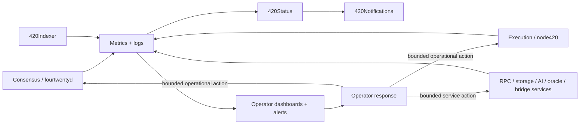

# Observability, status, and operator services

420 Integrated treats observability as evidence about system operation, never as a substitute for canonical chain truth. Metrics, logs, traces, dashboards, alerts, status pages, notification delivery, backup systems, and incident tooling help operators understand and recover the network, but none of those surfaces gain consensus, execution, wallet, governance, or protocol authority merely because operators rely on them.

The core rule is: **canonical state determines what happened; observability helps explain whether the system is healthy enough to continue operating safely.**

## Scope

This infrastructure layer covers:

- process and service health/readiness;
- consensus and execution metrics;
- RPC, Indexer, storage, AI, oracle, bridge, and application-service metrics;
- structured logs and diagnostic traces;
- operator dashboards and alerting;
- incident creation, severity, evidence, resolution, and public communication;
- 420Status as a public health/incident presentation surface;
- 420Notifications as an opt-in alert-delivery surface;
- backup and restore evidence;
- operator recovery ordering after partial or broad infrastructure failure.

It does not redefine protocol finality, balances, ownership, validator eligibility, settlement, bridge proof validity, oracle truth, or user authorization.

## Authority model

The feedback loop is operational, not authoritative. A dashboard may tell an operator that finality appears stalled; it cannot decide that a block is finalized. A status page may report an incident; it cannot create or erase the underlying incident condition. A notification may warn a user; it cannot perform the protected action on the user's behalf.

## Health versus readiness

Every material service should distinguish **liveness** from **readiness**.

A live process is running and can answer a basic health probe. A ready process is sufficiently synchronized, configured, authenticated, connected, and internally consistent to serve its intended role safely.

Examples:

- `fourtwentyd` can be live while not ready to sign because slashing protection or signer state is unavailable;
- `node420` can be live while not ready because execution is behind canonical consensus state;
- an RPC service can answer HTTP requests while being attached to the wrong chain or an unhealthy backend;
- 420Indexer can be live while its canonical or finalized cursor is too far behind;
- a storage/AI/oracle provider can be reachable while not eligible for new protocol work;
- 420Notifications can be live while delivery queues or downstream push providers are degraded.

Readiness must therefore include role-specific correctness checks rather than a process-exists test.

## Metrics

Metrics should answer four questions:

1. **Is the service alive?**
2. **Is it ready to perform its protocol or infrastructure role?**
3. **Is it keeping up with canonical state and expected service objectives?**
4. **Is there evidence of a safety, integrity, or availability problem?**

The existing canary dashboard already defines representative consensus and execution panels including:

- current slot, epoch, and rotation;
- head, safe, and finalized slots;
- finality lag;
- active seats and eligible validators;
- attestation participation;
- primary/FB1/FB2 proposal counts;
- QC count and signer count;
- Engine API error rate;
- `node420` execution-head lag;
- consensus peer counts;
- randomness status;
- `SAFETY_HALT` state;
- base fee;
- gross issuance, burns, and net supply change;
- validator client-version distribution.

Public-service observation adds objectives such as RPC availability, RPC latency/error rate, Explorer availability/indexing lag, faucet status, validator onboarding, conflicting-QC detection, unexplained safety halts, and finality-stall duration.

Metrics should use stable names/labels, bounded-cardinality dimensions, explicit units, and network/environment identity. Operator dashboards must make it difficult to confuse testnet, development, and production signals.

## Logs

Logs preserve event-level operational evidence that aggregate metrics cannot.

Critical logs should include enough context to correlate events across components, such as:

- UTC timestamp;
- network/environment identity;
- process/service identity and version;
- node/provider identity where appropriate;
- slot, epoch, block number, block hash, or finalized checkpoint where relevant;
- request/job/transfer/incident identifiers where relevant;
- severity;
- structured error category/code;
- correlation/trace identifier when crossing service boundaries.

Logs must avoid embedding private keys, JWT secrets, seed material, bearer tokens, push-provider credentials, plaintext private messages, confidential AI inputs, or other secrets.

Security-sensitive and consensus-relevant logs should be retained long enough to support incident analysis and protocol evidence handling. Log retention does not itself make log content canonical.

## Traces

Distributed traces are useful where one request crosses replaceable service boundaries, for example:

- client -> gateway -> RPC backend;
- Indexer -> RPC provider -> projection store;
- 420AI request -> matcher -> worker -> verifier -> settlement service;
- oracle ingestion -> adapter/provider -> router read -> consuming service;
- notification event -> subscription evaluation -> delivery provider.

Trace context must not become an authorization credential. Missing trace data may reduce diagnosability but must not change transaction validity, settlement, finality, or protocol state.

## Alerts

Alerts convert observations into operator attention. They should be actionable, deduplicated, severity-aware, and tied to a documented response path.

Useful alert classes include:

- consensus finality lag or quorum loss;
- conflicting QC/equivocation/safety-halt signals;
- Engine API or consensus/execution divergence;
- validator signer/slashing-protection problems;
- RPC availability, latency, saturation, or wrong-network detection;
- Indexer lag, checkpoint corruption, or finalized-state conflict;
- storage retrievability/proof failure;
- AI worker/matcher/verifier/settlement failure;
- oracle freshness, quorum, confidence, deviation, or circuit-breaker failure;
- bridge verifier, route, or settlement degradation;
- notification delivery backlog or provider outage.

Alerting systems must not automatically weaken safety constraints to clear an alert. In particular, operators must not lower QC thresholds, bypass verification, fabricate oracle values, mark jobs settled without required evidence, or rewrite finalized history merely to restore a green dashboard.

## Incident model

The existing canary incident schema defines four severity levels:

| Severity | Meaning |
| --- | --- |
| `INFO` | no protocol impact; record only |
| `WARN` | degradation without safety impact |
| `MAJOR` | liveness/service impact; may hold progression |
| `CRITICAL` | consensus-safety failure; progression must halt |

Incident records should preserve at least:

- incident ID;
- open/close timestamps;
- severity and category;
- summary;
- first observed slot or comparable chain position where applicable;
- affected nodes/services;
- evidence;
- incident state;
- resolution.

An incident is evidence and coordination state. It does not itself create protocol truth.

## 420Status boundary

420Status is the network/service-health presentation layer.

It may aggregate:

- consensus/finality health;
- execution health;
- public RPC/WSS availability;
- Indexer/Explorer/Search/Analytics freshness;
- storage/resource availability;
- AI compute availability;
- oracle health;
- bridge route/service health;
- Wallet/service availability;
- planned maintenance;
- active incidents, mitigations, and recoveries.

420Status must distinguish **service availability** from **canonical protocol state**. A red component does not prove the chain is unsafe; a green component does not prove a transaction settled or a block finalized.

Status incidents should link to evidence and, where appropriate, canonical references. Public incident communication should avoid exposing operator secrets or private user data.

Alternative status clients may independently derive the same health information. 420Status is not a monopoly on operational truth.

## 420Notifications boundary

420Notifications is an opt-in alert and event-delivery layer. It derives notifications from canonical or registered sources and must preserve source provenance, network identity, and relevant transaction/log/block context.

Notification infrastructure may deliver:

- account and transaction activity;
- payment/invoice state;
- bridge/swap state;
- validator/staking/reward events;
- governance deadlines;
- security/deprecation/verification changes;
- AppStore updates;
- 420Status incidents and recoveries;
- registered dApp events and explicit user watch conditions.

Subscriptions are reversible and may be controlled by source, topic, severity, and delivery channel. Promotional notifications require separate consent.

420Notifications cannot sign transactions, grant capabilities, approve spending, mutate protocol state, create canonical events, or bypass Wallet confirmation. Notification action buttons may only hand off to Wallet or the originating application, where normal authorization still applies.

Delivery must support deduplication, retry safety, rate limits, abuse controls, source attribution, and restart behavior that avoids duplicate user-visible delivery. Notification failure must never block the protocol event it describes.

## Privacy

Observability can become a surveillance system if telemetry collection is unconstrained. The infrastructure therefore follows data-minimization rules.

Do not place in public dashboards, logs, traces, notification indexes, or status reports:

- validator or Wallet private keys;
- Engine/JWT credentials;
- push-provider credentials/tokens;
- private Messenger/Commons plaintext;
- encrypted Resource payload plaintext;
- private Identity fields;
- raw private AI prompts/documents/results unless explicitly required within the authorized compute boundary;
- raw Attention telemetry where the protocol does not require publication;
- user notification watchlists or delivery endpoints by default.

Operational telemetry should expose the minimum detail required to diagnose the system safely.

## Backups

Backups serve different purposes depending on the component.

### Canonical node data

Consensus and execution nodes must preserve the state required to recover the same canonical finalized history. A backup is valid only if operators can identify the network/genesis and the canonical checkpoint/state it represents.

For consensus incidents, preserve logs, QCs, safety evidence, and the finalized checkpoint before remediation.

### Signing safety data

Validator slashing-protection and signing-history data are safety-critical and must be backed up independently from ordinary service caches. Restoring a validator without restoring compatible signing protection is unsafe.

Signing keys should remain in the approved signer/key-management boundary rather than being copied into generic application backups.

### Derived services

420Indexer and other derived projections should be rebuildable from canonical sources. Their backups improve recovery time but never outrank chain truth. If a derived backup conflicts with canonical state, discard/reconcile the projection rather than rewriting the chain to match it.

### Provider services

Storage, AI, oracle, RPC, notification, and similar provider services should back up the configuration, queue/accounting, and evidence needed for continuity while preserving their non-authoritative role. A restored provider queue may not invent protocol work that canonical state does not recognize.

### Backup validation

A backup policy is incomplete until restore is tested. Operators should periodically verify:

- network/genesis identity;
- checkpoint or cursor identity;
- integrity/hash of backup artifacts;
- encryption/key access where required;
- restore ordering;
- signer/slashing-protection compatibility;
- that restored derived services reconcile with canonical sources before serving writes or authoritative-looking views.

## Recovery order

Recovery must proceed from authority outward rather than from dashboards inward.

A representative order is:

1. determine whether consensus safety is intact;
2. preserve incident evidence and the latest trustworthy finalized checkpoint;
3. apply `SAFETY_HALT` procedures if the safety conditions require it;
4. restore `fourtwentyd` persistence, signing protection, signer state, and committee/finality state;
5. restore `node420` to matching canonical execution state and verify the private Engine boundary;
6. restore canonical protocol/system-service dependencies;
7. restore and reconcile public RPC/gateway services;
8. replay/rebuild 420Indexer and other derived projections;
9. restore storage/AI/oracle/bridge/provider services and reconcile their canonical jobs/agreements/feeds/transfers;
10. restore 420Status and operator dashboards from live evidence;
11. restore 420Notifications and delivery queues with deduplication/retry safeguards;
12. close the incident only after service observations agree with canonical state and the documented exit criteria are satisfied.

A dashboard turning green is not sufficient evidence to skip these steps.

## Safety-halt and rollback language

The existing testnet rollback runbook makes the terminology explicit: **never call a history rewrite a rollback**.

For a live network incident:

- preserve logs, QCs, evidence, and finalized checkpoint;
- do not lower quorum thresholds to regain liveness;
- do not replace validators solely because a partition-local view marks them inactive;
- freeze affected public distribution/gateway/treasury paths when required by the safety-halt procedure;
- if a test network is abandoned, retire its genesis/checkpoint identity explicitly and launch a distinct new network identity rather than pretending the old history was rewritten safely.

## Testnet observation objectives

The current 72-hour observation runbook supplies concrete launch-time examples of measurable objectives:

- at least three healthy RPC endpoints;
- RPC availability at least 99%;
- RPC p95 latency no more than one second;
- RPC error rate no more than 1%;
- Explorer availability at least 99%;
- Explorer indexing lag no more than three blocks;
- faucet operational without unresolved abuse incident;
- 15 active seats and at least 60 eligible validators;
- zero conflicting QCs;
- zero unexplained `SAFETY_HALT`;
- no unexplained finality stall beyond 42 slots;
- at least five external validators onboarded successfully.

These values are current testnet observation gates, not universal mainnet SLOs. Production SLOs may evolve through explicit operational policy without changing consensus rules.

## Failure behavior

### Metrics backend unavailable

Operators lose aggregate visibility. Canonical services continue if they are otherwise healthy. Do not infer protocol failure merely because metrics collection failed.

### Logging pipeline unavailable

Preserve local service evidence where possible and restore shipping later. Logging loss may increase incident severity because evidence is degraded, but it does not rewrite canonical state.

### Dashboard or 420Status unavailable

Public/operator visibility degrades. Use direct canonical/health interfaces and incident channels. Status-page outage cannot become a consensus or transaction blocker.

### Alert delivery unavailable

Operators must have alternate escalation paths for safety-critical systems. Alerts are attention mechanisms, not protocol controls.

### 420Notifications unavailable

Users may miss alerts, but payments, swaps, bridges, governance, staking, and contract interactions continue according to their own canonical rules.

### Backup unusable

Fail closed for roles whose safe recovery requires that backup, especially validator signing protection. Rebuild derived systems from canonical sources where possible rather than accepting uncertain data.

### Conflicting observations

Resolve disagreement against canonical consensus/execution state and the authoritative protocol source for the affected domain. Preserve both observations for incident analysis; do not select whichever makes the dashboard green.

## Observability and operator-service invariants

- **OBS-001** — metrics, logs, traces, dashboards, alerts, 420Status, and 420Notifications never become canonical merely because operators or users depend on them.
- **OBS-002** — service liveness and readiness are distinct; readiness includes role-specific correctness, synchronization, identity, and dependency checks.
- **OBS-003** — telemetry and incident records preserve network/environment identity and enough canonical references to support reconciliation where applicable.
- **OBS-004** — telemetry must not expose signing keys, JWT secrets, push credentials, private message content, private Identity data, or unrelated confidential payloads.
- **OBS-005** — alerts may trigger bounded operator response but cannot weaken consensus, verification, authorization, or settlement rules automatically.
- **OBS-006** — 420Status reports operational health and incidents but cannot create finality, settlement, ownership, validator eligibility, or protocol state.
- **OBS-007** — 420Notifications is opt-in/non-authoritative and cannot sign, spend, grant capabilities, mutate protocol state, or bypass Wallet authorization.
- **OBS-008** — notification retries, provider failover, and service restarts must not create duplicate canonical events or duplicate user-visible delivery where the delivery contract promises deduplication.
- **OBS-009** — validator signing/slashing-protection backups are safety-critical and remain separate from ordinary derived-service backups and application caches.
- **OBS-010** — derived-service backups never outrank canonical chain/protocol state and must reconcile before resuming service.
- **OBS-011** — incident recovery restores canonical authorities before derived projections, status presentation, and notification delivery.
- **OBS-012** — a green dashboard or recovered status page is insufficient evidence of protocol recovery unless canonical state, safety constraints, and documented exit criteria also agree.

## Implementation status and evolution

The repository already contains canary health/incident schemas, observation runbooks, dashboard definitions, public-service readiness checks, 420Notifications architecture/configuration, and operator recovery rules. DOC-5.9 consolidates those surfaces into the canonical infrastructure architecture model.

Future metrics backends, log aggregators, tracing systems, paging providers, status-page implementations, backup tooling, and notification delivery providers may change without changing the authority model above. Material changes to trust, recovery, or safety semantics must update this documentation and the underlying protocol/operator specifications together.

## Related documentation

- [Infrastructure overview](infrastructure-overview.md)
- [`fourtwentyd`](fourtwentyd.md)
- [`node420`](node420.md)
- [420Indexer](420indexer.md)
- [RPC, gateways, and network ingress](rpc-gateways-network-ingress.md)
- [Storage and resource infrastructure](storage-resource-infrastructure.md)
- [420AI compute infrastructure](420ai-compute-infrastructure.md)
- [Oracle and external-provider infrastructure](oracle-external-provider-infrastructure.md)
- `docs/420NOTIFICATIONS.md`
- `testnet/runbooks/OBSERVATION-OPERATIONS.md`
- `testnet/runbooks/ROLLBACK.md`
- `testnet/canary/dashboard.json`
- `testnet/canary/incidents/schema.json`
