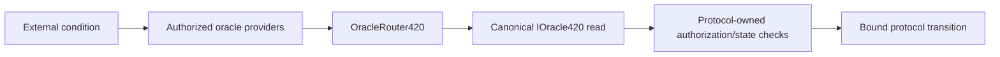

# Oracle & external-provider infrastructure

420 Integrated treats external facts as explicit trust-boundary inputs rather than native chain truth. **420Oracle** is the provider-neutral interface layer that turns qualified external observations into bounded canonical reads for protocols that need prices, proof-of-reserve facts, external outcomes, API results, automation conditions, or off-chain computation results.

The core rule is: **an external provider may report a fact, but it never becomes protocol authority merely because the network consumes that report.** Provider registration grants narrow reporting authority only. It does not grant custody, governance, bridge, validator, settlement, token-transfer, or arbitrary execution authority.

## 420Oracle V1 boundary

The frozen V1 Oracle layer consists of:

- `OracleIds420.sol` — canonical service, feed, source, and aggregation identifiers;
- `OracleProviderRegistry420.sol` — provider identity and submission-operator authority;
- `OracleFeedRegistry420.sol` — feed identity, heartbeat, source membership, aggregation policy, revisions, and source epochs;
- `OracleRiskPolicy420.sol` — confidence, deviation, and circuit-breaker policy;
- `OracleRouter420.sol` — replay-safe observation intake and deterministic fail-closed aggregation;
- `IOracle420.sol` — canonical consumer read surface;
- `IOracleSourceAdapter420.sol` — read-only external/TWAP normalization boundary;
- `TWAPOracleSourceAdapter420.sol` — current Swap TWAP adapter;
- `IRandomnessRouter420.sol` — separate generalized-randomness boundary.

420Oracle does not allocate a new frozen system predeploy address. Oracle services are discovered through canonical protocol/service discovery until an explicit deterministic-address decision changes that rule.

## External data classes

V1 recognizes six canonical ordinary-oracle classes:

- **price** — numeric price observations;
- **proof of reserve** — external reserve-state commitments/results;
- **outcome** — event or external-system outcomes;
- **external API** — normalized results from an external API/data service;
- **automation** — externally observed conditions used to decide whether a protocol-defined action may proceed;
- **computation** — external/off-chain computation result commitments.

These classes identify what kind of external fact is being represented. They do not weaken the consuming protocol's authorization, settlement, verification, or state-machine rules.

## Provider identity and reporting authority

`OracleProviderRegistry420` binds a stable provider identity to one active submission operator and records:

- provider metadata commitment;
- stake reference;
- activation/deactivation timestamps;
- provider epoch;
- active status.

Provider activation or operator replacement advances the provider epoch. This matters because observations record the provider epoch that was active when they were submitted. An observation from an earlier provider epoch cannot become eligible again merely because the same provider ID is later reactivated.

An active provider still cannot contribute to every feed automatically. Governance must separately activate it as a source for the specific feed.

## Feed definitions and bounded source sets

`OracleFeedRegistry420` defines each feed's:

- feed type;
- aggregation mode;
- metadata commitment;
- heartbeat/freshness interval;
- decimal precision for numeric reads;
- minimum source count;
- revision;
- active state;
- configured provider sources and source epochs.

V1 bounds each feed to at most **16 configured sources** and caps the heartbeat at **30 days**. These limits keep canonical aggregation predictably executable and prevent unbounded source enumeration.

Changing feed configuration increments the feed revision. Reactivating a source advances its source epoch. Existing observations remain historical, but they no longer qualify when their captured revision/epoch does not match current configuration.

## Observation intake and replay protection

A provider submits an observation through `OracleRouter420`. The router verifies that:

1. the feed exists and is active;
2. the caller is the currently authorized operator for the provider;
3. the provider is an active source for that feed;
4. the observation ID is nonzero and globally unused;
5. the observation timestamp is nonzero and not in the future;
6. confidence is within the valid basis-point range;
7. the provider's new observation is strictly newer than its previous observation for that feed.

The stored observation snapshots the current feed revision, provider epoch, and source epoch. Observation IDs cannot be replayed, and a provider cannot replace its current feed observation with an equal or older timestamp.

## Freshness and epoch eligibility

An observation is eligible for a canonical read only when all of the following remain true:

- its provider is active;
- the provider remains an active source for the feed;
- its timestamp is not in the future;
- its age is within the feed heartbeat;
- its feed revision matches the current feed revision;
- its provider epoch matches the current provider epoch;
- its source epoch matches the current source epoch;
- it satisfies configured confidence requirements.

This epoch model prevents a provider, source, or feed from being disabled and later re-enabled in a way that silently resurrects old observations.

## Canonical consumer reads

Consumers should use the provider-neutral `IOracle420` interface rather than consuming raw provider submissions as canonical truth.

Numeric reads return:

- value;
- conservative `updatedAt` representing the oldest contributing observation;
- decimals;
- conservative confidence;
- source spread in basis points;
- contributing source count.

Exact-result reads return:

- result hash;
- conservative `updatedAt`;
- agreeing source count;
- conservative confidence.

A provider transaction is therefore an input to Oracle state, not the canonical oracle answer. The canonical V1 answer is the successful router read after freshness, source, epoch, quorum, confidence, and risk rules are applied.

## Aggregation modes

### Median numeric

`MEDIAN_NUMERIC` collects all eligible numeric observations, sorts them deterministically, and selects the middle element. With an even number of sources, V1 selects the upper-middle value using `values[count / 2]`.

The router also computes the spread between the lowest and highest eligible observations relative to the median. This allows a feed-specific deviation policy to reject an otherwise fresh quorum when sources disagree too widely.

### Exact-result quorum

`QUORUM_EQUAL` requires at least the configured minimum number of eligible sources to report exactly the same `bytes32` result.

If no result reaches quorum, the read fails closed. If two different results independently satisfy quorum, the read fails closed as ambiguous rather than choosing one arbitrarily.

This mode is appropriate for external outcomes, discrete API results, automation conditions, computation commitments, or other facts represented by an exact result hash.

## Confidence, deviation, and circuit breakers

`OracleRiskPolicy420` can configure per-feed:

- minimum confidence in basis points;
- maximum numeric deviation in basis points;
- a feed-specific halt/circuit breaker.

Low-confidence observations cannot satisfy a configured canonical quorum. Excessive numeric spread causes the read to fail closed. A halted feed rejects canonical reads without deleting historical observations.

Clearing a halt does not automatically make old data valid. Freshness, current epochs, confidence, deviation, and quorum requirements still apply.

## Freshness is not enough

Security-sensitive consumers must not equate "recent" with "safe." The Oracle semantics freeze requires consumers to consider source provenance, observation window, confidence/deviation state, and oracle health in addition to timestamps.

The current Swap TWAP adapter demonstrates this distinction. It normalizes Q96 price output to 18-decimal fixed point but reports confidence `0` because the underlying TWAP surface does not provide an explicit confidence measure. A feed that requires stronger confidence must therefore combine or reject that source according to its configured policy rather than treating freshness as proof of reliability.

## Adapter and vendor neutrality

`IOracleSourceAdapter420` is a read-only normalization boundary. An adapter may translate a vendor-specific or protocol-specific source into a common numeric/result shape, but deployment of an adapter does **not** make that source canonical.

Adapters do not receive:

- custody authority;
- settlement authority;
- governance authority;
- bridge authority;
- validator authority;
- arbitrary execution authority.

External vendors, including future commercial oracle networks, remain providers/adapters behind the 420Oracle interface. Consumers depend on the configured 420Oracle guarantee rather than hard-coding one vendor as protocol truth.

## External computation and outcomes

Off-chain computation may produce a result commitment that providers report into a `COMPUTATION` feed. The oracle layer can establish that a configured provider/quorum reported the committed result under the feed's policy; it does not prove arbitrary computation correct unless the bound source/verifier semantics provide that guarantee.

Similarly, an `OUTCOME` feed can represent an external event result. The consumer remains responsible for defining what that result authorizes. Oracle reporting does not grant the provider permission to move funds, settle unrelated positions, change ownership, or bypass the consuming protocol's state machine.

## Automation triggers

An `AUTOMATION` feed represents an external condition or trigger fact. It is **not** a general remote-execution channel.

A safe automation flow is:

The consuming protocol still owns the authorization, timing, replay, value, and state-transition rules. A valid automation observation cannot by itself sign for a user or execute arbitrary calls.

## Bridge attestation boundary

Oracle external facts and bridge external-chain proofs are different trust domains.

420Bridge validates foreign-chain state through bridge-specific chain identity, finality/confirmation, proof or attestation authenticity, replay protection, destination/domain separation, asset identity, route policy, and verifier rules. A generic 420Oracle result cannot substitute for a bridge proof merely because both originate outside the 420 chain.

If a bridge specification explicitly consumes an oracle/verifier route, that use must still preserve the bridge's own frozen security requirements. Relayers and proof carriers transport evidence; they do not become canonical settlement authority merely by delivering it.

## Randomness remains separate

Ordinary oracle aggregation must never be used as an implicit randomness generator.

Generalized randomness uses the separate `IRandomnessRouter420` boundary, which binds request profiles, domain and purpose, primary/fallback routes, operators, verifiers, methods, deadlines, security tier, and fallback policy.

If an application requires VRF, threshold randomness, commit-reveal, or another qualified method, failure of that route must be handled by the randomness protocol's approved fallback semantics rather than by hashing an ordinary oracle feed or substituting an unverified service response.

## Provider outage, failover, and replacement

A single provider outage should reduce the available source set rather than redefine the feed. If the remaining eligible sources still meet quorum and all risk rules, reads may continue. If they do not, the affected read fails closed.

Provider replacement is performed through canonical provider/source configuration. New provider/source epochs ensure that prior observations do not become valid under newly activated authority.

Failover therefore means replacing or restoring qualified sources while preserving the same feed identity, aggregation semantics, and consumer interface. It does not mean silently changing trust assumptions inside an application.

## Failure behavior

### Stale data

Stale observations are excluded. If quorum is lost, the canonical read fails rather than extending the heartbeat locally.

### Insufficient sources

The router reverts. Consumers pause/defer the affected transition unless their own frozen specification defines a safe alternative.

### Conflicting exact-result quorums

The router fails closed as ambiguous. Operators investigate the provider/source evidence; consumers must not choose a winner off-chain and pretend it was canonical.

### Low confidence or excessive deviation

Configured risk rules reject the read. Operators should investigate sources rather than weakening policy reactively.

### Circuit breaker active

Canonical reads fail while history remains intact. Clearing the halt requires normal eligibility rules to pass again.

### Adapter or external vendor failure

The affected source becomes unavailable or stale. The provider-neutral feed may continue only if its remaining qualified sources satisfy policy.

### Provider compromise

Deactivate/replace the affected provider or feed source through canonical governance controls, advance epochs, preserve submitted evidence, and re-establish fresh quorum before dependent writes resume.

### Router unavailable

Dependent value-sensitive writes stop. Consumers must not bypass the router and promote raw provider data into canonical oracle state.

## Recovery order

A representative oracle/external-provider recovery sequence is:

1. verify canonical execution and 420Oracle deployment/discovery identity;
2. verify provider registry state and current provider epochs;
3. verify feed definitions, revisions, heartbeat, aggregation mode, and minimum-source policy;
4. verify active source membership and source epochs;
5. verify risk policy and circuit-breaker state;
6. restore external adapters/provider collectors and validate source provenance;
7. resume replay-safe observations with current timestamps/epochs;
8. establish fresh quorum and verify confidence/deviation behavior;
9. verify `IOracle420` reads against expected semantics;
10. resume dependent protocol writes only after their required oracle guarantees are healthy.

Historical observations may remain useful for audit and incident analysis, but they must not be manually promoted into current canonical reads when they fail the active feed rules.

## Oracle/external-provider invariants

- **ORACLE-INFRA-001** — no external vendor, adapter, relayer, or reporting provider becomes protocol-canonical merely because the ecosystem uses its service.
- **ORACLE-INFRA-002** — provider authority is reporting-only and feed-scoped; it never implies custody, governance, validator, bridge, settlement, or arbitrary execution authority.
- **ORACLE-INFRA-003** — consuming contracts treat successful `IOracle420`/`OracleRouter420` output, not raw provider submissions, as the canonical ordinary-oracle read.
- **ORACLE-INFRA-004** — stale observations and observations from obsolete feed/provider/source epochs cannot contribute to current canonical reads.
- **ORACLE-INFRA-005** — insufficient configured quorum produces no canonical read; consumers must not invent or guess a replacement value/outcome.
- **ORACLE-INFRA-006** — observation IDs are replay-safe and provider timestamps advance monotonically per feed.
- **ORACLE-INFRA-007** — configured confidence, deviation, and circuit-breaker rules fail closed and cannot be bypassed by application convenience layers.
- **ORACLE-INFRA-008** — source adapters are read-only normalization boundaries and are never canonical merely by deployment.
- **ORACLE-INFRA-009** — automation/outcome/external-computation results provide bounded facts or commitments only; they never grant ambient transaction, custody, or protocol-admin authority.
- **ORACLE-INFRA-010** — bridge proof/finality/asset-verification requirements remain bridge-specific and cannot be weakened into an unqualified generic oracle assertion.
- **ORACLE-INFRA-011** — generalized randomness remains a separate protocol boundary; ordinary oracle feeds never synthesize or silently substitute randomness.
- **ORACLE-INFRA-012** — provider outage, compromise, or replacement may degrade affected external-data consumers but cannot halt consensus, redefine canonical chain state, or resurrect observations from an obsolete authority epoch.

## Implementation status and evolution

The repository currently contains the frozen 420Oracle V1 model, provider/feed/risk registries, replay-safe router, canonical consumer interface, source-adapter interface, and Swap TWAP adapter. Additional external providers, APIs, proof-of-reserve sources, automation workers, computation verifiers, and vendor-specific adapters can be added behind these boundaries.

Material changes to provider authority, feed semantics, aggregation, risk rules, randomness separation, bridge interaction, or consumer failover must update this page rather than creating a competing source of truth.

## Related documentation

- [Infrastructure overview](infrastructure-overview.md)
- [420AI compute infrastructure](420ai-compute-infrastructure.md)
- [RPC, gateways, and network ingress](rpc-gateways-network-ingress.md)
- [System dependency map](../dependency-map.md)
- [Trust-boundary model](../trust-boundary-model.md)
- `docs/420-ORACLE-V1-MODEL.md`
- `contracts/config/interfaces/oracle-semantics.json`
