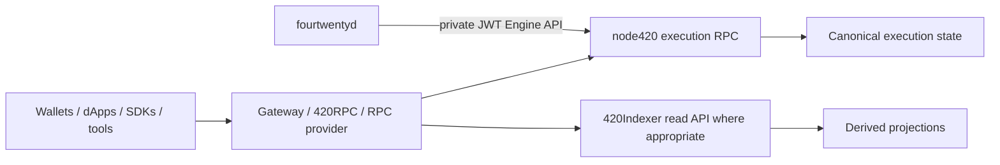

# RPC, gateways, and network ingress

420 Integrated exposes several network-access surfaces, but those surfaces do not all have the same authority or trust level. Public execution RPC, WebSocket access, index-consumer APIs, gateways/proxies, and future 420RPC services are replaceable ingress infrastructure. The private Engine API between `fourtwentyd` and `node420` is a separate privileged control plane and must remain isolated from public application traffic.

The core rule is: **transport and routing do not create protocol authority**. A gateway may route, authenticate, cache, rate-limit, balance, or fail over requests, but it must not redefine chain state, finality, signatures, canonical deployments, or consensus outcomes.

## Current state

Today, `node420` exposes the canonical execution JSON-RPC surface directly through its pinned Geth distribution. The wrapper defaults to:

- HTTP JSON-RPC on `127.0.0.1:8545`;
- public execution namespaces `eth`, `net`, and `web3`;
- authenticated Engine API on `127.0.0.1:8551`;
- JWT authentication for Engine access;
- execution P2P separately on port `30303`.

420Indexer consumes conventional EVM JSON-RPC behind its transport-neutral `ChainSource420` boundary and does **not** require a dedicated 420RPC implementation. This means the current architecture already has a stable source/interface boundary that a future 420RPC service can satisfy without changing Indexer semantics.

## Future 420RPC integration

420RPC has not yet replaced the direct execution-RPC path described above. When 420RPC is implemented, this page should be updated in place to document its concrete deployment, API extensions, endpoint-discovery records, health semantics, rate-limit classes, failover behavior, authentication model, and any 420-specific read helpers.

The architectural contract should remain stable:

A future 420RPC layer may improve reliability and developer ergonomics, but it must remain downstream of canonical execution and must not become a substitute consensus or execution authority.

## Public execution RPC

Public execution RPC is intended for ordinary application and developer access, including:

- chain identity checks such as `eth_chainId`;
- block, transaction, receipt, and log queries;
- account and contract state queries;
- transaction submission;
- fee/gas estimation where supported;
- network metadata exposed through approved namespaces.

Public ingress should expose only approved methods. Administrative, debugging, Engine, local maintenance, signer-control, or other privileged methods must not become publicly reachable merely because the underlying execution client supports them.

## WebSocket access

Where WSS is exposed, it is a public application transport rather than a new source of authority.

WSS endpoints should apply the same network-identity, method-allowlist, authentication, rate-limit, payload-size, and observability controls as HTTP RPC. Subscriptions may improve delivery latency, but clients must still treat observed head events as potentially non-final until the relevant finality boundary is reached.

A dropped subscription or reconnect must not be interpreted as a chain reorganization by itself.

## Private Engine transport

The Engine API is not part of public network ingress.

Its role is the privileged consensus-to-execution control boundary between `fourtwentyd` and `node420`. The current default is loopback `127.0.0.1:8551` with JWT authentication.

The Engine surface includes the 420-specific consensus-system-call staging capability used by the qualified execution build. It therefore requires stronger isolation than public RPC.

Public gateways must never proxy Engine methods, Engine credentials, or raw authenticated control-plane traffic to untrusted clients.

## Gateway and proxy responsibilities

A public gateway or reverse proxy may safely provide:

- TLS termination;
- request authentication/API keys when required;
- method allowlists;
- request/response size limits;
- rate limiting and quotas;
- connection limits;
- timeout enforcement;
- load balancing among compatible upstreams;
- health-aware failover;
- logging/metrics/tracing;
- DDoS/abuse controls;
- geographic or deployment routing;
- cache controls for explicitly safe read methods.

It must not:

- alter signed transaction bytes;
- invent successful transaction receipts;
- rewrite canonical block hashes or finality metadata;
- silently serve another chain under the same endpoint identity;
- expose privileged local-node methods;
- hide material upstream disagreement from security-sensitive consumers.

## Endpoint discovery

Clients should obtain endpoints from controlled network configuration, canonical manifests/registries where available, or explicitly versioned environment configuration rather than hard-coding a single operator hostname forever.

Endpoint metadata should eventually expose enough information to identify:

- environment/network;
- expected chain ID;
- transport (`https`, `wss`, internal HTTP, etc.);
- service class (`execution-rpc`, `indexer-api`, `gateway`, future `420rpc`);
- supported API/version profile;
- authentication requirements;
- health/readiness endpoint where applicable;
- operator/provider identity where relevant.

Endpoint discovery is routing metadata, not chain authority. A listed endpoint must still prove compatible network identity when contacted.

## Network identity checks

A client must not trust branding, DNS, TLS hostname, or provider reputation as proof that an endpoint belongs to the intended chain.

At minimum, execution clients should validate chain ID `420`. Higher-risk integrations should additionally verify canonical deployment identities and, where practical, genesis/network metadata and finalized-chain agreement.

420Indexer independently rejects wrong-chain execution sources before indexing. Future 420RPC implementations must preserve this fail-closed model rather than weakening it.

## Rate limiting and resource bounds

Ingress is exposed to untrusted callers and must be resource bounded.

Operators should apply independent limits for classes such as:

- lightweight reads;
- log/history queries;
- simulation/estimation;
- transaction submission;
- WebSocket subscriptions;
- bulk or archival access;
- authenticated first-party/internal consumers.

Limits should bound request size, batch size, concurrency, response size, execution time, subscription count, and expensive historical ranges where appropriate.

Rate limiting is an availability/security control. It must not change transaction validity or canonical ordering.

## Transaction submission

A gateway transports signed transactions to execution peers. It does not become custodian or signer merely by accepting a submission request.

Important consequences:

- signed transaction bytes should be forwarded without semantic rewriting;
- successful gateway acceptance is not proof of inclusion;
- mempool acceptance is not finality;
- retries must avoid creating misleading duplicate-success semantics;
- clients should track the transaction hash and later query canonical inclusion/finality.

A future 420RPC submission API may add structured status or routing helpers, but those helpers must distinguish submitted, accepted, included, safe, finalized, dropped, and failed states accurately.

## Read consistency and finality

Public RPC providers can be healthy while observing slightly different non-finalized heads. Security-sensitive clients should therefore distinguish:

- latest/head state;
- safe state;
- finalized state;
- indexed/derived state from 420Indexer;
- cached gateway responses.

Gateways must not label a non-finalized observation as finalized merely because it is cached or widely observed.

For rich historical/search queries, clients may use 420Indexer rather than repeatedly issuing expensive raw RPC scans. Indexed answers remain derived and should expose freshness/finality context.

## Caching

Caching is permitted only where method semantics allow it.

Reasonable cache candidates can include immutable historical block/receipt data after finality and static network metadata. Operators should avoid caching mutable head-state queries without explicit TTL/freshness semantics.

Never cache or replay a transaction-submission response in a way that implies a new submission occurred.

## Failover

RPC failover improves availability but introduces consistency requirements.

A failover target should be accepted only if it satisfies the expected network/service identity. Before routing security-sensitive traffic, the gateway should verify at least:

- expected chain ID;
- compatible service/API version;
- acceptable synchronization/freshness;
- no known finalized-chain conflict;
- required method availability.

Failover between providers must not silently cross development/testnet/mainnet environments.

When upstreams disagree on finalized state, the gateway should fail closed for affected operations and surface the disagreement rather than choosing whichever answer arrived first.

## Load balancing

Read traffic may be distributed among multiple compatible execution nodes or provider endpoints. Write traffic may also be submitted to multiple peers where intentionally designed, but duplicate fan-out must preserve the original signed transaction and idempotent hash semantics.

Load balancing is operational. It cannot replace consensus fork choice or determine which block becomes canonical.

## Ingress security

Public RPC/gateway services should assume hostile input.

Security controls should include:

- strict HTTP/WebSocket parsing;
- bounded body/header sizes;
- JSON-RPC batch limits;
- method allowlists;
- origin/CORS policy appropriate to the endpoint class;
- authentication and authorization for non-public tiers;
- rate limits/quotas;
- upstream timeout/circuit-breaker behavior;
- secret isolation;
- audit logs for privileged operator changes;
- no exposure of Engine JWT, validator signer, database, host, or cloud credentials.

Application API keys do not grant protocol authority and must remain separate from Wallet/user signing keys.

## Health and readiness

Ingress health should distinguish at least:

- process/proxy liveness;
- upstream reachability;
- expected chain identity;
- synchronization/freshness;
- method/API compatibility;
- Indexer lag where a gateway fronts derived APIs;
- failover capacity;
- degraded state.

A gateway returning HTTP 200 while routing to the wrong network is not ready.

## Failure behavior

### One upstream unavailable

Remove or quarantine it from healthy routing and use another verified compatible upstream where available.

### All execution RPC upstreams unavailable

Fail requests clearly. Do not fabricate state or transactions merely to preserve API uptime.

### Wrong-chain upstream

Quarantine/fail closed immediately.

### Upstream finalized disagreement

Fail closed for security-sensitive reads/writes and investigate the canonical source; do not majority-vote arbitrary RPC providers into a new finality mechanism.

### Indexer unavailable

Raw execution RPC may remain available. Explorer/search/analytics features depending on indexed projections may degrade independently.

### Gateway unavailable

Canonical consensus/execution may continue. Clients may fail over to another approved endpoint if configured.

### Engine API unavailable

This is a consensus/execution control-plane failure, not a public-gateway problem. Public routing must not attempt to repair it by exposing or proxying Engine access.

## Recovery order

A safe ingress recovery sequence is:

1. verify canonical `node420`/consensus health first;
2. verify network identity and finalized boundary;
3. restore/verify upstream execution RPC endpoints;
4. restore 420Indexer where derived API traffic depends on it;
5. validate gateway allowlists, credentials, limits, and TLS configuration;
6. verify each upstream's chain identity and freshness;
7. restore load balancing/failover pools;
8. expose public traffic gradually;
9. verify metrics/errors/latency and downstream application behavior.

Do not make a gateway appear healthy before its upstream network identity is proven.

## 420RPC documentation lifecycle

This page is intentionally designed to survive the transition from direct node420 RPC to a dedicated 420RPC service.

When 420RPC is implemented, update this page to replace the generic/future 420RPC sections with concrete facts such as:

- actual process/package names;
- deployment topology;
- supported JSON-RPC extensions;
- stable REST/WS interfaces, if any;
- canonical endpoint registry/configuration;
- routing/failover algorithms;
- authentication tiers;
- exact rate-limit/resource profiles;
- health/readiness contract;
- observability and incident behavior;
- qualification gates.

The stable rules on authority, Engine isolation, network identity, fail-closed behavior, and provider replaceability should remain unless the underlying protocol architecture itself changes.

Documentation does **not** update automatically merely because code is added. The 420Docs source is repository-controlled Markdown, so the 420RPC implementation PR should include a documentation update to this page (and later generated references where applicable). This is the intended GEN-DOC-001-style workflow: material external behavior changes ship with their docs.

## RPC and ingress invariants

- **RPC-001** — public RPC/gateway services receive no consensus or execution authority merely by routing traffic.
- **RPC-002** — public execution RPC and private authenticated Engine traffic must remain separate trust surfaces.
- **RPC-003** — Engine methods and JWT credentials must never be exposed through public gateway routing.
- **RPC-004** — endpoints must verify/advertise the intended network; hostname or branding alone is insufficient.
- **RPC-005** — gateways must not mutate signed transaction semantics or fabricate canonical inclusion/finality.
- **RPC-006** — rate limits, caching, and load balancing must not change transaction validity or chain semantics.
- **RPC-007** — failover targets must be network-compatible and sufficiently synchronized for the requested service class.
- **RPC-008** — finalized-state disagreement between upstreams fails closed; ingress does not invent its own finality vote.
- **RPC-009** — privileged/admin/debug surfaces must remain excluded from ordinary public RPC exposure.
- **RPC-010** — derived 420Indexer responses must remain distinguishable from direct canonical execution reads.
- **RPC-011** — gateway/application credentials must remain separate from Wallet, Engine, validator-signing, and host/operator credentials.
- **RPC-012** — future 420RPC implementation may replace/augment ingress transport but must preserve canonical authority and isolation boundaries unless explicitly redesigned at the protocol level.

## Related documentation

- [Infrastructure overview](infrastructure-overview.md)
- [`node420` infrastructure](node420.md)
- [420Indexer infrastructure](420indexer.md)
- [Network identity and configuration](../chain/network-identity-and-configuration.md)
- [Consensus failure, recovery, and operator safety](../consensus/failure-recovery-operator-safety.md)
