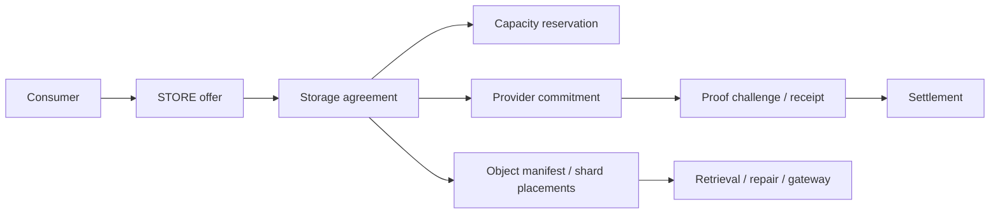

# Storage & resource infrastructure

420 Integrated treats storage, retrieval, relay, cache, and gateway capacity as provider-backed infrastructure coordinated by the **420 Resource Protocol**. The protocol anchors provider identity, offers, sessions, receipts, storage agreements, commitments, proof policy, and settlement state on-chain while keeping encrypted payload bytes, shards, private metadata, and most provider execution off-chain.

The central rule is: **resource providers supply service, not protocol authority**. A provider may store data, route traffic, serve cached content, or expose a gateway without gaining consensus, execution, governance, identity, or application-admin authority.

## Service classes

The genesis Resource Protocol defines four related service classes:

- **420Relay** — encrypted routing and metered bandwidth;
- **420Store** — persistent encrypted decentralized storage with verifiable commitments and proof receipts;
- **420Cache** — decentralized cache/CDN and retrieval bandwidth;
- **420Gateway** — public/private gateways into decentralized services.

These services share provider/node/session/accounting infrastructure but remain capability-separated. Authorization for one service does not imply authority over another.

## Provider and node boundary

Provider participation is represented through canonical provider and node registries. Active provider state requires a nonzero staking reference, and each node is bound to one provider and one canonical service class.

Provider/node state may establish that an actor is eligible to offer a service. It does not make the provider's local database, filesystem, API response, or monitoring result canonical chain state.

Applications should discover providers through canonical registries and approved manifests rather than hard-coding one operator wherever practical.

## Offers, sessions, metering, and settlement

Resource offers snapshot the service class, pricing, unit caps, terms, and expiry before consumption. Sessions are replay-safe and carry explicit unit and native-`$420` spend ceilings. Metering receipts advance cumulative usage monotonically and must remain within session limits.

Settlement authority is separately capability-scoped. A provider cannot exceed the session's maximum spend merely because it served additional off-chain work.

This separation keeps service delivery off-chain while placing economic/control state on-chain.

## 420Store architecture

420Store extends the shared Resource Protocol with storage-specific agreements, capacity reservations, commitments, proof schemes, proof receipts, manifests, shard placement, and settlement.

A representative storage flow is:

The chain anchors identities and commitments. Encrypted object bytes and erasure-coded shards remain off-chain.

## Storage agreements

`StorageAgreementRegistry420` binds a consumer request to a valid STORE offer, durability policy, proof scheme, object/content identity, capacity reservation, provider commitment, time interval, proof interval, and erasure parameters.

Agreement activation verifies that:

- the referenced offer is an effective STORE offer;
- the proof scheme is active;
- the provider/node is authorized;
- capacity is reserved for the same node, agreement, size, and lifetime;
- the storage commitment matches the node, provider, content root, byte size, proof scheme, and time interval.

Agreement state progresses through explicit lifecycle states rather than being inferred from provider claims.

## Capacity and oversubscription

Storage capacity is explicit infrastructure state. Providers advertise local capacity, while canonical reservations prevent the protocol from treating the same capacity as simultaneously available to incompatible agreements.

Operators must distinguish:

- configured/local disk capacity;
- registered provider capacity;
- reserved capacity;
- actually stored bytes;
- retrievable live capacity.

A healthy disk process is not sufficient evidence that a canonical storage agreement remains effective.

## Commitments and content addressing

Storage commitments bind immutable storage parameters including provider/node identity, proof scheme, content root, byte size, and storage interval. Commitment identity is single-use and historical commitment fields are not rewritten to track later provider configuration.

Content roots and manifest hashes identify the committed content envelope without placing plaintext payloads on-chain.

## Proof schemes and verification

Storage proof policy is versioned through `StorageProofSchemeRegistry420`. The current proof profile recognizes:

- `REPLICA_COMMITMENT`;
- `AVAILABILITY_WINDOW`;
- `AUDIT_RESPONSE`.

Proof computation occurs off-chain or in specialized verifier infrastructure. On-chain state carries proof-scheme policy, challenge replay protection, proof digests/receipts, and eligibility state.

Proof acceptance fails closed if the storage node or proof scheme is inactive, the verifier reverts, verification returns false, a deadline is exceeded, or a commitment/challenge pair has already produced an accepted receipt.

Accepted raw proof bytes are not retained on-chain. Proof acceptance also does **not** itself release payment; settlement consumes verified proof state under separate accounting rules.

## Object manifests, erasure coding, and shard placement

`StorageObjectManifestRegistry420` anchors object-level manifests while encrypted payloads and shard bytes remain off-chain.

A manifest binds:

- object identity and content root;
- manifest hash;
- encryption commitment;
- erasure root;
- object size and segment count;
- required data-shard count;
- total shard count.

Each shard placement is bound to a specific storage agreement, commitment, node, shard root, size, and shard index. A manifest cannot be sealed until every declared shard has a placement.

Retrievability is evaluated against live/effective agreements and commitments. For an erasure-coded object, the infrastructure can remain retrievable as long as at least the declared `dataShards` threshold remains live.

## Replication, availability, and repair

Redundancy is a policy/manifest property, not an assumption that every object exists on every provider. Storage classes and repair-policy hashes define expected durability behavior while manifests expose the erasure/placement envelope.

Provider loss should trigger degraded availability and, where policy permits, repair/re-replication workflows. Recovery must preserve object identity, content commitments, and historical proof/settlement provenance rather than silently substituting unrelated bytes.

Future or higher-level repair services may automate new placements, but they must operate through the same canonical agreement/commitment/manifest boundaries.

## Provider discovery and neutrality

No individual 420Store operator is privileged simply because it was the first or default deployment.

Provider selection may consider price, capacity, service class, proof scheme, geographic/operator diversity, historical availability, latency, and application-specific policy. Selection logic must not invent canonical authority for provider reputation or health data.

Provider replacement is allowed only through protocol-valid state transitions and new agreements/commitments where required. Historical proof reproducibility must be preserved.

## `node420` storage-service role

`node420` can optionally supervise a local 420Store provider process. Current operator configuration includes node ID, capacity, listen address, execution RPC source, scan start, confirmation depth, sync interval, and addresses for storage agreement, commitment, capacity, settlement, proof-scheme, and object-manifest registries.

The optional provider service defaults to loopback `127.0.0.1:8420` and stores local provider data below the node420 datadir.

This supervision is an operational convenience. 420Store remains a resource-provider role and does not become execution authority merely because it runs beside Geth.

## Data and privacy boundary

Encrypted user payloads, erasure-coded shards, private metadata, cache contents, and relay traffic remain off-chain.

On-chain storage/resource state should contain only what is needed for identity, commitments, proof policy/results, metering, capacity, agreements, and settlement.

Operators must not expose private payloads through indexers, public gateways, logs, metrics, proof receipts, or debugging endpoints.

## Failure behavior

### Provider/node offline

The affected service degrades. Canonical chain state remains intact. Proof deadlines or availability policy may later affect settlement/eligibility.

### Local disk loss or corruption

The provider must not claim availability for bytes it cannot reproduce. Recover from verified local replicas or initiate protocol-valid repair/replacement flows.

### Capacity exhaustion

Reject new reservations/offers rather than oversubscribing registered capacity.

### Proof verifier failure

Fail closed for the affected proof. Do not invent a successful receipt.

### Proof-scheme deactivation

New activity must respect current scheme policy while historical proofs/commitments retain their original scheme identity.

### Agreement/commitment mismatch

Fail activation or service readiness. Do not repair the mismatch by rewriting historical commitment identity.

### Insufficient live shards

Mark the object degraded/unretrievable according to the manifest threshold and begin approved repair if available. Do not report retrievability from stale provider metadata.

### Settlement failure

Keep accounting unresolved/fail closed. Service delivery or proof verification alone must not manufacture settlement success.

## Recovery order

A representative recovery sequence is:

1. verify canonical execution and relevant Resource/Storage registry state;
2. verify provider and node identity/status;
3. verify local payload/shard integrity against committed roots;
4. reconcile registered capacity and active reservations;
5. reconcile active agreements and immutable commitments;
6. restore proof-verifier/provider services;
7. determine manifest/shard retrievability;
8. initiate approved repair/replacement where redundancy is insufficient;
9. restore gateway/cache/retrieval paths;
10. resume settlement only after proof and accounting state are consistent.

## Storage/resource invariants

- **STORE-001** — resource/storage providers never receive ambient consensus, execution, governance, or application authority.
- **STORE-002** — encrypted payload bytes, shards, private metadata, cache contents, and relay traffic remain off-chain.
- **STORE-003** — active provider state requires canonical staking/registry eligibility; local service liveness alone is insufficient.
- **STORE-004** — service-class capabilities remain default-deny and cannot bleed across Relay, Store, Cache, or Gateway roles.
- **STORE-005** — storage agreements bind immutable object, durability, proof, capacity, provider/node, and time parameters before activation.
- **STORE-006** — capacity reservations must prevent protocol-level oversubscription of the same registered capacity.
- **STORE-007** — storage commitment identity and historical parameters are immutable after registration.
- **STORE-008** — proof challenges are replay-safe and deadline-bounded; verification failure fails closed.
- **STORE-009** — proof acceptance records digest/receipt state but does not by itself release payment.
- **STORE-010** — object manifests and shard placements preserve content/erasure provenance while bytes remain off-chain.
- **STORE-011** — retrievability claims must be derived from live/effective placements meeting the manifest threshold, not stale provider assertions.
- **STORE-012** — provider loss or replacement must preserve canonical agreement/commitment/proof history and must not rewrite chain state to match local provider data.

## Implementation status

The repository currently contains the shared 420 Resource Protocol, the 420Store storage-proof profile, storage agreement/capacity/commitment/proof/settlement registries, object-manifest and shard-placement logic, and an optional provider service supervised by `node420`.

Operational extensions such as larger-scale provider discovery, repair orchestration, retrieval/bandwidth proofs, proof aggregation, and production multi-provider deployment can evolve behind these boundaries without changing the core authority model.

## Related documentation

- [Infrastructure overview](infrastructure-overview.md)
- [`node420`](node420.md)
- [RPC, gateways, and network ingress](rpc-gateways-network-ingress.md)
- `contracts/config/420resource-genesis.json`
- `contracts/config/420storage-proof-v1.json`
