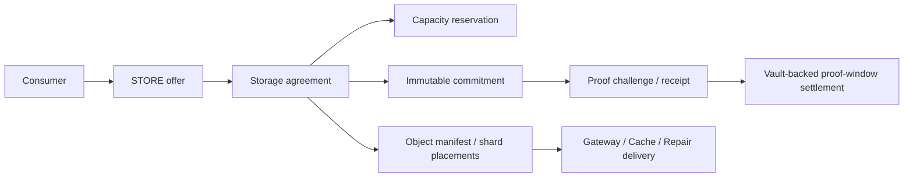

# Storage & resource infrastructure

420 Integrated keeps payload bytes, provider execution, caching, repair work, retrieval traffic and most gateway delivery off-chain while anchoring the state that must be authoritative on-chain. The 420 Resource Protocol owns provider/node identity, offers, bounded sessions and receipts. 420Store adds canonical storage capacity, agreements, commitments, proof policy/receipts, object manifests/placements and proof-window settlement.

The infrastructure rule is: **providers supply service; they do not become protocol authority merely because they are reachable.**

## Canonical versus operational state

| Surface | Role | Authority |
| --- | --- | --- |
| Resource/Storage contracts | provider/node/offers/sessions/capacity/agreements/commitments/manifests/proofs/settlement | canonical |
| 420Vault | custody of storage settlement obligations | canonical custody |
| 420Store provider filesystem | encrypted payload/shard storage | operational |
| Resource Network runtime | lifecycle, capability discovery, config, trust grants, metrics | operational |
| 420Repair | repair/reconstruction orchestration | operational |
| 420Cache | retrieval acceleration | operational |
| 420Gateway | retrieval routing/public-private access | operational |
| 420Storage API/SDK/S3 | developer integration | adapter |
| 420Indexer / Explorer / Search / Analytics | projection/presentation/analysis | derived |

If operational or derived state disagrees with the owning contract, fail closed and reconcile against canonical state.

## Service classes and runtime capabilities

The **canonical Resource Protocol** has four service classes:

- **420Relay** — encrypted routing and metered bandwidth;
- **420Store** — durable encrypted storage with commitments/proofs/manifests/settlement;
- **420Cache** — decentralized cache/CDN/retrieval bandwidth;
- **420Gateway** — public/private gateway access.

The **off-chain unified Resource Network runtime** recognizes five capabilities:

`store`, `repair`, `cache`, `gateway`, `relay`.

`repair` is intentionally an operational capability. 420Repair does not add a fifth canonical Resource Protocol service class and cannot create/alter chain authority by itself.

## Provider and node boundary

Canonical provider lifecycle is owned by `ResourceProviderRegistry420`:

`REGISTERED → ACTIVE ↔ SUSPENDED → RETIRED`

Provider activation requires a nonzero staking reference. Nodes are separately bound to providers and canonical service classes. Provider/node eligibility never grants consensus, validator, Wallet, governance or arbitrary application authority.

Runtime service lifecycle is separate and operational:

`registered → starting → running ↔ degraded → stopped/failed`

with restart paths from stopped/failed back through starting. A running process is not proof that its provider/node/agreement is canonically eligible.

## Resource Network runtime

The runtime provides:

- provider/node-bound service registration;
- capability-scoped discovery;
- dependency-aware deterministic startup/shutdown;
- lifecycle snapshots and health projection;
- configuration scoping and secret redaction;
- explicit operational trust grants;
- read-only economic/accounting projections;
- metrics/observability;
- Gateway source adaptation;
- production topology and multi-provider discovery.

Running services are discoverable by default. Degraded services require explicit opt-in. Registered, starting, stopped and failed services are excluded from normal active routing.

## Runtime configuration

Configuration has two scopes:

- **shared** — non-secret values only; not bound to a single service;
- **service** — values bound to a known service; may be marked secret.

Shared secret entries are rejected. Unknown service configuration fails closed. Snapshots redact secret values.

Production topology/config compatibility is frozen at schema `storage-topology-v1`.

## Operational trust domains

Resource Network trust grants are operational permissions, not chain capabilities.

| Domain | Permitted authorities |
| --- | --- |
| `storage` | `data.read`, `data.write` |
| `delivery` | `data.read`, `discover`, `serve` |
| `economic` | `settlement.read` |
| `control` | `lifecycle`, `credential.read` |

Cross-domain authority combinations are rejected. Shared runtime membership grants no ambient authority.

On-chain authorization remains owned by `ResourceAuthorization420` and the owning protocol contracts. Wallet/Smart Account permissioning is a separate user-authorization layer and does not replace Resource/Storage contract checks.

## Resource offers, sessions and metering

Canonical Resource offers snapshot service identity, price/unit semantics, term limits, unit caps and expiry. Bounded sessions bind the consumer, offer and maximum native `$420` spend. Metering receipts advance cumulative usage monotonically and cannot exceed session ceilings.

A provider-local invoice, runtime counter or accounting projection cannot expand spend authority.

## 420Store architecture

A representative storage path is:

The chain anchors identity/commitments/economics. Encrypted payload and shard bytes remain off-chain.

## Storage contracts and integration points

The implemented storage-specific contract surfaces are:

- `StorageIds420.sol` — storage domain identifiers;
- `StorageProofIds420.sol` — proof domain identifiers;
- `IStorageProofVerifier420.sol` — verifier interface;
- `StorageProofSchemeRegistry420.sol` — versioned proof policy/verifiers;
- `StorageCapacityRegistry420.sol` — registered capacity and reservations;
- `StorageCommitmentRegistry420.sol` — immutable provider/node storage commitments;
- `StorageProofRegistry420.sol` — challenge-bound accepted proof receipts;
- `StorageAgreementRegistry420.sol` — storage agreement lifecycle/activation gate;
- `StorageObjectManifestRegistry420.sol` — object manifests, shard placements and retrievability;
- `StorageSettlementRegistry420.sol` — 420Vault-backed proof-window settlement.

These are integrated with the shared Resource provider/node/offer/authorization surfaces. Exact public/external methods, events and custom errors are maintained by the generated contract reference rather than duplicated manually here.

## Storage agreements and capacity

`StorageAgreementRegistry420` binds consumer, effective STORE offer, object/content identity, repair-policy commitment, proof scheme, commitment, reservation, byte size, time interval, proof interval and erasure parameters.

Agreement lifecycle:

`PROPOSED → ACTIVE → COMPLETED`

or before activation:

`PROPOSED → CANCELLED`

Activation validates the effective STORE offer, authorized caller, active matching capacity reservation, compatible immutable commitment, proof scheme, content root, byte size and exact storage interval.

`StorageCapacityRegistry420` keeps canonical reservation accounting distinct from physical disk capacity. A healthy filesystem does not prove unreserved canonical capacity; a reservation does not prove local byte integrity.

## Commitments, proofs and manifests

Storage commitments preserve provider/node, roots, byte size, proof scheme and interval as immutable historical evidence.

The proof profile recognizes:

- `REPLICA_COMMITMENT`;
- `AVAILABILITY_WINDOW`;
- `AUDIT_RESPONSE`.

Proof payloads are bounded to **65,536 bytes**. A commitment/challenge pair is single-use, interval/deadline bound and verifier checked. Verifier failure/reversion fails closed. Canonical storage keeps proof receipt/digest metadata, not all raw proof bytes.

`StorageObjectManifestRegistry420` anchors object/erasure metadata and shard placements. Up to **1,024 total shards** are supported by the agreement profile. A manifest seals only after all declared shard indexes have placements. Current retrievability requires at least the configured `dataShards` threshold of live/effective placements.

Sealed is therefore not synonymous with permanently retrievable.

## 420Repair

420Repair is implemented as off-chain repair/reconstruction orchestration. Its job is to restore redundancy while preserving canonical identity/history.

Repair must preserve:

- object/content identity;
- manifest/shard identity;
- previous agreement/commitment/proof history;
- settled/refunded windows;
- new provider/node qualification;
- new capacity/commitment/placement state where replacement is needed.

Repair cannot relabel arbitrary replacement bytes or rewrite historical commitments to fabricate continuity.

## Gateway and Cache delivery

420Gateway routes verified retrievals across Cache and Store sources. Cache state is acceleration state only. Gateway route metadata is diagnostic only. Payload integrity remains bound to the requested shard root and size.

Private Gateway access is default-deny and forwarding headers are not promoted to identity/authority. Non-loopback developer API service requires TLS and explicit allowed hosts.

## 420Storage developer interfaces

The frozen developer surface is `v1` and includes:

- GET/HEAD retrieval at `/v1/resources/retrieve`;
- explicit public/private read metadata;
- bounded prepare/ingest upload transport;
- manifest/discovery/status helpers;
- standalone Go SDK `sdk/storage420`;
- semantics-preserving S3 subset.

Uploads are transport only and do not create canonical placements/agreements/proofs. S3 multipart, ACL mutation and versioning are unsupported in v1. S3 ETags are compatibility metadata, not 420 content authority.

See [420Storage Developer Hub](../../developers/420storage-developer-hub.md) for the exact interface behavior and examples.

## Economics and settlement

General Relay/Cache/Gateway-style resource usage uses bounded Resource sessions/receipts.

420Store settlement is stricter and proof-window based. The total storage amount is derived from:

`agreement.sizeBytes × offer.unitPrice420`

The agreement duration is divided into at most **4,096 settlement windows**. 420Vault holds the obligations. Each funded window ends as:

- **PAID** after the exact canonical challenge/proof qualifies; or
- **REFUNDED** when its proof deadline is missed.

Proof acceptance alone never means payment succeeded.

## Production topology and upgrade compatibility

SR-10 production qualification requires at least two providers and deterministic topology validation. Multi-provider discovery/failover remains operational and cannot create canonical provider/placement state.

Rolling upgrade logic freezes:

- Developer API `v1`;
- topology/config schema `storage-topology-v1`.

Normal rolling upgrade rejects silent API/schema drift and provider/node substitution. Upgrade and rollback qualification preserve manifest/shard/agreement/commitment identity.

## Credentials and secret handling

Production credential management is service-operational state. It stores secret digests rather than raw secrets, supports bounded-overlap rotation, zero-overlap compromise rotation, full-service revocation and explicit recovery generations.

Redacted qualification snapshots never contain raw credentials/bearer values. Credential state cannot create protocol authorization.

## Backup, restore and disaster recovery

DR evidence schema is `storage-dr-v1`. Backups intentionally contain only operational recovery state; they do not become authority for credentials, payload bytes, agreements, proofs or settlement.

Restore reconciles exact canonical manifest identity and topology fingerprint and enforces configured RPO/RTO limits. Backup data cannot overwrite canonical history.

## Alerts and SLOs

Operational health categories are `healthy`, `degraded`, `pending`, `stopped` and `failed`.

Default qualification alert policy:

- Store capacity warning 80%, critical 90%;
- Repair backlog warning 25, critical 100;
- first integrity failure critical;
- authorization failures warning at 25 per aggregation window;
- Gateway routing failures warning at 10 per aggregation window;
- degraded service warning;
- stopped/failed service critical.

Availability, integrity and recovery SLOs are independently evaluated. These thresholds/objectives are deployment policy, not consensus rules.

## Testnet and launch evidence

Testnet evidence schema is `storage-testnet-evidence-v1`. A valid bundle binds exact commit, config and topology fingerprints and requires evidence for:

- upload;
- manifest;
- verified retrieval;
- cache route;
- Gateway route;
- repair reconstruction;
- provider-loss recovery;
- discovery-degradation recovery;
- credential-revocation recovery;
- successful SLO evidence;
- no unresolved critical launch blocker.

The completed production launch froze the above compatibility contracts and passed exact-head Docs/node420/Integrated qualification before merge. Qualification evidence remains evidence only; it cannot rewrite canonical protocol state.

## `node420` integration

`node420` can supervise the 420Store provider service and related Gateway delivery configuration. The provider role remains separate from execution authority even when co-located with the execution client.

Provider configuration includes local identity/capacity/listen and canonical storage contract addresses needed by the service. Deployment-specific addresses must come from the qualified environment/configuration; documentation must not invent them.

## Security and privacy boundary

Remain off-chain/private unless explicitly required otherwise:

- plaintext payloads;
- encrypted payload bytes;
- erasure-coded shard bytes;
- decryption keys;
- private application metadata;
- cache contents;
- relay traffic;
- service credentials/session secrets.

Do not expose these through Indexer, Explorer, Search, Analytics, public gateways, logs, metrics or evidence artifacts.

The chain stores the minimum state required for identity, authorization, economics, commitments, manifests, proof policy/results and settlement.

## Failure and recovery principles

- provider/node offline: isolate delivery, preserve canonical history;
- disk corruption/loss: reject unverifiable bytes and use protocol-valid repair;
- capacity exhaustion: reject new reservations rather than oversubscribe;
- proof verifier failure: fail closed, no proof receipt/payment release;
- agreement/commitment mismatch: fail activation, never rewrite history;
- insufficient live shards: report degraded/unretrievable until redundancy restored;
- settlement/Vault failure: keep accounting unresolved; delivery/proof does not manufacture settlement success;
- runtime/Indexer disagreement: re-read the owning canonical contracts.

## Completed implementation status

The Storage & Resource suite is complete through **SR-10**. Implemented scope includes Resource/Storage contracts, provider runtime, 420Repair, 420Cache, 420Gateway, unified Resource Network lifecycle/config/trust/observability, developer API/SDK/S3 compatibility, multi-provider production topology, adversarial/load qualification, upgrade/credential/DR procedures, abuse resistance, operator alerts/SLOs and deployment/launch evidence.

The historical phase record is maintained in [420Store & storage resource roadmap](420store-roadmap.md). Future work must be introduced as a new version/roadmap rather than silently changing the frozen SR-10 semantics.

## Related documentation

- [Storage Proof & Resource Protocol](../protocols/storage-proof-resource-protocol.md)
- [420Storage Developer Hub](../../developers/420storage-developer-hub.md)
- [420 Resource Network operations](../../420RESOURCE-NETWORK-OPERATIONS.md)
- [420Gateway operations](../../420GATEWAY-OPERATIONS.md)
- [420Store & storage resource roadmap](420store-roadmap.md)
- [`node420`](node420.md)
- [Generated reference](../../reference/index.md)
- `contracts/config/420resource-genesis.json`
- `contracts/config/420storage-proof-v1.json`
