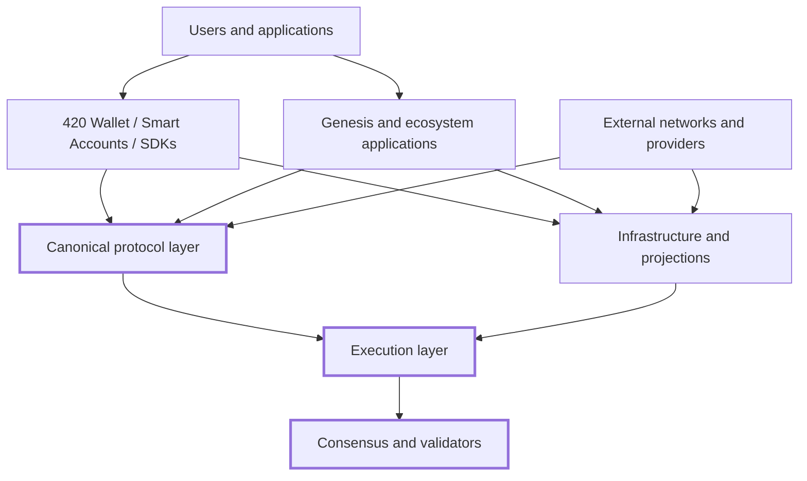
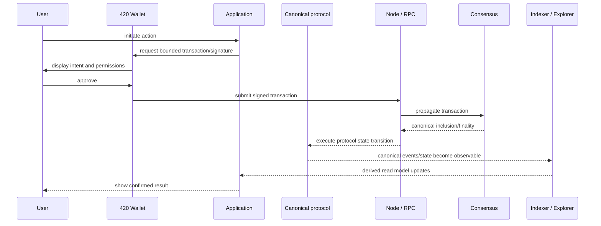

# 420 Integrated system overview

420 Integrated is an EVM-compatible Layer-1 and integrated application ecosystem designed to launch with a shared set of canonical services rather than an empty execution layer.

This page describes the top-level architecture: which layers are authoritative, which services are replaceable, how applications compose shared infrastructure, and where trust boundaries exist.

## Scope

This page covers the architecture of the 420 Integrated system as a whole. It does not define detailed consensus rules, contract ABIs, wallet workflows, bridge verification logic, validator operations, or individual application behavior. Those belong to later architecture, reference, operator, and application documentation.

## Architectural model

The system is divided into five broad layers:

1. **Chain and consensus** — block production, execution, finality, validator lifecycle, native `$420`, and canonical chain state.
2. **Canonical protocol layer** — registries, identity, names, payments, exchange, governance, rights, randomness, storage/resource coordination, verification, and other shared protocol authorities.
3. **Infrastructure and projections** — RPC, indexing, exploration, search, analytics, status, gateways, compute providers, storage providers, and other services that expose or process canonical state without replacing it.
4. **Wallet and developer access** — 420 Wallet, smart-account infrastructure, SDKs, Developer Hub, APIs, and integration surfaces used by users and application developers.
5. **Applications** — genesis-resident and later ecosystem applications that consume shared services while keeping application-specific state and authority bounded to their own domain.

The important architectural distinction is that infrastructure and user interfaces may observe, transform, index, route, or present canonical information, but they do not become protocol authority merely because users interact with them.

## Chain and consensus

The execution layer provides EVM-compatible transaction execution and state transition semantics. The consensus system determines canonical ordering, validator participation, proposer behavior, finality, rewards, penalties, and recovery rules.

The chain is the final authority for:

- native `$420` balances and transfers;
- deployed contract code and storage;
- canonical registrations and protocol state;
- finalized transaction outcomes;
- governance and treasury state when governed on-chain;
- authoritative ownership, rights, settlement, staking, and other protocol results.

Explorer pages, indexers, analytics systems, search results, caches, gateways, and application databases must be reconstructable from canonical sources or explicitly identified as non-authoritative derived state.

## Canonical protocol layer

420 Integrated uses shared protocols so applications do not need to rebuild incompatible versions of common ecosystem functions.

Examples include:

- **420 Registry** — canonical discovery of contracts, assets, applications, and protocol services;
- **420 Names** and **420 Identity** — human-readable naming and optional identity/reputation surfaces;
- **420 Pay**, **420 Swap / Exchange**, and **420 Bridge** — payment, exchange, and cross-chain value movement;
- **420 Stake**, **420 Governance**, **420 Treasury**, and **420 Grants** — validator and public-governance infrastructure;
- **420 Randomness**, **Oracle Interface Layer**, **420 Storage Proof Protocol**, and **420 Resource Protocol** — shared external-data, randomness, storage, and resource primitives;
- **420 Rights**, **420 Verify**, **420 Arbitration**, and **420-IS** — rights, verification, dispute, and interoperability primitives;
- **420 Messenger**, **420 Notifications**, and **420 Attention** — communication and engagement services with bounded authority.

A protocol may delegate execution or service delivery to off-chain providers, but canonical permissions, commitments, settlement, or registrations remain anchored to the designated protocol authority.

## Infrastructure and projections

Several important components are intentionally replaceable or independently operable.

Examples include:

- RPC endpoints;
- `fourtwentyd` and `node420` operational deployments;
- 420Indexer;
- 420 Explorer;
- 420 Search;
- 420 Analytics;
- 420 Status;
- gateways and caches;
- AI compute providers;
- storage providers;
- oracle providers;
- notification delivery infrastructure.

These systems can improve availability, discovery, usability, performance, or off-chain execution, but they must not silently acquire authority over balances, ownership, wallet signing, protocol permissions, or consensus.

A compromised indexer may lie about a balance display; it must not be able to change the balance. A compromised search service may rank a fraudulent application; it must not be able to make that application canonical in 420 Registry. A compromised AI provider may return bad output; it must not receive validator or wallet authority from the AI protocol.

## Wallet and developer access

420 Wallet is the primary user-facing access point to accounts, smart accounts, permissions, recovery, dApp connections, transactions, and ecosystem discovery.

The wallet architecture follows two rules:

- user keys and signing authority remain bounded to the wallet/account security model;
- developer-facing SDKs and applications orchestrate wallet actions but do not silently become signers.

The 420 Developer Hub and shared SDKs expose network discovery, canonical contract metadata, RPC access, wallet/smart-account integration, examples, and developer tooling. They are integration surfaces, not sources of chain authority.

## Applications

Genesis and later applications are expected to compose shared infrastructure where appropriate instead of introducing parallel identity, wallet, payment, naming, registry, rights, messaging, or asset systems.

Applications may maintain their own domain authority. For example, a game may define game rules and game-specific state, but it should use canonical wallet, identity, payment, token, randomness, and registry infrastructure where those services apply.

Application-specific authority must not automatically expand into protocol-wide authority.

## External systems

420 Integrated interacts with systems outside the chain, including:

- external blockchains;
- oracle data sources;
- AI and compute providers;
- storage providers;
- messaging transports;
- external APIs and outcome providers;
- user devices and browser wallets.

External information must cross an explicit trust boundary before it can affect canonical state. The protocol receiving that information is responsible for defining required attestations, validation, quorum, verification, dispute, timeout, or fail-closed behavior.

## Authority and trust boundaries

The high-level authority model is:

| Layer | May be authoritative for | Must not become authoritative for |
| --- | --- | --- |
| Consensus | canonical ordering, validator/finality rules | application-specific permissions unless explicitly defined by protocol |
| Execution/contracts | balances, ownership, protocol state, governed outcomes | off-chain facts without defined verification |
| Canonical protocols | their explicitly defined domain | unrelated protocol domains |
| Wallet/smart accounts | user-controlled signing and account permissions | protocol governance merely because the user uses the wallet |
| Indexers/explorers/search | derived views and discovery | canonical state or legitimacy |
| AI/storage/oracle providers | service output under protocol rules | validator, wallet, or unrestricted governance authority |
| Applications | bounded application state and rules | network-wide authority outside their declared interfaces |

Later DOC-2 work expands this model into a dedicated trust-boundary document.

## System invariants

The system architecture depends on the following cross-cutting invariants:

1. **Canonical state remains chain-authoritative.** Replaceable services may project or process state but cannot redefine it.
2. **Authorization is explicit and bounded.** Security-sensitive capabilities use declared authorities rather than ambient privilege.
3. **Interfaces are replaceable where possible.** Providers may change without changing the canonical protocol contract or guarantee.
4. **Wallet authority stays with the account model.** SDKs, dApps, indexers, search systems, attention systems, and service providers do not silently acquire signing power.
5. **Cross-domain authority is not implied.** Authority over one application or protocol does not automatically grant authority over another.
6. **External facts cross explicit verification boundaries.** Off-chain information cannot become canonical merely because a service reports it.
7. **Genesis-critical behavior is hardened before freeze.** Components become mainnet assumptions only after qualification and explicit freeze decisions.
8. **Derived systems remain rebuildable.** Indexes, analytics, search projections, and similar data products must be reconstructable from authoritative inputs wherever practical.

## Typical transaction flow

A normal user-initiated application action follows this shape:

Applications may optimize reads through indexers, caches, or application services, but security-sensitive decisions should be verified against the appropriate canonical source when stale or manipulated projections could change the outcome.

## Failure and recovery model

The architecture assumes individual replaceable services can fail without redefining canonical state.

Examples:

- if an explorer is unavailable, chain state still exists and can be queried through another RPC/indexer;
- if a search index is stale, Registry state remains authoritative;
- if an AI or storage provider fails, protocol-specific timeout, reassignment, dispute, escrow, or slashing rules apply rather than granting the provider permanent authority;
- if a wallet front end fails, account authority remains defined by the smart-account/controller/recovery model;
- if an application front end fails, canonical assets and protocol state remain independently observable where designed to do so.

Consensus and execution failures have different recovery rules and are documented separately in DOC-3 and DOC-4.

## Genesis status

420 Integrated intends to launch with a defined genesis-resident service layer rather than relying on every core ecosystem capability to appear after network launch.

The current genesis application decision includes Wallet, Explorer, Registry, Names, Identity, Swap, Bridge, Stake, Governance, AI, Attention, and Status, with additional shared protocols and supporting infrastructure implemented in the repository. Testnet-only services such as the faucet remain outside mainnet economics.

Not every first-year application is a genesis-critical protocol. The architecture distinguishes between **genesis infrastructure that other systems depend on** and **applications that can evolve above that foundation**.

## Related documentation

- [Architecture documentation index](index.md)
- [Architecture Decision Records](decisions/README.md)
- [Documentation roadmap](../DOCS-ROADMAP.md)

DOC-2.2 will document the design principles that govern how these layers are allowed to evolve.
