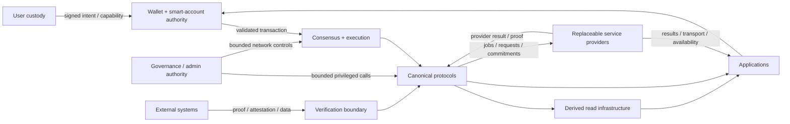
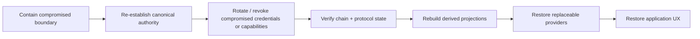

# Trust-boundary model

This page defines the principal trust boundaries in 420 Integrated and the rules that apply when authority, custody, external evidence, administrative control, or derived data crosses from one domain into another.

A trust boundary is not merely a network boundary. It exists anywhere one component must decide whether to accept another component's claim, authorization, proof, identity, state projection, or administrative instruction.

## Trust domains

420 Integrated is divided into the following major trust domains:

1. **user custody and authorization** — private keys, smart accounts, session keys, recovery, and explicit capabilities;
2. **consensus and execution** — validator decisions, finalized blocks, EVM state transitions, balances, and contract state;
3. **canonical protocol authority** — Registry, Identity, Names, Pay, Swap, Stake, Governance, Bridge, Rights, Randomness, Storage Proof, AI settlement, and other protocol-owned state;
4. **administrative and governance authority** — explicitly granted upgrade, parameter, treasury, emergency, or operational powers;
5. **derived read infrastructure** — Indexer, Explorer, Search, Analytics, caches, dashboards, and generated catalogues;
6. **replaceable off-chain services** — RPC operators, storage gateways, AI workers, relayers, messaging transports, media delivery, automation workers, and similar providers;
7. **external systems** — foreign chains, oracle data sources, external APIs, reserve systems, payment rails, and other non-420 authorities;
8. **applications and developer tooling** — dApps, SDKs, Developer Hub, front ends, games, and integrations that request or compose capabilities without becoming root authority.

## Boundary map

The arrows describe permitted trust crossings, not unconditional trust. Each crossing requires validation appropriate to the domain.

## TB-1 — User custody to Wallet/smart-account authority

Applications may construct intent, but they do not own the user's signing authority.

At this boundary:

- private keys must remain outside application and SDK core;
- account and chain identity must be checked explicitly;
- capabilities and session keys must be scoped, revocable, and time-bounded where applicable;
- recovery authority must be distinct from ordinary application permissions;
- signing prompts must correspond to the actual operation being authorized;
- stale, revoked, malformed, cross-chain, or non-canonical authorization must fail closed.

An application can request authority. It cannot manufacture it.

## TB-2 — Wallet/smart-account authority to execution

A valid signature or account authorization is necessary but not sufficient for execution.

The execution layer independently enforces:

- nonce and replay rules;
- chain identity;
- account and contract state;
- gas and fee constraints;
- contract authorization checks;
- protocol invariants;
- transaction validity.

Wallet approval does not override contract or chain rules.

## TB-3 — Consensus/execution to canonical protocols

Canonical protocols derive authority from finalized chain state and their own contract/state-machine rules.

At this boundary:

- protocols must not rely on front-end state as authoritative;
- contract identity must be canonical and version-compatible;
- protocol state transitions must be deterministic from accepted inputs;
- protocol-specific authorization must be enforced independently of UI assumptions;
- upgrades or migrations must preserve explicit authority and compatibility rules.

## TB-4 — Canonical protocols to derived infrastructure

420Indexer, 420Explorer, 420Search, 420Analytics, caches, dashboards, and generated catalogues consume canonical state but do not become canonical themselves.

Required properties:

- derived state must identify its source chain/network and relevant version;
- projections should be reproducible or independently verifiable;
- stale or incomplete indexing must be detectable;
- disagreement is resolved in favor of canonical chain/protocol state;
- derived services must not possess transaction-signing authority merely because they expose convenient APIs;
- loss of a projection must reduce usability, not rewrite protocol truth.

## TB-5 — Applications to derived infrastructure

Applications may use Indexer, Explorer, Search, Analytics, and similar services for efficient reads.

The boundary becomes security-sensitive when a read influences a value-moving or privileged action.

For security-sensitive decisions, applications should verify critical state against canonical or independently verifiable sources where required. Examples include:

- bridge settlement status;
- capability validity;
- asset ownership;
- governance execution state;
- validator/slashing state;
- payment settlement;
- protocol deployment identity.

A convenient API response is not automatically sufficient evidence for a privileged action.

## TB-6 — Governance/admin authority to canonical protocols

Governance and administrative powers are explicit trust crossings.

Every privileged path should document:

- the authority source;
- the exact callable domain;
- parameter or value limits;
- delay, quorum, or approval requirements where applicable;
- revocation or rotation rules;
- emergency scope;
- audit evidence;
- actions that remain impossible even for governance.

Governance is not assumed to be a universal superuser.

## TB-7 — Emergency authority

Emergency controls cross a particularly sensitive boundary because they intentionally bypass normal operating cadence.

Emergency mechanisms should therefore be:

- narrowly scoped;
- independently observable;
- limited to documented components or actions;
- incapable of silently seizing unrelated user custody;
- reversible or recoverable through a defined process where practical;
- separated from ordinary operational credentials;
- subject to post-incident review and evidence preservation.

A pause mechanism should pause only the domain it is authorized to pause.

## TB-8 — External chain to 420Bridge

Foreign-chain state is outside 420 Integrated's native trust domain.

Before an external claim affects canonical 420 state, the bridge boundary must validate the required evidence, such as:

- source-chain identity;
- finalized or sufficiently confirmed source state;
- message/proof authenticity;
- replay protection;
- destination-domain separation;
- asset identity and accounting semantics;
- verifier set or proof-system validity;
- expiry or freshness where relevant.

If the required proof cannot be validated, settlement pauses. The system must not substitute relayer confidence for bridge verification.

## TB-9 — External data to Oracle Interface Layer

Oracle data originates outside consensus and must cross an explicit verification boundary before it can influence canonical protocol state.

The consuming protocol defines the required guarantees, which may include:

- provider identity;
- quorum;
- freshness;
- confidence bounds;
- signature or attestation validity;
- proof of reserves;
- source diversity;
- dispute/challenge period;
- deterministic transformation rules.

Missing or invalid data must not be silently replaced with guesses or stale values in value-sensitive paths.

## TB-10 — Randomness providers to consuming protocols

Randomness is external trust unless it is derived through a protocol-defined verifiable mechanism.

Consumers must validate the randomness mechanism they require, such as VRF, threshold generation, commit-reveal, or another accepted provider-neutral scheme.

A random-looking value from a service endpoint is not equivalent to protocol-qualified randomness.

## TB-11 — AI workers to 420AI settlement

AI inference and compute occur off-chain, while job registration, payment/escrow, staking/slashing, and accepted result evidence are coordinated through canonical protocol surfaces.

At this boundary:

- workers receive only the job authority necessary to execute assigned work;
- workers do not gain wallet, governance, registry, or consensus authority;
- result acceptance rules must be explicit;
- payment must follow canonical settlement state;
- failed, timed-out, or invalid jobs must have deterministic recovery/reassignment behavior;
- private or sensitive job inputs must not be exposed beyond the declared execution boundary.

## TB-12 — Storage providers/gateways to canonical storage/resource state

Storage availability and retrieval are provider responsibilities. Proof, registry, allocation, payment, and integrity state may be canonical protocol responsibilities.

The boundary requires separation between:

- “the provider returned bytes”;
- “the bytes match the committed content”;
- “the provider satisfied a protocol proof obligation”;
- “the provider is entitled to payment.”

A gateway response alone must not satisfy a canonical proof requirement unless the protocol explicitly defines it that way.

## TB-13 — Messaging transport to on-chain permissions

Messaging transport and message storage may be off-chain, while membership, roles, subscriptions, entitlements, and treasury permissions may be canonical.

Transport providers must not be able to grant themselves on-chain membership or alter canonical permissions merely by delivering or withholding messages.

Loss of transport affects communication availability, not canonical authorization.

## TB-14 — Developer Hub/SDK to Wallet and protocols

The Developer Hub and SDKs expose typed interfaces, discovery, orchestration, and examples. They are not root authorities.

At this boundary:

- SDK contract identities must come from canonical or verified catalogues;
- chain mismatch must fail closed;
- SDK helpers must not silently sign or custody user keys;
- runtime adapters must not substitute non-canonical authority contracts;
- generated clients and schemas must preserve protocol version expectations;
- convenience abstractions must not erase important authorization or settlement states.

## TB-15 — Application/game servers to canonical assets

Applications and games may maintain high-frequency or private off-chain state, but ownership and other canonical asset rights remain where the protocol defines them.

An application server must not be treated as authoritative for transferable ownership merely because it coordinates gameplay or application logic.

Where server decisions can affect canonical assets, the protocol must define the signed, proven, or otherwise authorized transition that crosses the boundary.

## TB-16 — Operator credentials to infrastructure

Node, indexer, gateway, deployment, monitoring, and automation operators may require operational credentials.

Operational credentials must be separated from user custody and from unrelated protocol authority.

Examples:

- an Indexer deployment key should not control treasury funds;
- a monitoring credential should not upgrade contracts;
- a gateway credential should not become a validator key;
- a CI deployment token should not silently become a governance executor.

Credential compromise should have a bounded blast radius matching the operator's responsibility.

## TB-17 — Documentation and generated metadata

420Docs, generated ABIs, contract catalogues, deployment manifests, and SDK metadata influence developer decisions, so provenance matters even though documentation is not chain authority.

Security-sensitive metadata should be reproducible or verifiable against canonical deployment and registry state. A documentation error must not be able to redefine the canonical contract address or grant authority by itself.

## Trust-boundary matrix

| Boundary | What crosses | Required validation | Failure behavior |
| --- | --- | --- | --- |
| User → Wallet | intent, capability request | identity, chain, scope, expiry, consent | reject/require reauthorization |
| Wallet → Execution | signed transaction/user operation | signature, nonce, gas, state, protocol checks | reject transaction |
| Execution → Protocol | finalized state/input | contract identity, state-machine rules | no state transition |
| Protocol → Indexer/Explorer | events/state | chain identity, ordering, finality/reorg handling | stale/unavailable projection |
| App → Derived reads | query result | freshness/source where security-sensitive | re-query or canonical verification |
| Governance → Protocol | privileged action | proposal/executor/domain/limits | reject unauthorized call |
| Emergency → Protocol | pause/containment action | emergency role + scope | reject outside scope |
| External chain → Bridge | proof/attestation | source chain, finality, proof, replay, asset identity | pause settlement |
| Oracle → Protocol | external fact | provider/quorum/freshness/proof | fail closed/defer |
| Randomness → Protocol | random value/proof | scheme-specific verification | defer/reject |
| AI worker → AI protocol | result/evidence | assignment, SLA/proof/result policy | retry/reassign/slash as defined |
| Storage provider → protocol | proof/result/availability | integrity/proof/allocation rules | no payment/mark unavailable |
| Transport → messaging app | messages | membership/authorization context | delivery unavailable |
| SDK → Wallet/protocol | orchestration/config | verified catalogue, chain/version | configuration error/fail closed |
| Operator → infrastructure | operational command | least privilege, credential scope | bounded service impact |

## Trust invariants

The system-level trust model establishes these invariants:

- **TRUST-001** — no derived read service may become canonical solely because applications depend on it.
- **TRUST-002** — no application or SDK may acquire user signing authority without explicit Wallet/smart-account authorization.
- **TRUST-003** — no external-chain claim may affect canonical bridge state without protocol-qualified verification.
- **TRUST-004** — no external fact may affect a value-sensitive protocol path without the consuming protocol's required oracle validation.
- **TRUST-005** — governance and emergency authority must remain bounded to explicitly documented domains.
- **TRUST-006** — operational credentials must not imply unrelated protocol, validator, governance, or custody authority.
- **TRUST-007** — replaceable providers may reduce availability when they fail, but must not silently rewrite canonical ownership, balances, permissions, or settlement state.
- **TRUST-008** — security-sensitive cross-boundary messages must include sufficient identity/domain/replay context to prevent ambiguous reuse.
- **TRUST-009** — canonical contract and service identity must be discoverable or independently verifiable rather than accepted solely from untrusted UI configuration.
- **TRUST-010** — recovery after a boundary compromise must restore canonical authority before rebuilding derived services and application convenience layers.

## Compromise and containment model

A useful trust boundary limits how far a compromise can propagate.

Examples:

- compromised Explorer: users may see misleading data, but the attacker cannot rewrite chain state;
- compromised Indexer: projections may be wrong, but canonical contracts and balances remain unchanged;
- compromised RPC endpoint: clients may receive false or censored responses, so critical clients should support verification/failover; the endpoint does not gain signing authority;
- compromised AI worker: assigned jobs/results are suspect, but the worker cannot control governance or consensus;
- compromised storage gateway: retrieval may fail or return bad bytes, but integrity checks and proof rules prevent the gateway from redefining canonical content commitments;
- compromised relayer: bridge messages may be delayed or censored, but unverifiable messages must not settle;
- compromised dApp front end: it may present malicious transaction intent, but Wallet must display/validate the actual authorization boundary;
- compromised governance executor: impact is limited to the powers that executor was explicitly granted; unrelated custody should remain outside its reach.

## Recovery ordering after trust-boundary failure

Recovery must start from the authoritative layer. Rebuilding dashboards before determining canonical state is not recovery.

## Relationship to the rest of DOC-2

- [System overview](system-overview.md) defines the top-level architecture.
- [System design principles](design-principles.md) defines the architectural rules applied across these boundaries.
- [Genesis architecture](genesis-architecture.md) defines the launch-time composition and frozen assumptions.
- [System dependency map](dependency-map.md) defines the direction and class of dependencies between domains.
- This page completes DOC-2 by making the trust assumptions and boundary-validation rules explicit.

## Non-responsibilities

This document does not define cryptographic algorithms, validator quorum thresholds, exact governance parameters, production key-management procedures, bridge proof formats, oracle-provider lists, or incident-response runbooks. Those belong in DOC-3 onward, protocol specifications, security documentation, operator runbooks, generated reference, and accepted ADRs.
