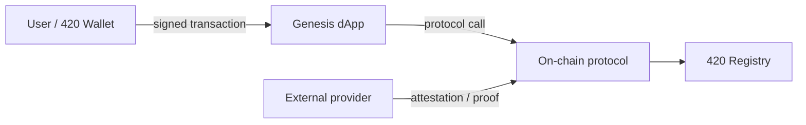

# Documentation Diagram Conventions

420 Integrated documentation should prefer diagrams that remain reviewable, diffable, and reproducible from repository source.

## Default format

Use Mermaid for documentation diagrams when Mermaid can represent the concept clearly. Static SVG or PNG diagrams may be used when Mermaid would materially reduce clarity, but the editable source should be committed whenever practical.

## Supported diagram purposes

Prefer a diagram when it materially clarifies:

- system/component relationships;
- protocol or service dependencies;
- transaction and message flows;
- trust and authority boundaries;
- state machines and lifecycle transitions;
- validator/consensus sequences;
- bridge verification flows;
- storage, compute, indexer, or oracle interactions;
- recovery and failure paths.

## Conventions

- Read primary flows left-to-right or top-to-bottom.
- Label boundaries explicitly; do not imply trust properties only through placement.
- Distinguish on-chain from off-chain components in labels, not solely by color.
- Label external chains and third-party providers as external.
- Identify governance-controlled or privileged actions where relevant.
- Name messages, attestations, transactions, or proofs on important edges.
- Avoid diagrams that merely repeat a prose list.
- Keep diagrams small enough that they remain readable on mobile documentation pages.

## Security-sensitive diagrams

Architecture diagrams involving value transfer, authorization, bridging, oracle input, storage proofs, or AI/resource settlement should identify the applicable trust boundary and point readers to the security assumptions in the surrounding document.

## Example

The labels, not visual styling, carry the architectural meaning.